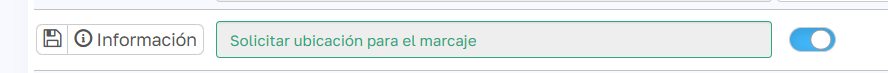
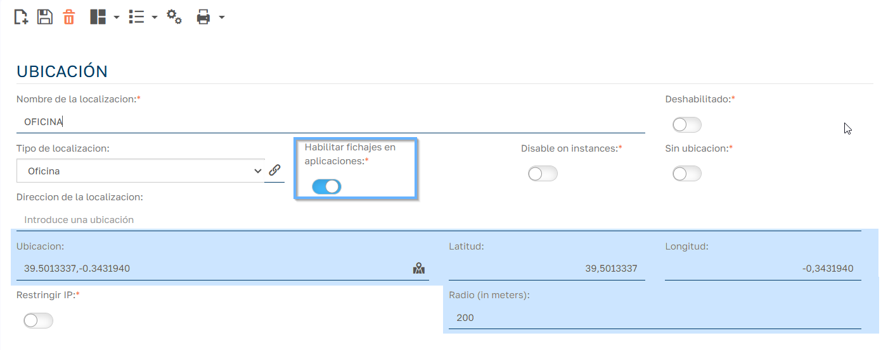
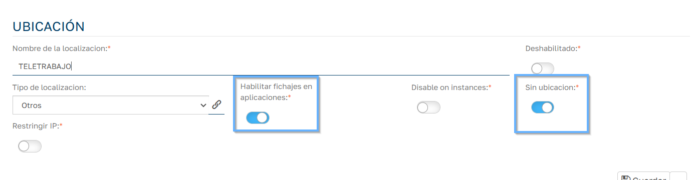
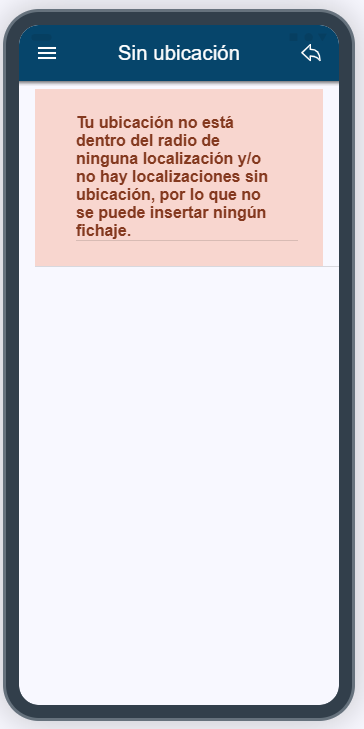

# Fichajes desde la APP Offline

El sistema de fichajes desde la aplicación móvil de Sebastian HR permite a los empleados registrar sus entradas y salidas de forma ágil y segura, integrando funcionalidades avanzadas como la geolocalización. A continuación, se detalla el funcionamiento de esta herramienta para garantizar su correcta utilización.

## Diferencias respecto a los fichajes desde la aplicación web

A diferencia de los fichajes realizados desde el backlog en la versión web, los fichajes efectuados desde la APP recogen las coordenadas GPS del dispositivo desde el que se realiza el marcaje. Esta funcionalidad permite asociar el fichaje a una localización física concreta, si así se ha configurado.

## Parámetros configurables

El comportamiento del sistema de fichajes móviles está condicionado por la configuración del parámetro:

## Solicitar ubicación para el marcaje (Mantenimiento > Configuración > Aplicación)

Este parámetro determina cómo se gestionan las coordenadas y la validación de localizaciones. Su funcionamiento es el siguiente:

## 1\. Si el parámetro está activado

  * Al realizar un fichaje, la aplicación comprobará si el dispositivo del empleado se encuentra dentro del radio de alguna localización que tenga el check "Habilitar fichajes en aplicaciones" activado.  
  (Mantenimiento > Fichajes > Localizaciones)
  

  * Si existe coincidencia, el sistema registrará:

    * Las coordenadas GPS del dispositivo.

    * El ID de la localización correspondiente.

  * Si el dispositivo está fuera del radio de todas las localizaciones habilitadas:

    * Se abrirá un listado de localizaciones que cumplan los siguientes requisitos:

      * Tengan el check "Habilitar fichajes en aplicaciones" activo.

      * Además, tengan activado el check "Sin ubicación".

  * Si no existe ninguna localización que cumpla estos criterios, el sistema mostrará un mensaje informativo indicando que no es posible realizar el fichaje.

## 2\. Si el parámetro está desactivado

  * El sistema registrará únicamente las coordenadas GPS del dispositivo.

  * No se asociará ninguna localización al fichaje, aunque esta exista en el sistema.

  
