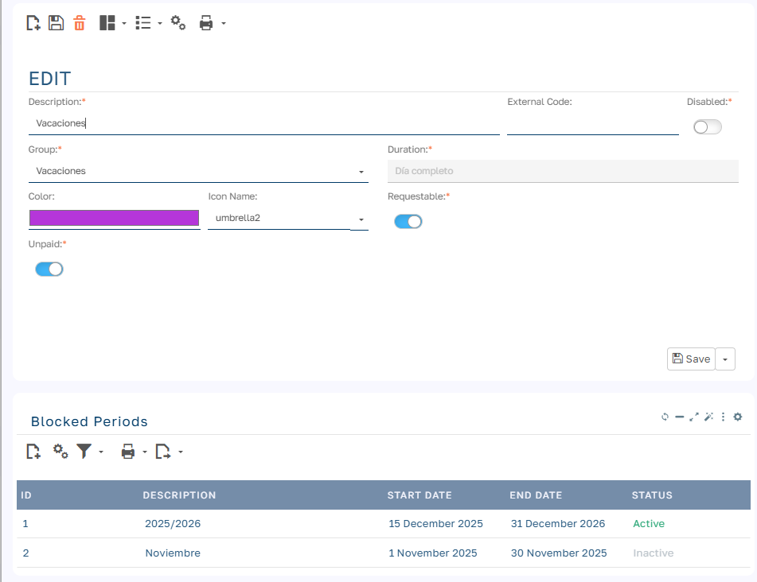
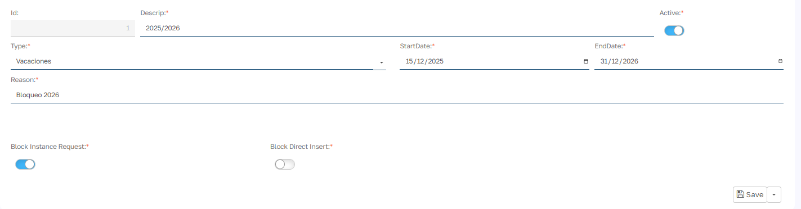

# Bloqueo de periodos por Ausencia

## ¿Qué es el bloqueo de periodos?

El Bloqueo de Periodos es una funcionalidad que permite a la empresa definir fechas específicas en las que no se pueden solicitar vacaciones o ausencias.

## ¿Por qué existe esta funcionalidad?

Existen situaciones en las que la empresa necesita garantizar la presencia de todo el equipo:

- Temporada alta de trabajo o ventas
- Cierre de fin de año administrativo
- Inventarios o auditorías
- Eventos importantes de la empresa
- Reuniones obligatorias de equipo

## ¿Cómo funciona?

Cuando intentas solicitar vacaciones en un periodo bloqueado, el sistema te mostrará un mensaje informativo explicando por qué no es posible solicitar esos días.

!!! example "Ejemplo de mensaje"
    Periodo bloqueado.

    No se pueden solicitar vacaciones en las siguientes fechas bloqueadas:

    - **Temporada alta verano 2025**: del 01/07/2025 al 31/08/2025  
    - **Motivo**: Temporada de máximo trabajo

## ¿Cuándo debo crear un bloqueo?

Crea un periodo bloqueado cuando:

- Necesitas asegurar la presencia del equipo completo
- Es un periodo crítico para el negocio
- Hay un evento importante (reunión, auditoría, cierre)
- Es temporada alta y necesitas el máximo de recursos

## Cómo crear un periodo bloqueado

### Accede a la gestión de periodos bloqueados

1. Ve a `Menú principal > Mantenimiento`
2. Busca Tipos de Ausencia y accede al tipo de ausencia en la que quieres aplicar un bloqueo de periodo.
3. En el módulo de Periodos bloqueados puedes añadir los bloqueos que sean necesarios

### Completa la información

| Campo | Tipo | Descripción |
| --- | --- | --- |
| Descripción | Obligatorio | Ejemplo: "Cierre de fin de año 2025".   Consejo: usa un nombre claro y descriptivo. |
| Fecha de inicio | Obligatorio | Ejemplo: 24/12/2025.   Consejo: marca el primer día del bloqueo. |
| Fecha de fin | Obligatorio | Ejemplo: 31/12/2025.    Consejo: marca el último día del bloqueo. |
| Tipo de ausencia | Obligatorio | Ejemplo: Vacaciones. |
| Bloquear solicitudes de empleados | Checkbox | ✓ Marcado = los empleados NO pueden solicitar por el sistema.   ✗ Desmarcado = los empleados SÍ pueden solicitar. Recomendación: siempre marcado. |
| Bloquear inserción de gestores | Checkbox | ✓ Marcado = ni los gestores pueden asignar vacaciones en este periodo.   ✗ Desmarcado = los gestores SÍ pueden hacer excepciones. Recomendación: marcado para cierres obligatorios, desmarcado para temporadas altas (permite excepciones). |
| Motivo | Obligatorio | Ejemplo: "Periodo de cierre administrativo. Todos los departamentos cerrados."   Consejo: explica claramente el motivo; los empleados lo verán en el mensaje. |
| Activo | Checkbox | ✓ Marcado = el bloqueo está activo.    ✗ Desmarcado = el bloqueo está desactivado (no se aplica). Nota: puedes desactivar temporalmente un bloqueo sin borrarlo. |

### Guarda el periodo bloqueado

1. Haz clic en Guardar
2. El bloqueo estará activo inmediatamente
3. Verifica que aparece en la lista de periodos bloqueados

Resultado: Nadie puede estar ausente ese día específico.

## Gestión de periodos bloqueados

### Ver todos los bloqueos

En la lista verás:

- Descripción del bloqueo
- Fechas (inicio y fin)
- Estado (Activo/Inactivo)
- Tipo de bloqueo (Solicitudes, Gestores, o Ambos)

### Editar un bloqueo existente

1. Haz clic en el periodo que quieres modificar
2. Cambia los campos necesarios
3. Guarda los cambios

### Desactivar temporalmente un bloqueo

1. Abre el periodo bloqueado
2. Desmarca Activo
3. Guarda

!!! warning "Nota"
    El bloqueo sigue en el sistema pero no se aplica.

### Eliminar un bloqueo

1. Selecciona el periodo bloqueado
2. Haz clic en Eliminar
3. Confirma la eliminación

!!! warning "Nota"
    Una vez eliminado, no se puede recuperar.

## Cosas importantes a tener en cuenta

### Los bloqueos se aplican inmediatamente

- En cuanto guardas, el bloqueo está activo
- Los empleados verán el mensaje si intentan solicitar

### Los bloqueos no afectan vacaciones ya aprobadas

- Si alguien ya tiene vacaciones aprobadas en ese periodo, se respetan
- El bloqueo solo aplica a nuevas solicitudes

### Los bloqueos aplican a todos los empleados

- No se pueden hacer bloqueos por departamento o persona
- Es para toda la empresa

### No hay notificación automática

- Los empleados solo se enteran cuando intentan solicitar
- Recomendación: envía un email informativo cuando crees bloqueos importantes

## Preguntas frecuentes

### Para gestores

**¿Puedo crear bloqueos solo para mi departamento?** 

No, los bloqueos afectan a toda la empresa.

**¿Puedo crear un bloqueo que empiece hoy?**

Sí, pero ten en cuenta que quien ya haya solicitado antes del bloqueo mantendrá su solicitud.

**¿Qué pasa con las vacaciones ya aprobadas en un periodo que bloqueo después?**

Las vacaciones ya aprobadas se respetan. El bloqueo solo afecta a nuevas solicitudes.

**¿Puedo hacer una excepción para un empleado específico?**

Si el bloqueo NO tiene marcado "Bloquear inserción de gestores", puedes asignar manualmente las vacaciones a ese empleado.

**¿Cuántos periodos bloqueados puedo crear?**

No hay límite, pero recomendamos solo los estrictamente necesarios para no restringir demasiado al equipo.

**¿Los bloqueos afectan a las bajas médicas?**

No, las bajas médicas son independientes. El empleado puede registrar una baja en cualquier momento.

**¿Puedo editar un bloqueo que ya está activo?**

Sí, puedes modificarlo en cualquier momento. Los cambios se aplican inmediatamente.

**¿Cómo informo a los empleados sobre un nuevo bloqueo?**

El sistema no envía notificaciones automáticas. Recomendamos enviar un email o anuncio interno.

## Ejemplos prácticos

### Ejemplo 1: empresa de retail - Navidad

**Situación:** tienda de ropa con temporada alta en Navidad.

**Bloqueo creado:**

- **Descripción**: "Campaña Navidad - Presencia obligatoria"
- **Fechas**: 01/12/2025 - 06/01/2026
- **Tipo**: Vacaciones
- ☑ Bloquear solicitudes de empleados
- ☐ Bloquear inserción de gestores
- **Motivo**: "Temporada de máximo ventas. Necesitamos todo el equipo."
- ☑ Activo

**Resultado:**

- Los empleados no pueden solicitar vacaciones en diciembre
- El gerente puede hacer excepciones para casos especiales
- Los permisos por horas siguen permitidos

### Ejemplo 2: empresa de servicios - cierre de fin de año

**Situación:** oficina que cierra completamente del 24 al 31 de diciembre.

**Bloqueo creado:**

- **Descripción**: "Cierre oficinas fin de año 2025"
- **Fechas**: 24/12/2025 - 31/12/2025
- **Tipo**: Vacaciones
- ☑ Bloquear solicitudes de empleados
- ☑ Bloquear inserción de gestores
- **Motivo**: "Cierre administrativo anual. Oficinas cerradas."
- ☑ Activo

**Resultado:**

- NADIE puede solicitar ni asignar ausencias
- Son días de vacaciones obligatorias para todos
- Sin excepciones posibles

### Ejemplo 3: empresa de contabilidad - cierre fiscal

**Situación:** gestoría con cierre fiscal del primer trimestre.

**Bloqueo creado:**

- **Descripción**: "Cierre fiscal Q1 - Solo permisos bloqueados"
- **Fechas**: 01/04/2025 - 20/04/2025
- **Tipo**: Permisos
- ☑ Bloquear solicitudes de empleados
- ☑ Bloquear inserción de gestores
- **Motivo**: "Cierre fiscal. No se permiten permisos."
- ☑ Activo

**Resultado:**

- Los empleados NO pueden solicitar permisos
- Las vacaciones SÍ están permitidas (si alguien las tiene planificadas)
- Bloqueo específico solo para permisos

## Conclusión

El sistema de Bloqueo de Periodos está diseñado para:

- Ayudar a la empresa a gestionar periodos críticos
- Dar claridad a los empleados sobre cuándo NO solicitar vacaciones
- Reducir conflictos y rechazos de solicitudes
- Mejorar la planificación de vacaciones para todos

Usándolo correctamente, beneficia tanto a la empresa como a los empleados.