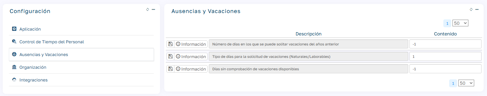
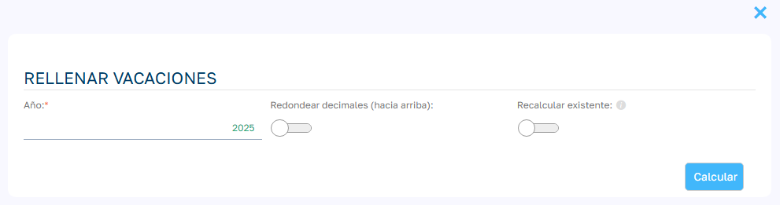
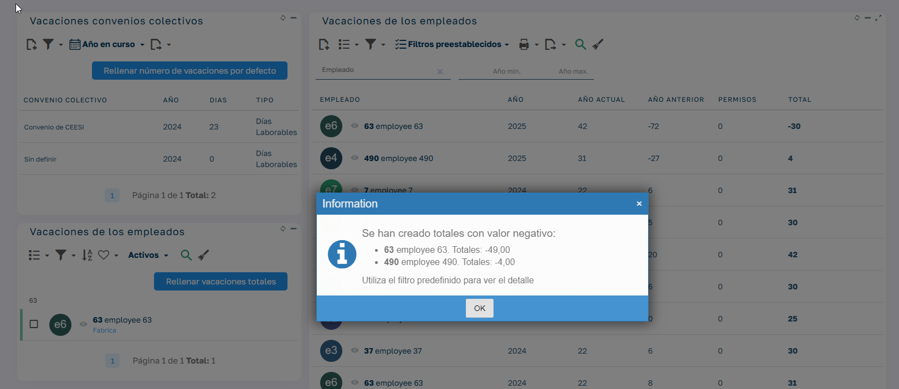

# Gestión de días vacaciones

En este artículo se detallan los principales aspectos relacionados con los parámetros de configuración y la asignación de días de vacaciones.

## Configuración de Vacaciones y Ausencias

En el menú Mantenimiento/Configuración/Vacaciones y Ausencias , se encuentran los siguientes parámetros:

## 1\. Tipo de días de vacaciones

Define el tipo de día por defecto aplicado a los convenios colectivos. Al configurar un nuevo convenio, es fundamental confirmar y ajustar este parámetro según las características de cada organización.

### Vacaciones en días naturales:

Cuando las vacaciones se calculan en días naturales, se cuentan todos los días consecutivos desde el inicio hasta el final del periodo solicitado, incluyendo sábados, domingos y festivos.

Por ejemplo, si un empleado pide vacaciones del 1 al 7 de agosto, se le descontarán 7 días naturales, aunque no todos sean días laborales. 

### Vacaciones en días laborables:

Cuando las vacaciones se calculan en días laborables, solo se descuentan los días en los que el empleado tiene obligación de trabajar, excluyendo fines de semana y festivos. Así, si un trabajador que trabaja de lunes a viernes se toma vacaciones del lunes al viernes, solo se le descontarán 5 días laborables, aunque en la práctica esté ausente durante más días seguidos.

Determinación de días laborables según modo de aplicación:

El sistema determina qué días de la semana se consideran laborables de forma diferente según el modo de aplicación:

### _Modo LITE:_

Los días laborables se configuran a nivel de tipo de ausencia :

  * Sábado laborable: Si está marcado en el tipo de ausencia, los sábados se cuentan como días laborables.
  * Domingo laborable: Si está marcado en el tipo de ausencia, los domingos se cuentan como días laborables.
  * Los Festivos se excluyen automáticamente según el calendario configurado en la oficina del empleado/a.

_Ejemplo:_ Un tipo de ausencia con "Sábado laborable" marcado pero "Domingo laborable" sin marcar, contará de lunes a sábado como días laborables (6 días), excluyendo domingos y festivos.

### _Modo PRO:_

Los días laborables se determinan según el régimen del contrato :

  * Días no laborables (NoLaborDays): Configurado en el régimen del contrato, indica qué días de la semana NO son laborables mediante números separados por "|" (1=Lunes, 2=Martes... 7=Domingo). Por ejemplo, "6|7" excluye sábados y domingos.
  * Festivos: Se excluyen automáticamente según el calendario configurado en la oficina del contrato prioritario.

_Ejemplo:_ Un régimen con "sábado|domingo" en días no laborables contará de lunes a viernes como días laborables (5 días), excluyendo sábados, domingos y festivos.

Nota: La configuración de "Sábado laborable" y "Domingo laborable" en tipos de ausencia solo aplica en modo LITE. En modo PRO, estos campos no se utilizan y no son visibles, ya que la configuración se obtiene del régimen del contrato.

## 2\. Número de días para solicitar vacaciones del año anterior

Permite especificar un numero de días que sumados a la fecha inicial de 1 de enero nos dé un fecha límite hasta la cual se pueden disfrutar los días pendientes del año anterior.

  * Valor predeterminado: Número de días definido por la empresa.
  * Importante : Si no se desea esta restricción el valor debe ser -1

A. Si las vacaciones pueden solicitarse durante todo el año:

  1. Se suman las vacaciones disponibles del año actual y las del año anterior (según la tabla `employees_holidays_totals`).

  2. A esa suma se le restan las vacaciones ya solicitadas este año, tanto en estado aceptado como pendiente.

  3. El resultado es el número de días de vacaciones disponibles.

B. Si las vacaciones del año anterior solo pueden solicitarse en una fecha concreta:

  1. Si la fecha actual está dentro del periodo permitido para pedir las vacaciones del año anterior:

     * Se aplica el mismo cálculo que en el caso A.

  2. Si la fecha actual está fuera del periodo permitido:

     * Se suman todas las vacaciones solicitadas este año.

     * De esa suma, se resta la cantidad de días que correspondan a solicitudes hechas dentro del periodo permitido para las vacaciones del año anterior , hasta un máximo del valor indicado en el campo "Vacaciones del año pasado" en la tabla `employees_holidays_totals`.

     * Esa cantidad se descuenta de las vacaciones del año en curso.

     * El resultado final es el número de días disponibles para este año.

## 3.Días sin comprobación de vacaciones disponibles

Este ajuste define los días, a partir del 1 de enero , durante los cuales se permite solicitar vacaciones incluso si no se ha rellenado la cantidad total de días disponibles para una persona empleada. Es especialmente útil para anticipar solicitudes de vacaciones del año siguiente.

  * Si se configura en -1 , no se aplicará ninguna comprobación, permitiendo solicitar vacaciones en cualquier momento, independientemente de si los días totales están establecidos.

### Impacto en el registro de vacaciones

Cuando se solicitan vacaciones bajo este ajuste, los días utilizados no se descuentan automáticamente de las vacaciones disponibles del año en curso. La deducción se realiza en el momento en que se rellenan las vacaciones totales.

Por ejemplo:

1. Una persona empleada tiene **5 días disponibles** en 2024.
2. Solicita **4 días de vacaciones** para enero de 2025.
3. **Hasta que no se inserten las vacaciones totales de 2025 y se haga el traspaso de días sobrantes de 2024, no quedarán reflejados los días utilizados en enero y se seguirán teniendo 5 días de vacaciones disponibles para 2024**. Más adelante se detalla el posible caso en el que un/a empleado/a tenga más días utilizados que disponibles.

## Gestión de los Días de Vacaciones Totales

En el menú Mantenimiento/Vacaciones y Ausencias/Días de Vacaciones Totales , se define la cantidad de días de vacaciones disponibles para cada persona trabajadora en un año específico. Los pasos a seguir son:

## 1\. Rellenar las vacaciones del convenio

Cada convenio debe tener configurados los días de vacaciones por defecto para el año correspondiente. Este registro es crucial para mantener un histórico fiable de las condiciones de cada convenio.

## 2\. Asignar días de vacaciones a empleados/as

Tras completar los días en los convenios:

  * Se seleccionan las personas empleadas desde la lista y se ejecuta el proceso para hacer el cálculo de vacaciones totales.
  * Este cálculo considera el tiempo en que el contrato ha estado activo.
  * Si el contrato especifica un número diferente de días, este tendrá prioridad sobre el convenio.

### Decimales en días de vacaciones

Es posible elegir entre mantener los decimales en los días calculados o redondearlos hacia arriba para simplificar la gestión.

### Recalcular registros existentes

Seleccionando esta opción, el calculo de vacaciones disponibles de los empleados seleccionados que ya estén registradas en el sistema se eliminarán y se volverán a calcular, eliminando también los registros de modificaciones asociados.

  

### _Nota importante : Si existen días sin comprobación de vacaciones y la cantidad solicitada supera los días totales asignados, es posible que el saldo quede en negativo. En estos casos:_

  * _Al completar las vacaciones totales, el sistema mostrará un mensaje de aviso._
  * _Se recomienda utilizar el filtro predefinido para identificar y resolver estas situaciones._

__

## Creación de Empleados/as

Al crear un/a empelado/a desde el asistente de la Lista de Empleados/as , se puede configurar la asignación automática de los días totales de vacaciones. 

Para que este proceso se realice correctamente es necesario que las vacaciones por defecto del convenio estén previamente configuradas. Esto agiliza la incorporación y evita la necesidad de navegar manualmente a la sección de vacaciones totales.
