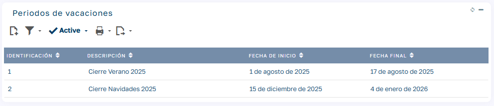
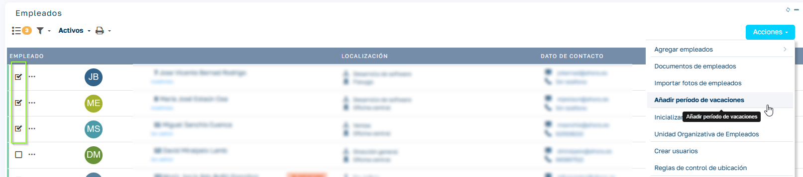

# Periodos Vacacionales

## ¿Qué es un período vacacional?

Un Período Vacacional es un rango de fechas definido por la empresa en el que un grupo de empleados debe disfrutar (total o parcialmente) de sus vacaciones. Este modelo es especialmente útil en organizaciones que realizan cierres colectivos, como por ejemplo:

  - Empresas industriales que paran en agosto.

  - Oficinas que cierran en Navidad o Semana Santa.

  - Departamentos con calendarios de vacaciones diferenciados.

## Objetivo del módulo

El módulo de Gestión de Períodos Vacacionales permite a RRHH:

  - Crear uno o varios períodos vacacionales en un año.

  - Asignar cada período a un grupo de empleados.

  - Forzar o recomendar la solicitud de vacaciones dentro de esos períodos.

  - Controlar y planificar la ausencia masiva de personal.

Si un empleado tiene una baja laboral activa en las fechas en que se aplica el periodo vacacional, los días que coincidan no se insertarán vacaciones para el empleado, ya que estas deberán ser reprogramadas para su disfrute una vez finalice la baja, conforme a la normativa vigente. 

## Acceso y navegación

  1. Inicia sesión en Sebastian HR.

  2. Ve a `Mantenimientos > Vacaciones y Ausencias > Períodos Vacacionales`.

La pantalla principal muestra:

  - Lista de períodos definidos.

  - Acciones disponibles: crear, editar, asignar a empleados, eliminar.

## Crear un período vacacional

  1. Pulsa + Nuevo Período.

  2. Completa los campos:

    - Descripción: Ej. “Cierre Agosto 2025”.

    - Fecha inicio / Fecha fin.

    - Tipo de asignación (informativo o restrictivo).

    - Activo: marca si debe estar disponible desde ya.

  3. Guarda el período.

> Puedes tener varios períodos en un mismo año siempre que no se asignen al mismo grupo de forma solapada.

## Asignar período a grupo de empleados

  1. En la lista de empelados

  2. Selecciona:

    - Los empleados a los que quieres aplicar el periodo vacacional

    - Desde el menú Acciones selecciona Añadir periodo de vacaciones

  3. Selecciona el periodo a aplicar y acepta el proceso

> Esta funcionalidad es ideal para aplicar de forma masiva el período vacacional a grupos enteros.

## Ejemplos prácticos

| Caso | Descripción | Ejemplo de período |
| --- | --- | --- |
| **Cierre total de verano** | Toda la plantilla toma vacaciones en agosto. | 01/08/2025 – 31/08/2025 |
| **Semana de Navidad** | Sólo administrativos cierran. | 23/12/2025 – 02/01/2026 |
| **Turnos escalonados** | Cada grupo tiene un período distinto. | Producción A: julio / Producción B: agosto |
