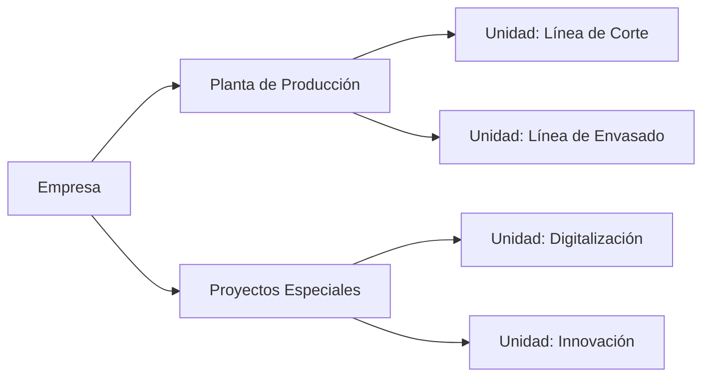

# Estructura de Unidades Organizativas Pro

Una unidad organizativa es una agrupación funcional y lógica que permite organizar, planificar y gestionar de forma conjunta un conjunto de empleados, independientemente de su departamento o área formal dentro de la empresa.

No debe confundirse con un _departamento_ o _sección administrativa_. La unidad organizativa puede representar:

- Un equipo de trabajo operativo (por ejemplo, "Producción turno mañana").

- Una zona o centro de actividad (por ejemplo, "Planta Norte" o "Proyecto Alfa").

- O cualquier agrupación temporal o permanente que la empresa necesite para planificar personal, horarios o tareas.

En resumen, las unidades organizativas son una forma flexible de organizar personas, pensadas para facilitar la gestión diaria y la planificación.

## ¿Qué es un grupo?

Dentro de cada unidad organizativa pueden existir grupos, que son subdivisiones más específicas de trabajo o colaboración.  
Sirven para organizar equipos más pequeños dentro de una misma unidad.

Por ejemplo:

- En la unidad _Producción Turno Mañana_, pueden existir grupos como _Línea de montaje 1_ o _Línea de montaje 2_.

Cada grupo puede tener:

- Un líder o supervisor.

- Una asignación de turno o actividad concreta.

El sistema permite que los grupos cambien de unidad con el tiempo, manteniendo siempre el histórico de sus movimientos y pertenencias.

## ¿Qué es un puesto de trabajo o posición?

El puesto de trabajo o posición describe la función o rol que desempeña un empleado dentro de la unidad organizativa o del grupo.

Por ejemplo: _Operario_, _Jefe de Equipo_, _Supervisor de Producción_, etc.

Cada empleado puede desempeñar funciones distintas a su puesto contractual. Esto permite reflejar la realidad operativa del día a día, donde un trabajador puede:

- Tener un puesto contractual (definido en su contrato de trabajo), que se usa para pagos y condiciones laborales.

- Y a la vez tener un puesto operativo dentro de su unidad organizativa actual, que indica las funciones que realiza en la práctica.

El sistema mantiene el historial de funciones y posiciones dentro de las unidades para poder consultar en qué rol se encontraba cada empleado en cualquier momento.

## Estructura organizativa vs. estructura del empleado

Es importante distinguir entre dos conceptos:

## Estructura del empleado

Está formada por los datos propios de cada persona, como:

- Departamento, Área y Responsable directo (definidos en la ficha del empleado).

- En versión LITE: se asigna una oficina directamente al empleado.

- En versión PRO: la oficina y el puesto provienen del contrato activo.

Estos datos describen la posición administrativa o laboral del empleado dentro de la empresa.

## Estructura organizativa Pro

Es una forma adicional y más flexible de organizar personas.  
Permite agrupar empleados de diferentes departamentos o contratos bajo unidades funcionales y grupos de trabajo, para planificar y gestionar de forma conjunta.

!!! example "Ejemplo"
    Un empleado puede pertenecer al departamento "Finanzas" (estructura administrativa), pero formar parte de la unidad organizativa "Proyecto Digitalización", donde colabora con personal de otras áreas.

## ¿Qué significa la planificación?

La planificación permite anticipar cambios en las unidades, grupos o puestos.  
Por ejemplo:

- Un empleado que pasará del grupo _Línea 1_ al grupo _Línea 2_ el mes que viene.

- Una nueva unidad que se activará para un proyecto en una fecha futura.

El sistema aplicará automáticamente los cambios cuando llegue el momento, garantizando que la información siempre refleje la situación real.

Esta funcionalidad ayuda a:

- Evitar errores administrativos.

- Preparar movimientos internos con antelación.

- Mantener actualizada la organización sin necesidad de hacerlo manualmente el mismo día del cambio.

## Cómo se registran los cambios

Cada vez que un empleado cambia de unidad, grupo o puesto:

- El sistema cierra la asignación anterior, marcando una fecha de finalización.

- Crea una nueva asignación con la información actualizada.

Así se conserva un histórico completo de movimientos, lo que permite saber:

- En qué unidad o grupo estaba una persona en una fecha determinada.

- Cuándo cambió de puesto o asumió nuevas funciones.

Nada se pierde: cada cambio queda documentado para futuras consultas.

## La jerarquía de unidades

Las unidades organizativas se estructuran en niveles jerárquicos, formando un árbol de relación entre áreas.  
Por ejemplo:

Esta jerarquía permite visualizar cómo se agrupan las distintas unidades y cómo los empleados se distribuyen dentro de ellas.

## ¿Qué utilidad tiene esta estructura?

La estructura organizativa de Sebastian HR permite:

- Organizar personas por funciones reales, más allá del organigrama clásico.

- Planificar y gestionar recursos humanos de manera flexible.

- Controlar y consultar los movimientos históricos de cada empleado.

- Visualizar la jerarquía de unidades, grupos y empleados en un mismo lugar.

- Preparar cambios futuros sin alterar la información actual.

En definitiva, ayuda a tener una visión operativa y funcional de la organización, complementaria a la visión administrativa.

## Cómo se ve en la aplicación

En la interfaz de Sebastian HR, los usuarios pueden:

- Navegar por la estructura organizativa para ver las unidades, grupos y empleados activos.

- Consultar en la ficha de un empleado:

    - Su unidad actual, grupo y función dentro de esa unidad.

    - Su historial de movimientos.

- Programar cambios futuros (como traslados o reestructuraciones).
