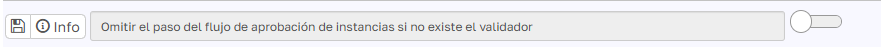
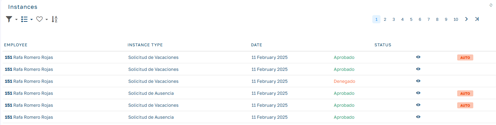

# Flujos de aprobación de Instancias

En el presente documento nos centraremos en cuál es el comportamiento de los flujos de aprobación en base a la parametrización existente y la ausencia o no de validador para un o varios de los pasos de la instancia.

Para conocer la funcionalidad general de la gestión de instancias visita los siguientes enlaces:

[Instancias I - Conceptos y flujo de aprobación](https://www.youtube.com/watch?v=JA8NGSR0bpY&list=PL9w4-AXXOetUYg92G8-dCIZ1MZ8IR_7Fp&index=13)

[Instancias II - Casos de uso](https://www.youtube.com/watch?v=YwhqGFkPVhI&list=PL9w4-AXXOetUYg92G8-dCIZ1MZ8IR_7Fp&index=14)

## Opción de todos los pasos

Como se muestran en los videos anteriores en cada flujo de instancia podemos indicar la opción de "Todos los pasos":

- Si **activamos** esta opción estaremos indicando que se generen todos los pasos de la instancia en el momento de añadir la instancia, esto hará que le aparezca a todos los validadores y la instancia podrá ser gestionada por cualquiera de ellos, aprobándose o denegándose en el momento que la gestione uno de los validadores.
- Si **no activamos** esta opción, los pasos se irán generando de forma secuencial en el orden que se indica en el flujo, hasta que el primer validador no apruebe su paso, no se generará el siguiente paso de validación. Cuando un validador de la secuencia deniega el paso, se deniega la instancia y no se generan los siguientes pasos.

Además podemos configurar como queremos que se comporte el flujo de validación en el caso de que para alguno/s de los pasos no exista el validador. (Por ejemplo si el paso tiene como validador el responsable del empleado y el empleado no tiene informado su responsable en la ficha del empleado). Para esto tenemos un parámetro en la configuración dentro del apartado aplicación:

## Flujo de un solo paso

| Omitir si no hay validador | Todos los Pasos | Validador | Resultado |
| --- | --- | --- | --- |
| OFF | OFF | Sin validador | La instancia se cancela. |
| OFF | OFF | Con validador | La instancia se aprueba o deniega según la acción del validador. |
| ON | OFF | Sin validador | La instancia se aprueba automáticamente. |
| ON | OFF | Con validador | La instancia se aprueba o deniega según la acción del validador. |
| OFF | ON | Sin validador | La instancia se cancela. |
| OFF | ON | Con validador | La instancia se aprueba o deniega según la acción del validador. |
| ON | ON | Sin validador | La instancia y la solicitud se aprueban automáticamente. |
| ON | ON | Con validador | La instancia se aprueba o deniega según la acción del validador. |

## Flujo de dos pasos (extrapolable a más pasos)

### Con todos los pasos = OFF

| Omitir si no hay validador | Todos los Pasos | Validador | Resultado |
| --- | --- | --- | --- |
| **OFF** | **OFF** | Sin validadores | La instancia y la solicitud se cancelan. |
| **OFF** | **OFF** | Paso 1 sin validador, Paso 2 con validador | La instancia se cancela al solicitarse (por ausencia de validador en el Paso 1). |
| **OFF** | **OFF** | Paso 1 con validador, Paso 2 sin validador | La instancia se cancela al validar el Paso 1 (por ausencia de validador en el Paso 2). |
| **OFF** | **OFF** | Ambos pasos con validadores | Flujo normal: cada paso se valida de forma secuencial. |
| **ON** | **OFF** | Sin validadores | La instancia y la solicitud se aprueban automáticamente (autoaccepted=true). |
| **ON** | **OFF** | Paso 1 sin validador, Paso 2 con validador | Se omite el Paso 1 y la gestión se delega al validador del Paso 2. |
| **ON** | **OFF** | Paso 1 con validador, Paso 2 sin validador | Al aprobar el Paso 1, se aprueba la instancia, omitiendo el Paso 2. |
| **ON** | **OFF** | Ambos pasos con validadores | Flujo normal: cada paso se valida de forma secuencial. |

### Con todos los pasos = ON

| Omitir si no hay validador | Todos los Pasos | Validador | Resultado |
| --- | --- | --- | --- |
| **OFF** | **ON** | Sin validadores | La instancia se cancela al solicitarse. |
| **OFF** | **ON** | Paso 1 sin validador, Paso 2 con validador | La instancia se cancela al solicitarse. |
| **OFF** | **ON** | Paso 1 con validador, Paso 2 sin validador | La instancia se cancela al solicitarse (por ausencia de un validador en alguno de los pasos). |
| **OFF** | **ON** | Ambos pasos con validadores | Cualquier acción de un validador decide el estado final de la instancia. |
| **ON** | **ON** | Sin validadores | La instancia se aprueba automáticamente. |
| **ON** | **ON** | Paso 1 sin validador, Paso 2 con validador | La gestión se delega al validador del Paso 2. |
| **ON** | **ON** | Paso 1 con validador, Paso 2 sin validador | La gestión se delega al validador del Paso 1. |
| **ON** | **ON** | Ambos pasos con validadores | Cualquier acción de un validador decide el estado final de la instancia. |

## Tipo no requiere validación

En el caso que definamos en algún paso del flujo que el tipo de validación `No requiere validación` la instancia se validará automáticamente en el momento en el que el usuario introduzca la instancia, esto será así aunque existan otros pasos en el flujo que tenga el validador definido.

## Coincidencia de validadores

En el caso que tengamos definido el flujo con el parámetro Todos los **Pasos = ON**, si en el momento de calcular los validadores de los pasos del flujo se obtiene el mismo validador en diferentes pasos del flujo solo tendrá en cuenta uno de los pasos asignados al validador, esto es no generará varias validaciones de la misma instancia a un mismo validador.

Por ejemplo, para validar unas vacaciones tenemos un flujo de dos pasos, el primer paso el tipo de validación es el responsable del empleado y el segundo paso es el responsable del departamento asignado al empleado. Si cuando calculamos el flujo ambos validadores son el mismo empleado, únicamente se le enviará una solicitud de gestión de instancia y no dos (una por cada paso)

## Auto validaciones

Podemos visualizar desde la lista de instancias mediante la etiqueta AUTO, si la instancia ha sido validad por parte de algún validador o si por el contrario ha sido validada automáticamente por la configuración de nuestro flujo y/o por la ausencia de validadores:

