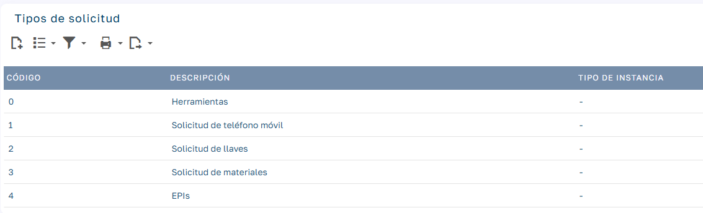
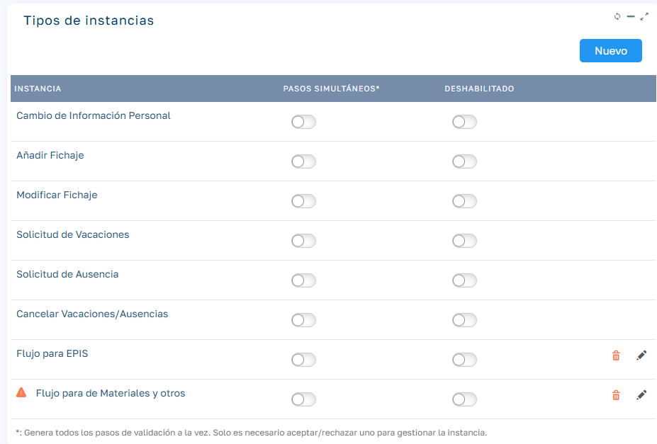
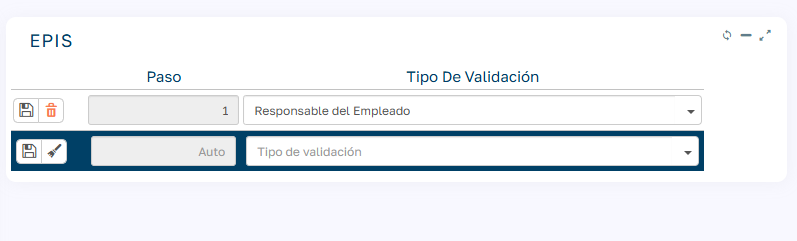
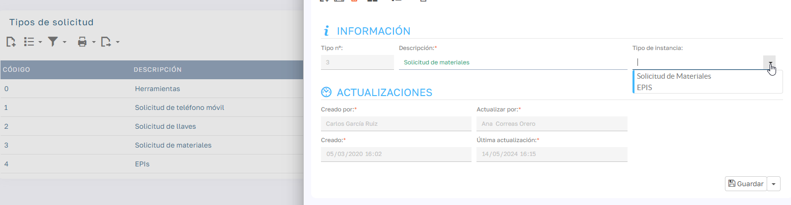
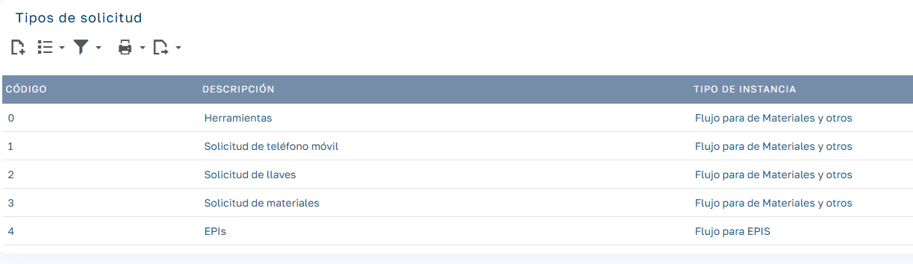
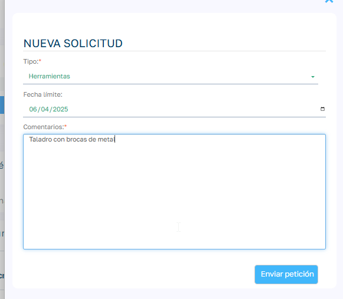

# Solicitudes con Flujos de Aprobación

Esta funcionalidad permite gestionar solicitudes a través de flujos de aprobación configurables.

Podremos distintos flujos de aprobación para cada uno de los tipos de solicitud que se creen en la aplicación.

## Características principales

- Creación de solicitudes: Los empleados pueden generar solicitudes para diversos procesos dentro de la empresa.  
- Flujos de aprobación personalizados: Se pueden definir diferentes etapas de aprobación, asignando responsables y condiciones específicas para cada instancia.  
- Seguimiento en tiempo real: Cada solicitud muestra su estado actual y el historial de aprobaciones.  
- Notificaciones por email: Los aprobadores reciben notificaciones cuando tienen una solicitud pendiente y los empleados las reciben cuando su solicitud es gestionada por los aprobadores.  
- Registro y auditoría: Todas las acciones quedan registradas para asegurar la trazabilidad del proceso.

Para saber más sobre le funcionamiento de flujos de aprobación de instancias visitar el siguiente enlace: [Flujos de aprobación de Instancias](FlujosInstancias.es.md)

## Configuración

### Tipos de solicitud

Comenzaremos creando los tipo de solicitud que queremos gestionar, para ello iremos a `Mantenimiento > Instancias > Tipos de Solicitud`

### Tipos de instancia de solicitudes

Existen tipos de instancias fijadas y definidas en el producto, para distintas gestiones como solicitar vacaciones, modificar un marcaje etc. Estos tipos de instancias siempre estarán disponibles y no se pueden modificar. 

Para el caso de la gestión de solicitudes por instancias crearemos tipos de instancias nuevos y si podremos gestionar de forma libre según las necesidades que tengamos, les llamaremos tipos de instancia de solicitud.

Daremos de alta los distintos tipos de instancia o flujos que queremos usar para el conjunto de solicitudes que tengamos. En este ámbito tenemos que entender el tipo de instancia como el flujo de validación que queremos aplicar, por tanto podemos usar un mismo tipo de instancia para varios tipos de solicitudes si el flujo de validación coincide para evitar crear tantos tipos de instancias como tipos de solicitudes, esto ya de penderá de nuestras necesidades.

Para dar de alta los tipos de instancia iremos a `Mantenimiento > Instancias > Tipos de Instancia`

Aquellas que podemos eliminar o editar son las instancias de solicitud que podemos dar de alta con el botón Nuevo de la parte superior del modulo.

Cuando veamos un triangulo de warning al lado de la instancia quiere decir no se ha definido el flujo de validadores

El flujo de validación se configura de la misma forma que en el resto de instancias, añadiendo los distintos pasos de validación y cuales son sus tipos de validador.

### Asignar tipos de instancia a tipos de solicitud

Para finalizar la configuración nos faltaría volver a los tipos de instancia e indicar a cada tipo de solicitud el tipo de instancia que gestiona su flujo de aporbación. Para ello simplemente tenemos que seleccionar el tipo de instancia en el campo correspondiente del tipo de solicitud:

### Petición de solicitudes por parte de los empleados

En el dashboard del empleado tenemos una nueva opción para realizar peticiones de solicitudes:

Nos mostrará el formulario para realizar la solicitud:

Indicaremos el tipo solicitud de entre todas las que estén disponibles en el sistema, podremos indicar una fecha límite si fuera necesario y un comentario especificando concretamente lo que estamos solicitando.

Una vez realizada la petición, el empleado podrá visualizar su nueva petición dentro del apartado Instancias Pendientes:  

De aquí en adelante el funcionamiento es el mismo que para el resto de instancias que ya conocemos.
