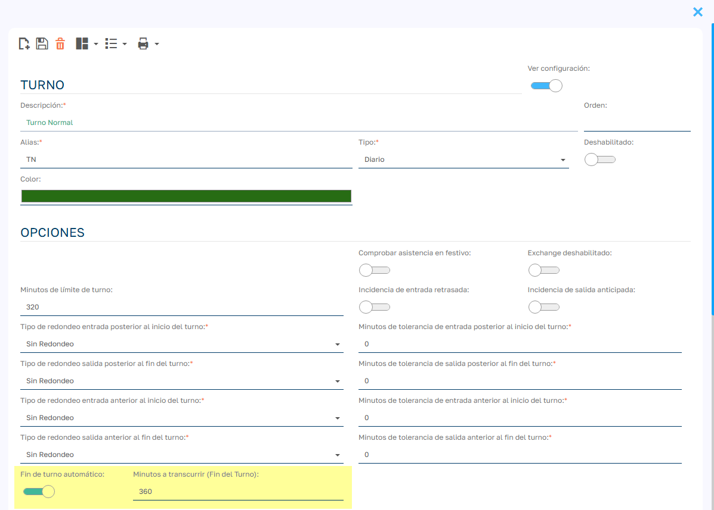

# Automatizar cierre de fichajes pendientes

En Sebastian HR, la funcionalidad de cierre automático de fichajes permite gestionar de manera eficiente los casos en los que los empleados no registran su salida al final de la jornada laboral. A continuación, se explica cómo configurarla paso a paso.

## Configura el turno con el cierre automático

1. Dirígete a `Mantenimiento > Turnos`.
2. Selecciona el turno correspondiente.
3. Haz clic en el check “Ver configuración” para desplegar los campos adicionales.
4. Marca el check “Fin de turno automático”.
5. Establece el número de minutos tras la hora planificada de fin del turno, después de los cuales el sistema cerrará automáticamente el fichaje.

_Por ejemplo, si el turno finaliza a las 18:00 y configuras 10 minutos, el sistema considerará que a las 18:10 el empleado ha terminado su jornada y cerrará su fichaje automáticamente._

## Asegúrate de que la tarea cron esté activa

La automatización funciona gracias a una tarea programada (cron job). Para verificar su estado:

1. Accede a `Admin. área > Lógica y reglas > Tareas Cron`.
2. Busca la tarea llamada “AutoEndOfShift_Markings”.
3. Comprueba que esté activada.

Si no está activa, simplemente habilítala para que el sistema pueda procesar los cierres de fichajes pendientes de forma automática.
