# Bolsa de horas

Antes de abordar la lectura de este artículo es conveniente la lectura y comprensión del articulo [Gestión de tiempo extra](GestionTiempoExtra.es.md)

El objetivo de las bolsas de horas es únicamente la liquidación de las horas asignadas a la bolsa, es decir no pretende ser un acumulador de horas en el que se vayan asignado y desasignando horas, a una bolsa de horas se le asignan un conjunto de registros de horas para ser liquidadas en su totalidad. O dicho de otra forma no tiene sentido asignar horas a una bolsa de horas si no vamos a proceder a su liquidación de forma inmediata.

Para generar las bolsas de horas partimos del registro de tiempo extra. En el podemos activar el preset “Bolsa Pendiente” (1) y nos filtrará todos aquellos registros de tiempo extra de empleados que se gestionan vía bolsa de horas y todavía no tienen bolsa asignada.

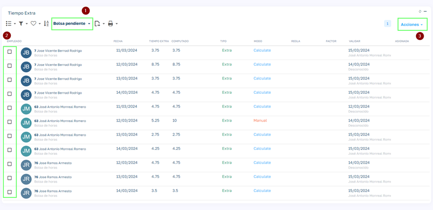

Filtramos los registros que queramos pasar a bolsa de horas (2) y en Acciones seleccionamos la opción “Generar Bolsa”. El proceso agrupa las horas de cada empleado y le genera una bolsa de horas para cada uno de ellos.

La gestión de la bolsa de horas la hacemos desde la opción “Horas de Bolsa” del menú lateral principal, accediendo a la lista de objeto bolsa de horas.

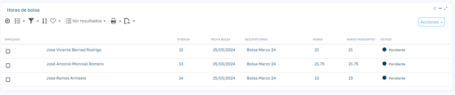

Las bolsas de horas se generan en estado pendiente.

La gestión a realizar con cada bolsa de horas se divide en dos pasos:

1. **Compensar**: En este paso lo que hacemos es en saldar las horas de la bolsa con un abono en nómina o con tiempo de descanso.
2. **Liquidar**: Una vez compensada, el proceso de Liquidar transforma el desglose realizado de la bosa de horas, en los propios abonos de nómina o días/horas de tiempo libre.

## Proceso de compensación

!!! warning "Requisito previo"
    Para compensar por días de vacaciones el empleado debe tener definidos los totales de vacaciones por año previamente.

Cuando hacemos clic en un registro de bolsa de horas se abre la página para realizar el saldo del total de horas de la bolsa.

Nos aparece el módulo de líneas de bolsa vacío y debemos añadir líneas hasta saldar el total de horas y que la columna horas pendientes sea 0 o menor que cero, en ese momento el estado pasa de Pendiente a Compensado.

Cuando añadimos líneas tendremos que indicar:

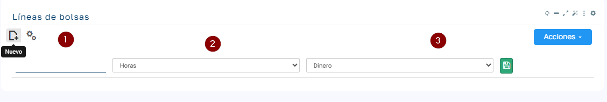

1. Cantidad
    1. En caso de seleccionar Días en (2) aquí no se permitirá un valor decimal.
2. Unidad de Compensación (Horas o Días):
    1. En caso de que en (3) seleccionemos Dinero, se deben convertir los días en horas para pagar ese número de horas por el precio de hora extra del empleado. Un día equivale al número de horas indicado en el convenio del contrato del empleado, en el campo _Max.Horas Diarias._

1. Método de Compensación (Dinero, Descanso, Ajuste)
    1. Ajuste: Esta opción es para compensar parte de las horas sin vincular contraprestación a ese número de horas. (p.e. picos de horas que queremos saldar sin dinero ni descanso)
    2. Dinero: se generará un abono de nómina al liquidar la bolsa de horas.
    3. Descanso: se generará días u horas de descanso. Los días se añadirán al total de vacaciones del empleado y las horas se añadirán a un contador de horas de vacaciones del empleado, si no existe se creará y si existe se asignará al más reciente en caso de tener varios contadores de este tipo activos.

En el menú Acciones tenemos opciones para automatizar la compensación del saldo pendiente de la bolsa en las opciones que se ven a continuación:

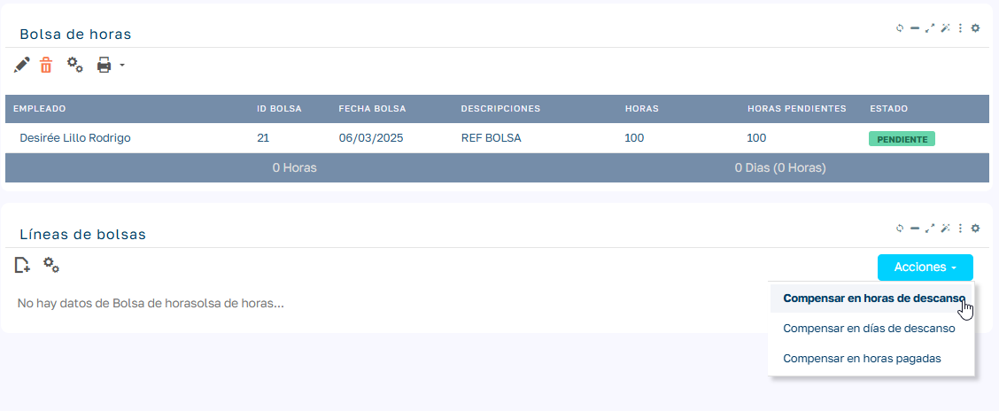

- **En horas de descanso**: incluye todo el saldo pendiente en una línea de tipo Horas Descanso.
- **En días de descanso**: divide el saldo pendiente por el valor del campo _Max.Horas Diarias_ del convenio del empleado y si no es exacto, añade una línea de ajuste.
- **En horas pagadas**: incluye todo el saldo pendiente en una línea de tipo Horas Dinero.

Como decíamos una vez el sumatorio de las líneas nos salde las horas de la bolsa, el estado de la bolsa pasa a compensado.

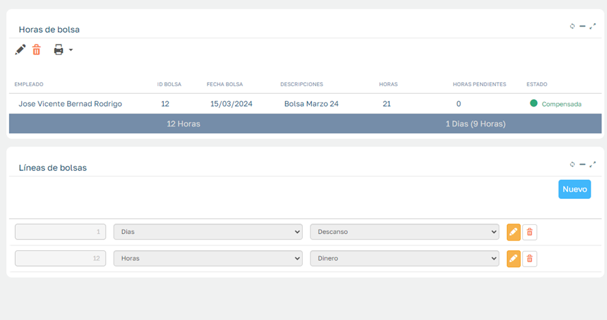

Las bolsas en estado Compensado ya pueden ser Liquidadas.

## Proceso de liquidar bolsa

Podemos filtrar las bolsas de horas Compensadas para seleccionarlas.

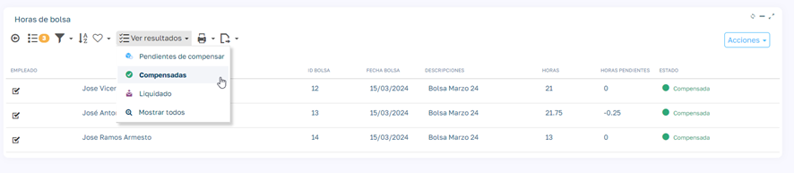

Desde el botón Acciones pulsamos la opción Liquidar.

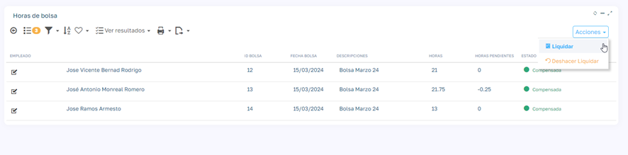

Nos pedirá la fecha a liquidar:

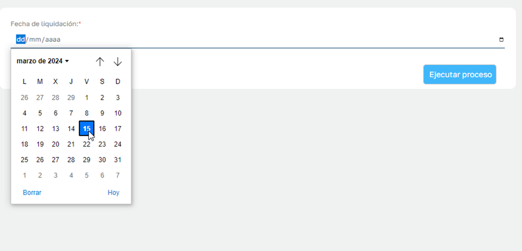

Esta fecha será la fecha en que se generen los abonos de nómina para las líneas de Dinero, para las líneas de descanso en cambio determinarán el año al que deben acumularse los días/horas de descanso.

Una vez liquidada podemos acceder a la bolsa de horas y visualizamos las salidas que ha generado la liquidación en el ejemplo un abono de nómina de 120 € y un día de descanso por compensación de bolsa de horas.

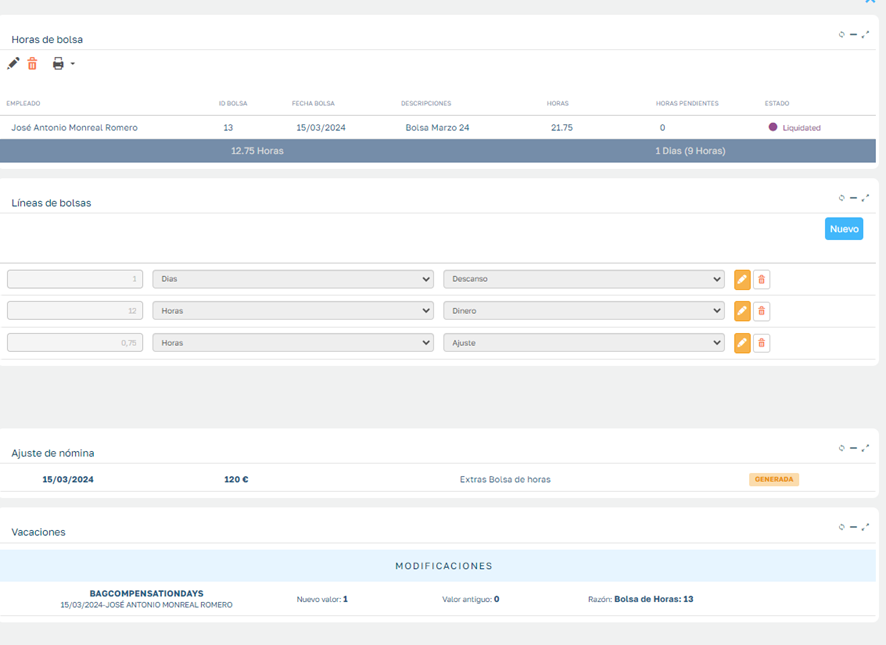

Esto también lo vemos reflejado en los datos de cada empleado:

Acumulados de vacaciones

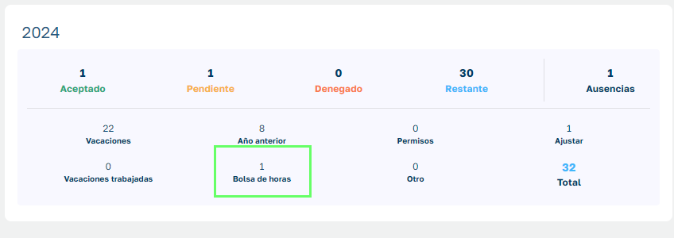

Abonos de nómina del empleado

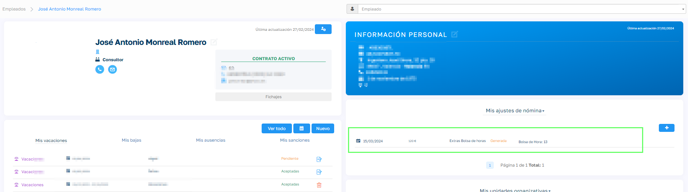

## Proceso de deshacer liquidación

El proceso de liquidación de bolsa se puede revertir, desde el proceso Deshacer Liquidación que está disponible en el mismo lugar que el proceso de Liquidar.

El proceso de deshacer liquidación:

1. Elimina los abonos de nómina vinculados (siempre y cuando no hayan sido asignados a una liquidación de nómina en cuyo caso no permitirá deshacer la liquidación de bolsa)
2. Resta las horas/días de descanso de los totales de vacaciones anuales del empleado, si este proceso dejara este contador en negativo, el empleado deberá días a la empresa y el proceso de deshacer liquidación se ejecutaría normalmente.
