# Casos de Uso de Fichajes de Empleado

###   

### Consideraciones previas

En este documento no vamos a tener en cuenta los casos especiales de configuración de descansos que pueden modificar el comportamiento y la generación de fichajes, estos casos los podemos consultar en los siguientes documentos: 

[Descuentos automáticos de descansos de la jornada](DescuentoAutomaticoDescansos.es.md)

[Aplicar descansos mínimos](DescansoMinimoTurno.es.md)

El turno de ejemplo tiene configurado que se deben fichar los descansos y al no ficharlos en estos ejemplos, se computarán como tiempo trabajado.

En los casos de uso vamos a tener en cuenta que la secuencia de Entradas y Salidas de los fichajes sea correcta, es decir, no vamos a tener en cuenta que por errores de introducción del usuario se generen dos entradas o dos salidas consecutivas, en ese caso el sistema indica una incidencia de “Relación incorrecta de fichajes” que habría que subsanar, aunque el sistema si es posible intenta gestionar estas situaciones y establecer un emparejamiento, por ejemplo en el siguiente caso el sistema ignora la segunda salida consecutiva, aunque te indica que la jornada tiene incidencias de fichaje:

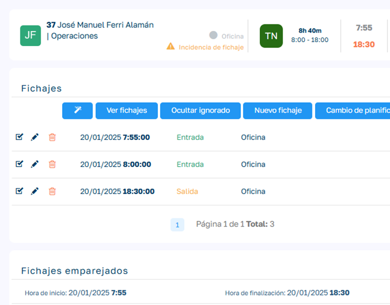

  

 _Por tanto, nos vamos a centrar en cómo se desarrolla el cálculo de asignación de turnos y fechas a los fichajes, es decir, como la aplicación sabe a qué turno y a que fecha tiene que asignar cada uno de los fichajes en cada situación._

  

### Términos Importantes

  

  * Empleado de Tipo Planificado (ETP): Estos empleados son los que en su ficha de empleado tienen el campo _Tipo de gestión de fichaje_ con el valor “Planificado” o NULO.
  *Empleado de Tipo Sin Planificar (ETSP): Estos empleados son los que en su ficha de empleado tienen el campo _Tipo de gestión de fichaje_ con el valor “Sin Planificar”.
  *Empleado Planificado a Fecha (EPF): Estos son empleados ETP que además tienen adjudicada una planificación o turno para la fecha en cuestión.
  *Empleado Planificado Sin Planificación Fecha (ESPF): Estos son empleados ETP que no disponen de una planificación de turno para la fecha en cuestión.
  *Ventana de Jornada (VJ): Es el rango de horas en el que los fichajes se van a asignar a una misma jornada. Podemos configurar la separación mínima de horas entre jornadas (`MinBreakBetweenWorkingDays`) y el número máximo de horas que puede durar una jornada (`MaxJourneyHours`). Si un fichaje excede estas condiciones, se considerará el inicio de una nueva jornada. Por tanto, la ventana de jornada va a depender de la planificación del empleado, de la secuencia de fichajes que vaya realizando e incluso de los posibles fichajes posteriores.
  
  * Descanso mínimo entre días laborables (en horas): Parámetro de la aplicación (`MinBreakBetweenWorkingDays`). Si el tiempo transcurrido desde el último fichaje es igual o superior a este valor, se infiere que estamos fichando para la jornada siguiente. Para los ejemplos de este documento tendremos configurado este parámetro a 10 horas (valor por defecto).

  * Horas hasta nueva jornada (en horas): Nuevo parámetro de la aplicación (`MaxJourneyHours`). Este parámetro solo tiene efecto si su valor es mayor que cero. Si el tiempo transcurrido desde el _primer fichaje_ de la jornada actual supera este valor y el fichaje actual es en una fecha diferente a la del inicio de la jornada, el sistema inferirá que se trata de una nueva jornada. Esto evita que jornadas excepcionalmente largas se extiendan indefinidamente a través de múltiples días si hay un corte lógico para crear una nueva jornada. Para los ejemplos de este documento tendremos configurado este parámetro a 12 horas. 

* Algoritmo de cálculo y asignación de fichajes (ACAF): Es el proceso por el cual se realiza la asignación de un turno y una fecha de jornada a un fichaje determinado. Además, también se encarga de establecer los pares de fichajes, enlazando las entradas con sus correspondientes salidas.
*Recalcular Jornada (RJ): Este proceso se ejecuta sobre una jornada determinada (fecha) y tiene en cuenta la secuencia de fichajes de esa jornada y de las siguientes siempre y cuando estas jornadas siguientes no estén en estado validado o sus fichajes fijados a su jornada. A partir de un fichaje validado o fijado ya no se tienen en cuenta los siguientes. Por tanto, dependiendo de las VJ que se encuentre en la secuencia de fichajes y la situación de estos (validados/generados o fijados/no fijados) puede trasladar fichajes de una jornada a otra para cumplir las secuencias de fichaje de cada VJ.
*Proceso de Asignar Jornada a Fichajes (PAJF): Este proceso se ejecuta sobre un conjunto de fichajes para asignarles una jornada determinada que normalmente diferirá de la que se ha calculado en ACAF.  Estos fichajes afectados por el proceso se marcan como con “Jornada Fijada”, esto se tendrá en cuenta en procesos como ACAF o RJ para no reasignarle la jornada que devuelvan esos procesos para ese fichaje.

* Fichaje Cerrado (FC): Cuando se valida la jornada de un empleado todos sus fichajes pasan a estado cerrado, esto quiere decir que no se permitirá la reasignación de fecha de jornada y turno en ese fichaje.
*Fichaje con Jornada Fijada (FJF): Un fichaje con la jornada fijada impide su reasignación de turno y fecha de jornada. Por defecto al generar un fichaje nuevo y asignársele el turno y fecha jornada por parte de ACAF, se le fija la jornada. El personal de RRHH puede desfijar el fichaje desde la lista de fichajes de la jornada del empleado.

### Lógica General

#### Fichaje secuencial

En términos generales la lógica de asignación de fichajes a una jornada determinada depende de si el empleado es un empleado planificado o un empleado sin planificar.

Empleados Planificados: El empleado planificado tiene asignado un turno (horario) para una fecha determinada. Cuando el empleado ficha se le asigna el turno planificado y la fecha de jornada del fichaje. Si ficha fuera de los límites del turno, el sistema permitirá fichar, pero se mostrará una incidencia en la jornada del empleado. El sistema permitirá fichajes consecutivos asignándolos a la misma jornada hasta que uno de los fichajes se localice dentro de los límites del turno de la siguiente jornada o exista una separación con el fichaje anterior que supere la separación mínima entre jornadas (`MinBreakBetweenWorkingDays`), o bien la duración total desde el primer fichaje de la jornada exceda las `MaxJourneyHours` y el fichaje actual sea de un día diferente al inicio de la jornada. 

  

Empleados sin Planificar: Estos empleados al fichar por primera vez se les asigna un turno genérico “Sin Planificación” y se les asigna la fecha de jornada del fichaje. En los siguientes fichajes se asignará el mismo turno y fecha de jornada del fichaje anterior hasta que se realice un fichaje que tenga una separación con el fichaje anterior que supere la separación mínima entre jornadas (`MinBreakBetweenWorkingDays`), o bien la duración total desde el primer fichaje de la jornada exceda las `MaxJourneyHours` y el fichaje actual sea de un día diferente al inicio de la jornada. 

Un empleado de tipo Planificado que no tenga planificación asignada actúa como un Empleado sin Planificar.

#### 

#### Edición de la secuencialidad de Fichajes

El personal de RRHH puede editar la secuencialidad de los fichajes del empleado, por varios motivos como por ejemplo que un empleado se haya olvidado de realizar un determinado fichaje. 

Estos cambios pueden modificar la separación mínima de jornadas o la duración máxima de la jornada y, por tanto, se deben recalcular tanto el nuevo fichaje como los fichajes posteriores del empleado para preservar la lógica de asignación explicada anteriormente. 

### Empleados de Tipo Planificado

  

### Empleado planificado para la jornada actual (EPF)

  

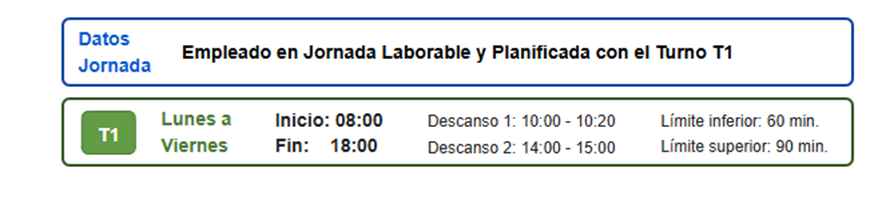

  

Caso de Uso - Fichar dentro de los límites del turno: Es el fichaje más habitual, se asignan turno y fecha correspondiente y no se genera ningún tipo de incidencia.

  

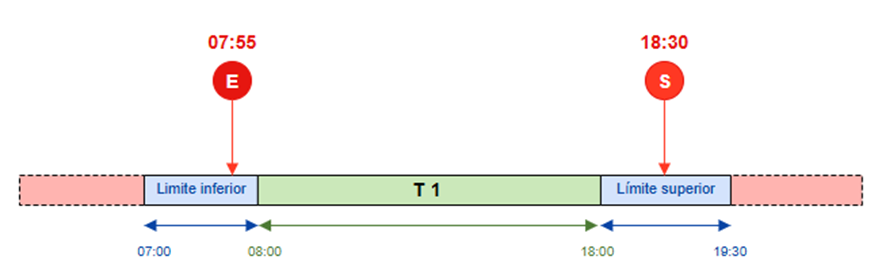

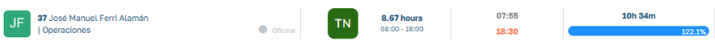

  

  

Caso de Uso - Fichar entrada antes del inicio de límite inferior del turno : asignará el turno planificado y mostrará una incidencia de Fichajes fuera de límites del turno. Este caso también contempla el caso de que la salida sea fuera de los limites superior del turno.

  

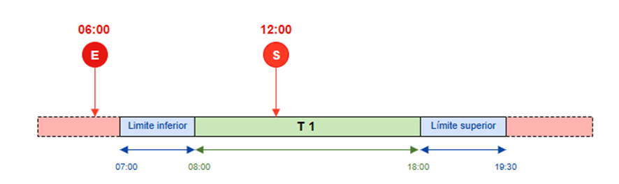

  

  

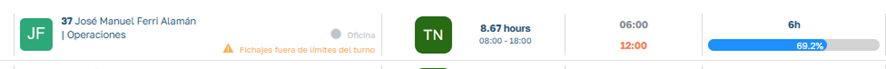

  

ACAF en primera instancia no puede establecer el turno del fichaje de entrada por ficharse fuera de los límites del turno, pero al estar el empleado planificado con un turno para esa fecha se le asigna ese turno planificado. La fecha de la jornada se establece a la fecha del fichaje al no tener fichajes anteriores que puedan variar este cálculo.

Caso de Uso – Excesos extraordinarios en la jornada: En situaciones puntuales, por cualquier motivo, puede darse el caso que empleado tenga que continuar realizando fichajes fuera de los limites superiores del turno que tiene asignado para ese día, incluso excediendo en los fichajes la fecha en que se comenzó a trabajar (fichar en dos días diferentes dentro de la misma jornada de trabajo).

En estos casos, ACAF va a ir calculando si cada fichaje pertenece a la VJ actual o ya debe generar una nueva jornada. Para esto, lo que hace es asignar fichajes a la jornada actual hasta que exista una separación con el fichaje anterior que exceda la`MinBreakBetweenWorkingDays` (en el ejemplo, 8 horas), o bien la duración total desde el primer fichaje de la jornada exceda las `MaxJourneyHours` (en el ejemplo, 12 horas) y el fichaje actual sea en una fecha diferente a la del inicio de la jornada, o finalmente, el nuevo fichaje se encuadre dentro de los límites del turno de la siguiente jornada. 

Vamos a poner un caso extremo pero que nos va a servir para ver cómo se comporta el sistema en cualquier variante de fichajes que contemple el esquema siguiente:

  

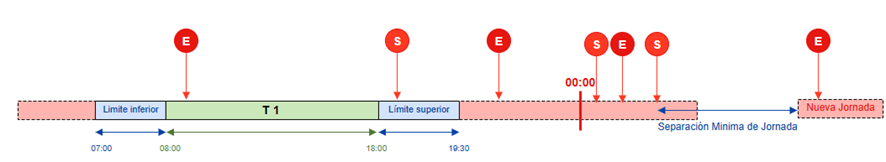

  

  

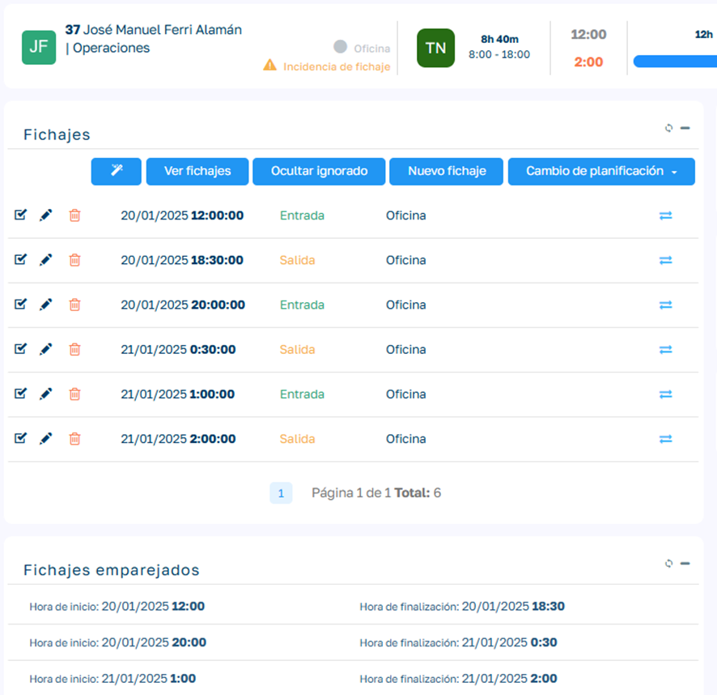

  

  

Como vemos esta asignado toda la secuencia de fichajes a la jornada actual (20/01/2025) aunque existan fichajes con fecha del día siguiente, ya que entiende que son pertenecientes a la misma VJ, esto será así hasta que exista un fichaje que supere las 10 horas de separación (parámetro) o este se encuadre dentro del límite del turno de la siguiente jornada (en el ejemplo un fichaje que supere las 7 am, límite inferior del turno asignado al empleado para la siguiente jornada)

Caso de Uso – Edición/inserción de fichajes en una jornada que tiene una jornada posterior sin validar o sin fijar jornada en fichajes En/Sn:

Una vez el empleado ha fichado, los usuarios con Rol de HR pueden realizar modificaciones o nuevas inserciones de fichajes, ya sea por olvidos o equivocaciones del empleado a la hora de fichar. Cuando realizamos esto dentro de los límites del turno, el funcionamiento es el habitual, pero hay casos menos habituales que tenemos que conocer cómo se comporta ACAF.

En este ejemplo tenemos fichajes en una jornada (E1,S1) y fichajes en una jornada posterior que tenemos sin validar y sin fijar jornada (En,Sn) :

  

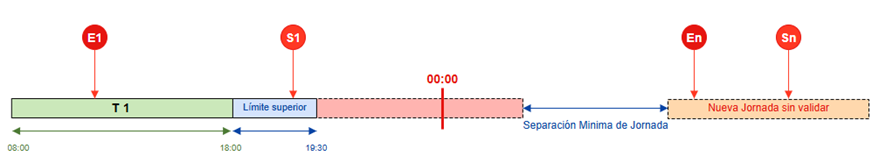

  

Para este ejemplo vamos a introducir dos nuevos fichajes (E2,S2) que rompan la separación mínima de jornadas:

  

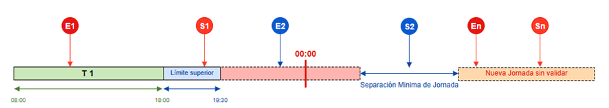

  

  

Aquí se va a comportar de dos formas distintas según estemos: 

  1. Insertando/modificando fichajes E2/S2 : En este caso En y Sn permanecerán en la jornada en la que están asignados.
  2. Lanzando el proceso RJ sobrela jornada actual: En este caso En y Sn _pasaran a formar parte de la jornada actual_ junto a E1, S1, E2 y S2 porque pertenecen a la misma VJ.

Caso de Uso – Edición/inserción de fichajes en una jornada que tiene una jornada posterior validada o los fichajes En/Sn tienen fijada la jornada:

En este caso los fichajes En y Sn no van a cambiar de jornada ya que se da el caso de que están en una jornada validada o existe un fichaje fijado a la jornada (En) a partir del cual los fichajes siguientes a él actúan como fijados, aunque no lo estén.

  

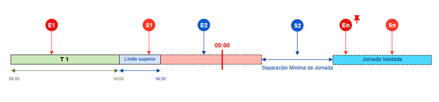

  

### Empleado sin planificación (ETSP)

Este tipo de empleados actúan siempre sin planificación, lo cual implica que no van a tener un tiempo teórico de trabajo. Como veíamos en el apartado Lógica General , el empleado irá realizando fichajes sobre la jornada de inicio del primer fichaje hasta que se genere una nueva VJ, considerando tanto`MinBreakBetweenWorkingDays` como `MaxJourneyHours`. 

  

  

### Empleado sin planificación para la jornada actual (ESPF)

Estos empleados que siendo ETP no tienen planificado un turno para una fecha, actuarán como si tratasen de ETSP para esa fecha.

El sistema nos advertirá que existe una incidencia en la planificación del empleado ya que es un empleado que se espera que tenga un planificación y no la tiene. Además vemos que el tiempo previsto de jornada es 0 horas y con turno no asignado.

Pese a ello el sistema permitirá registrar los fichajes del empleado. 

  

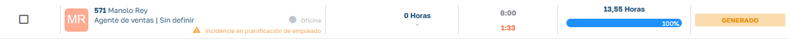

  

  

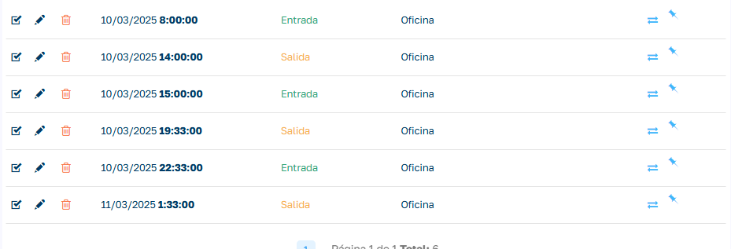

  

En estos casos, si es necesario, ya sea porque se nos olvido planificarlo o cualquier otro motivo, podemos asignar el turno a la jornada del empleado para que se recalcule el horas realizadas en base a las horas teóricas del turno. Para ello vamos al detalle de fichajes del empleado y seleccionamos la opción _Cambiar Turno,_ seleccionamos el turno que queremos aplicar y ser regenera la jornada del empleado con los nuevos datos de planifcación:

  

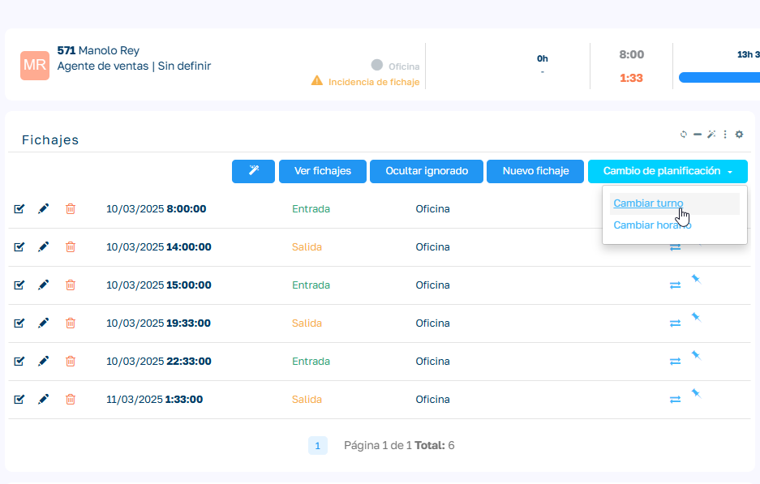

  

Vemos aquí la jornada ya replanificada:

  

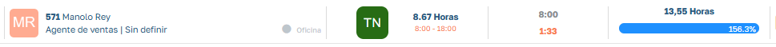