# Contadores de Horas

Los Contadores de Horas en Sebastian HR permite la definición y gestión de contadores de diferentes tipos para llevar un control preciso de las horas trabajadas por los empleados. Con esta funcionalidad, se pueden clasificar las horas según distintos criterios y realizar un seguimiento detallado de su distribución.

## Tipos de contador

Para empezar a usar los contadores de horas debemos generar los tipos de contador que vamos a utilizar en la aplicación. Un tipo de contador es las distintas agrupaciones de contadores de horas que queremos realizar.

Para darlos de alta iremos a la opción `Mantenimiento > Tablas Maestras > Tipos de contador`.

Para darlos de alta indicaremos la descripción del tipo de contador.

Si estamos dando de alta el tipo de contador que vamos a destinar para liquidar las horas de vacaciones generadas desde una bolsa de horas extras marcaremos la opción "Vacaciones por horas", lo normal es que solo tengamos un tipo de contador con esta opción marcada.

En caso de que en algún momento queramos dejar de usar un tipo de contador que ya tenga contadores asociados no podremos eliminarlo al tener ya registros de horas asociados, así que lo que podremos hacer es deshabilitarlo con la opción correspondiente para dejar de usarlo.

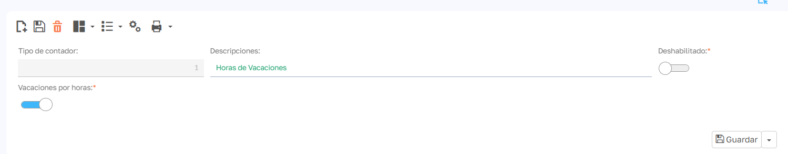

Para los ejemplos de este documento vamos a dar da alta tres tipos de contador:

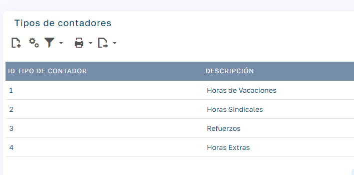

El contador 1 estará marcado como "Vacaciones por horas" y el resto no.

## Contadores

Un contador de horas nos servirá para contar el registro de horas de un empleado para un tipo de contador. Un empleado puede tener varios contadores del mismo tipo.

Para contabilizar el saldo de horas, cada contador dispone de un registro de líneas positivas o negativas en función de si son horas a favor del empleado (positivas) o en el debe del empleado (negativas).

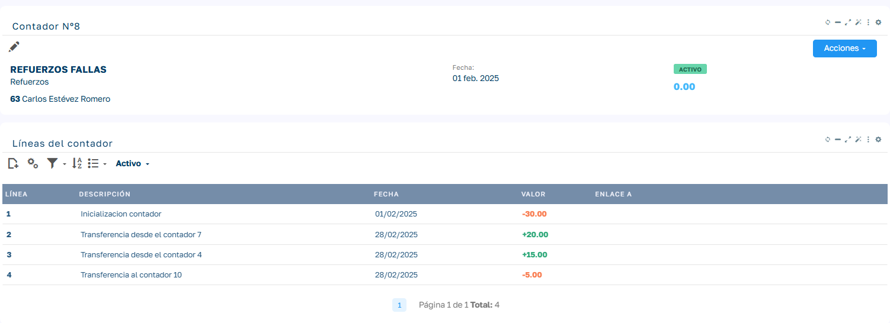

Los contadores pueden estar en uno de los 2 estados siguientes:

- **Activo**: En este estado el contador esta habilitado para generar líneas de contador nuevas o recibirlas de los procesos asociados a los contadores.
- **Cerrado**: Cuando cerramos un contador estamos indicando que ya no se pueden introducir más líneas en ese contador (salvo excepciones de introducción de líneas automatizadas por procesos de liquidación).

## Alta de contadores de forma manual

Para acceder a la lista de contadores de horas lo haremos desde `Menú Lateral > Contadores de horas`, desde aquí accederemos a la lista de contadores que por defecto se carga con un preset de los contadores activos.

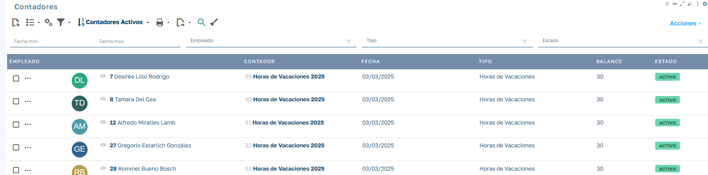

Para dar de alta un contador de forma manual, desde la cabecera de la lista de contadores pulsaremos el botón Nuevo Contador de la barra de herramientas y rellenaremos los datos que se solicitan.

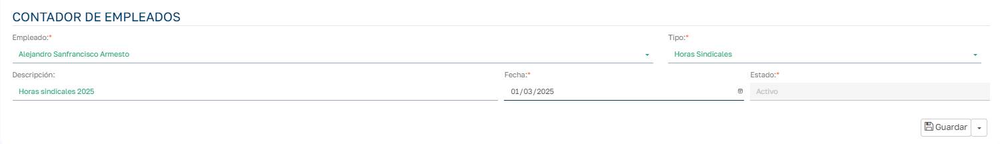

Al crear un contador de esta forma, el saldo del contador estará a cero hasta que no introduzcamos líneas en el contador, esto lo podremos hacer desde el módulo de líneas botón Acciones - Nuevo:

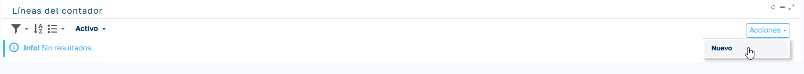

Esto nos pedirá los datos necesarios para generar la línea de contador:

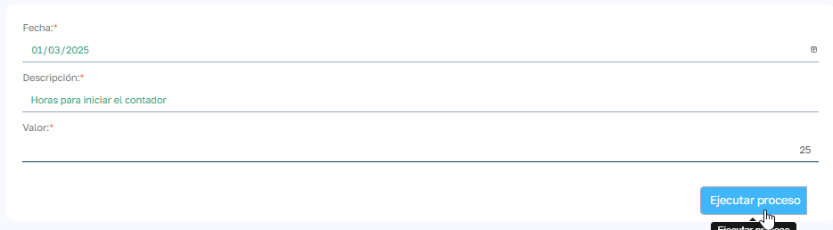

De esta forma ya tendremos un saldo inicial del contador:

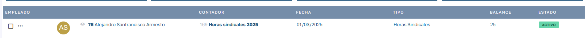

## Alta de contadores e inicialización de forma masiva

En ciertas situaciones podemos requerir generar contadores de una sola vez para varios empleados. Para esto iremos a la lista de empleados, marcaremos los empleados a los cuales les queremos generar un contador de un tipo determinado y seleccionamos el proceso _Inicializar Contador_

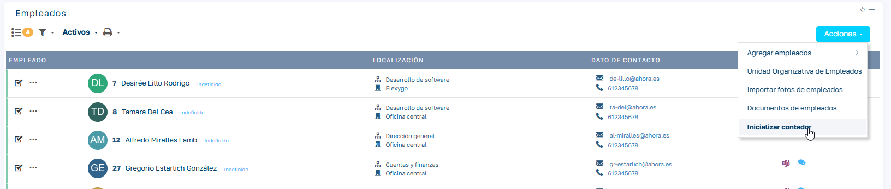

Completamos los datos requeridos para ejecutar el proceso:

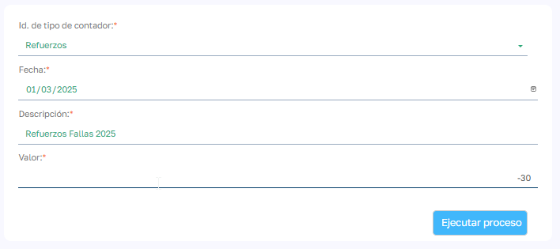

Este proceso genera un contador para cada empleado seleccionado, del tipo que indiquemos en los parámetros de entrada del proceso y generará una línea de inicialización del contador, que para este ejemplo vemos que es negativa porque estamos indicando que los empleados deben esas horas. Al ejecutar el proceso se generan los contadores correspondientes:

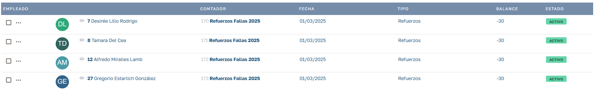

## Añadir líneas a contadores de forma masiva

Desde la lista de contadores podemos seleccionar varios contadores y ejecutar el proceso `Acciones > Añadir Linea`:

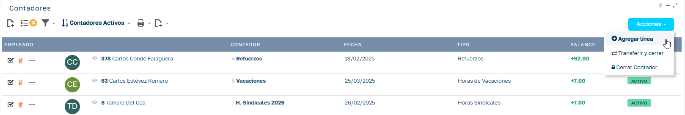

Nos pedirá la fecha de registro, la descripción de la línea y el número de horas a registrar:

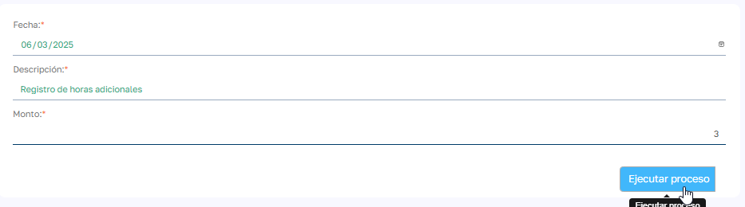

Añadiendo la línea a cada uno de los contadores seleccionados siempre y cuando estos contadores estuvieran Activos:

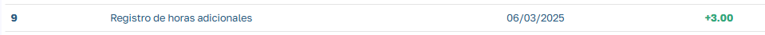

## Automatización de líneas

Podemos configurar la aplicación para que en ciertos procesos se generen líneas de forma automática en los contadores de los empleados.

### Automatización por vacaciones y ausencias

Podemos configurar los tipos de ausencia para que al insertar una ausencia de ese tipo a un empleado genere una línea de contador descontado (en negativo) las horas indicadas en la ausencia. Señalar que esta opción solo estará disponible para ausencias creadas en los grupos "Ausencias Justificadas" y "Vacaciones por Horas" y en el caso se configuren como ausencias parciales (por horas), ya que se necesita que se indiquen las horas que se van a descontar.

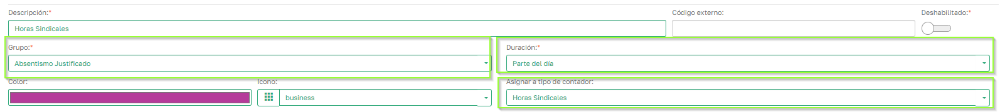

Al generar una ausencia de este tipo para un empleado en una fecha y horario definido, cuando la ausencia pase a estado _Aceptado_ se generará una línea sobre el contador abierto de ese tipo que tenga el empleado, si no existe lo crea y si existe más de uno en estado abierto selecciona el más reciente.

La línea de contador queda ligada a la ausencia generada con lo que si eliminamos la ausencia o la cambiamos a un estado distinto de aceptado, la línea del contador se eliminara de forma automática. Si el contador está cerrado no se podrá modificar la ausencia.

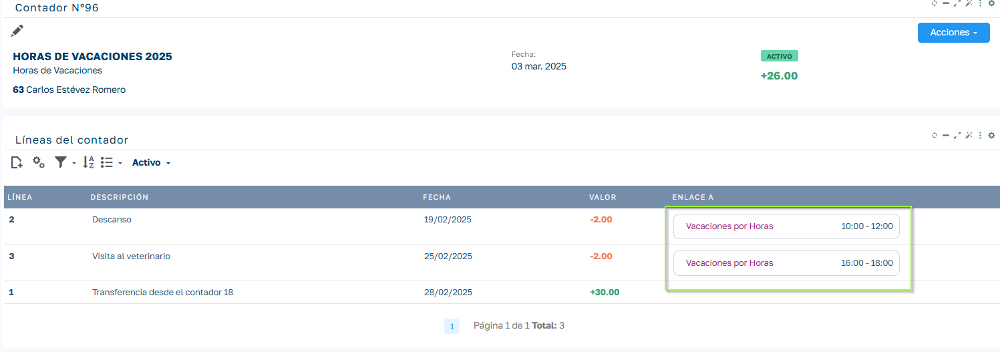

### Automatización por validación de jornada

Podemos configurar los turnos para indicar que cuando un empleado realice horas sobre esos turnos se generen líneas de contador añadiendo horas en positivo a un contador determinado.

Para hacerlo iremos al turno en cuestión e indicaremos el tipo de contador que tiene que usar. Con la opción _Contar solo el exceso de trabajo_ en caso de activarlo solo tendrá en cuenta las horas que hayan excedido del turno y en caso de no activar generará la línea con el total de horas fichadas por el empleado ese día en ese turno. Con la opción _Contar solo el déficit de trabajo_ en caso de activarlo solo tendrá en cuenta las horas que no se hayan realizado del tiempo previsto del turno planificado. En caso de activar una de estas dos opciones podremos indicar los minutos mínimos de exceso o déficit para empezar a contar estos tiempos y podremos indicar si queremos establecer un redondeo a minutos.

Ejemplo redondeo: Con valor 15:

- 7 minutos → se redondea a 0
- 8 minutos → se redondea a 15
- 23 minutos → se redondea a 15
- 38 minutos → se redondea a 30

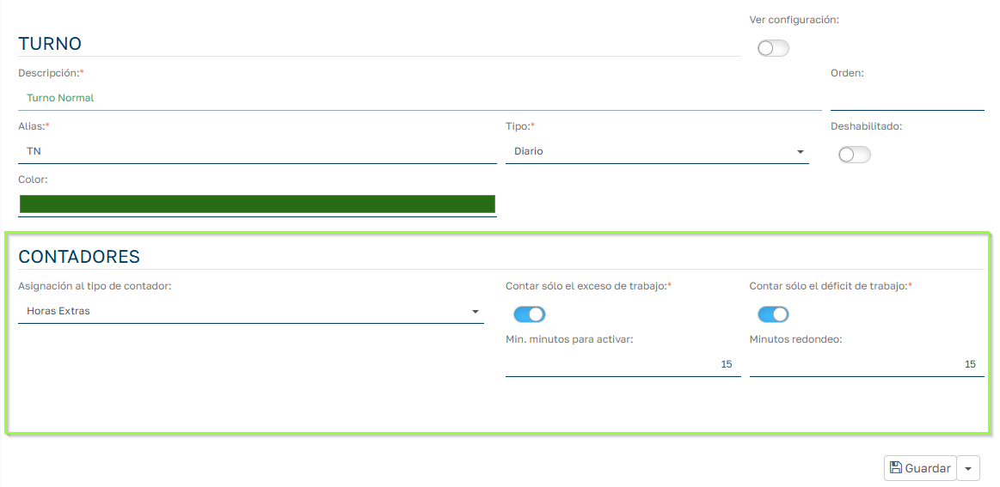

Las líneas de contador se generarán en el momento que se VALIDE la jornada del empleado. Las líneas de contador quedan vinculadas a la jornada validada del empleado, en caso de deshacer la validación se eliminarán las líneas de contador asociadas a la jornada. Si el contador está cerrado no se podrá desvalidar la jornada del empleado.

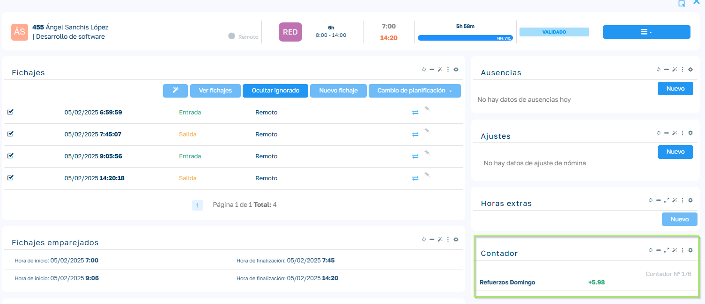

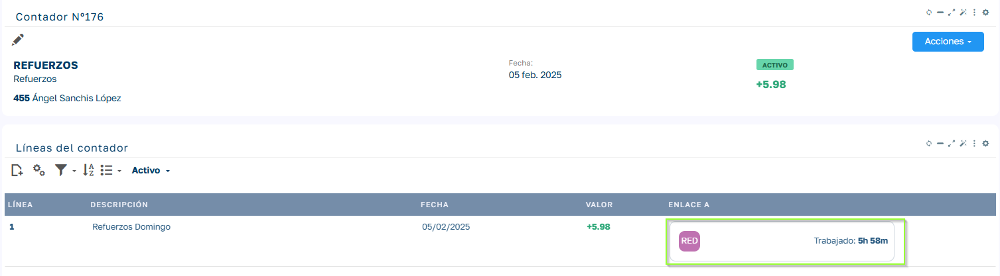

## Cambios de estado de contadores

Recordemos como veíamos anteriormente que los contadores pueden pasar por 2 estados: Activo y Cerrado.

Vamos a ver cómo podemos hacer la transición a estos estados desde la aplicación:

### Cerrar contadores

Para cerrar un contador el contador debe estar en estado Activo.

Podemos cerrar un contador desde la página del contador `Acciones > Cerrar contador` y desde la lista de contadores menú de la línea Cerrar Contador.

Podemos cerrar varios contadores de forma masiva desde la lista de contadores, marcamos los contadores a cerrar y damos al menú `Acciones > Cerrar Contador`.

### Activar contadores

Al generarse un contador lo hace por defecto en estado Activo. Una vez que cambia este estado podemos volver a activar un contador siempre y cuando ese contador esté en estado Cerrado.

Para ello desde un contador cerrado podemos ejecutar la opción `Acciones > Activar Contador` de la página del contador o desde el menú de línea de la lista de contadores.

### Trasferencia de un contador origen a otro destino

Podemos transferir saldo positivo de un contador a otro, para esto tanto el contador origen como el contador destino deben estar en estado Activo y el contador origen debe tener saldo positivo para traspasar.

Para traspasar saldo de un contador a otro vamos a la página del contador `Acciones > Transferencia de Contador` al seleccionarlo nos pide los siguientes datos:

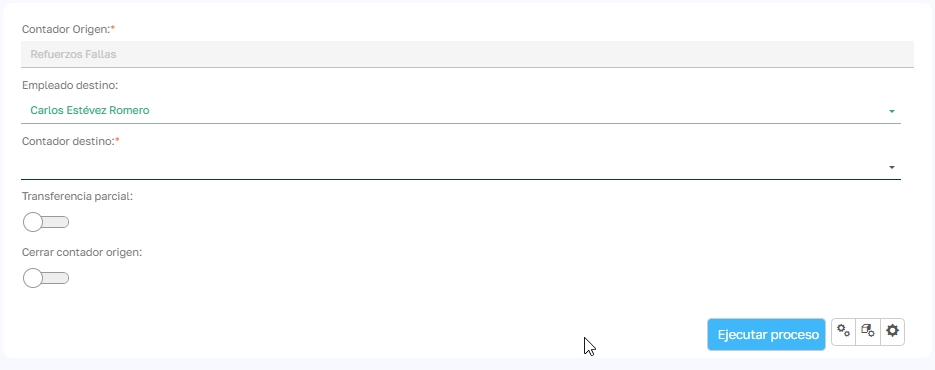

| Campo | Descripción |
| --- | --- |
| Empleado | Por defecto nos muestra el empleado del contador origen, pero podríamos cambiarlo para traspasar saldos de horas de un empleado a otro. |
| Contador destino | Nos mostrará los contadores Activos del empleado seleccionado. |
| Trasferencia parcial | Si no lo activamos nos traspasará todo el saldo del contador, si lo activamos nos pedirá que indiquemos el número de horas a traspasar, estas deben ser menor o igual al saldo del contador origen. |
| Cerrar contador origen | Si queremos que además de realizar el traspaso el proceso cierre el contador origen seleccionamos esta opción. |

Al realizar la trasferencia en el contador origen se añade una línea en negativo con la cantidad de horas traspasadas:

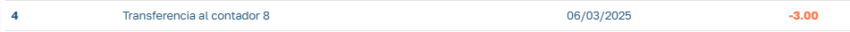

Y en el contador destino se añade una línea en positivo con las horas recibidas:

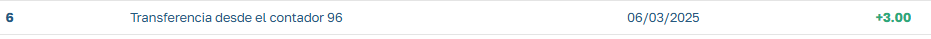

Por tanto la trasferencia de horas afectará al saldo de ambos contadores.

### Trasferencia y cierre de contadores masivo

En algunas circunstancias nos puede interesar hacer un traspaso masivo de saldos de varios contadores.

Por poner un ejemplo, si trabajamos con vacaciones por horas y tenemos las contadores de vacaciones de horas de un año y queremos generar contadores nuevos para las horas de vacaciones del año siguiente traspasando el saldo pendiente del contador de año al otro.

Desde la lista de contadores podemos ir a `Acciones > Transferir y Cerrar`:

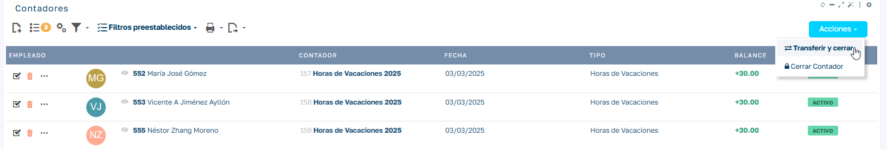

Se nos solicita la siguiente información:

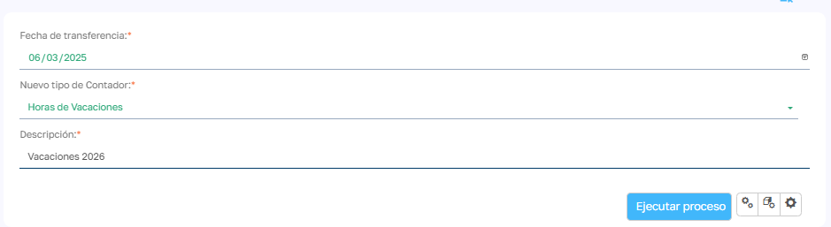

Le estamos indicando que nos genere nuevos contadores de tipo hora de vacaciones para trasferir a ellos el saldo de los contadores seleccionados y cerrando estos.

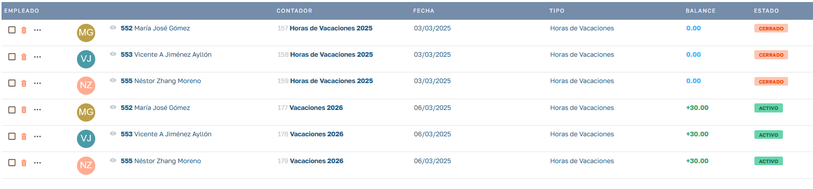

## Ignorar líneas y agregar líneas de compensación

Podemos marcar los contadores a seleccionar y podemos lanzar procesos sobre los contadores seleccionados

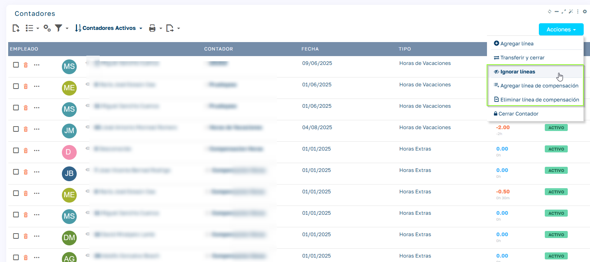

### Ignorar líneas

Seleccionamos un periodo y se ignoran las líneas del contador de ese periodo.

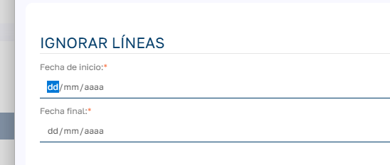

### Agregar línea de compensación

Indicamos un periodo y la descripción de la línea a generar. El proceso calcula el saldo de las líneas de contador de ese periodo y genera una nueva línea para compensar el saldo del periodo. Existe el proceso de Eliminar líneas de compensación que elimina todas las líneas de compensación generadas en el contador.

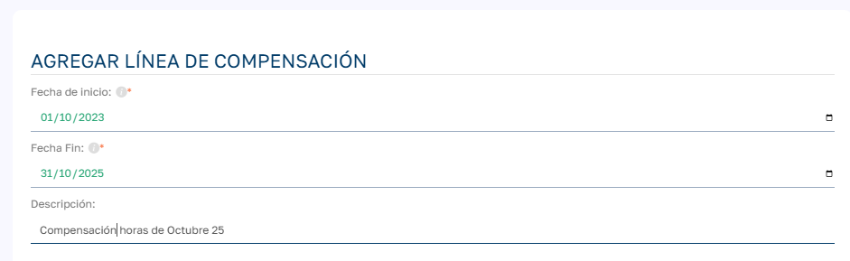

## Visualización de contadores por parte del empleado

El empleado podrá visualizar en su ficha la situación de saldo de sus contadores:

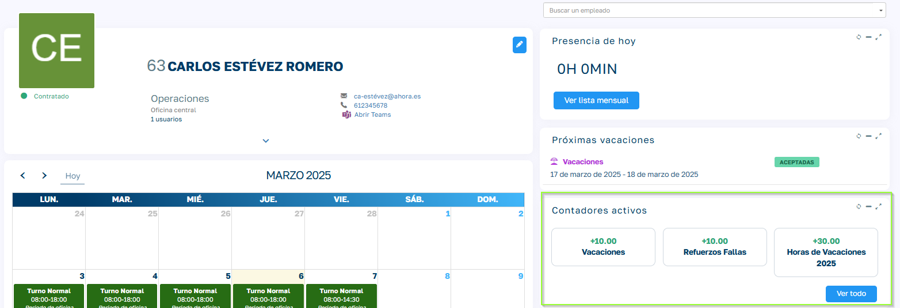

Podrá acceder a visualizar el detalle de registro de horas: (dependiendo del rol asignado al empleado podrá hacer modificaciones o solo visualizar)

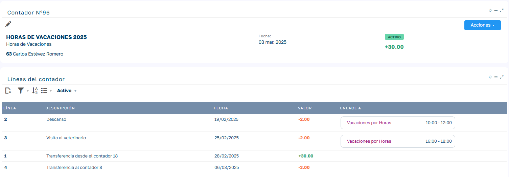

Desde el botón de Ver Todo podrá acceder a su lista completa de contadores aunque ya no estén activos.
