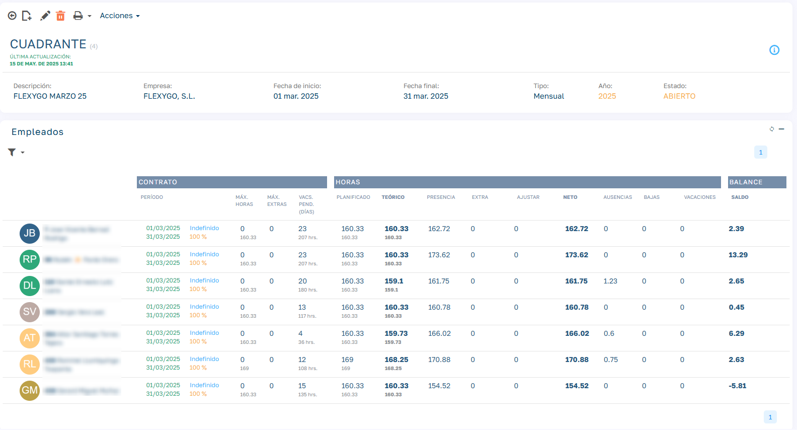

# Cuadrantes

El cuadrante es una herramienta para planificar, gestionar y controlar la jornada laboral de los empleados. Permite comparar lo previsto con lo realmente trabajado, detectar desviaciones y garantizar el cumplimiento de convenios laborales.

### 
   

### Estructura del Cuadrante

###  1\. Información del Contrato

Esta sección muestra los datos contractuales del empleado durante el periodo del cuadrante:

  * Fechas del contrato  
Rango de días en los que el contrato está activo dentro del cuadrante.

  * Max Horas (máximas a realizar)  
Desglosadas en dos líneas:

  * Línea Superior  
Horas que marca el convenio como obligación estándar.  
Variables que la afectan:

      * Duración del contrato (si < 365 días)

      * % de jornada (si < 100%)

  * Línea Inferior  
Cálculo:  
`Horas Planificadas Totales - Horas de Vacaciones Pendientes de Solicitar`

  * Vacaciones Pendientes de Solicitar  
Se calcula multiplicando los días de vacaciones no solicitados por las horas/día según convenio.

### 2. Detalle de Horas

Muestra el desglose de las horas asignadas, trabajadas, ajustadas y ausentes:

  * Planificado  
Turnos asignados al empleado menos vacaciones aceptadas y festivos del calendario.

  * Teórico  
Resultado de:  
`Planificado - Ausencias Remuneradas - Permisos - Bajas`

  * Presencia  
Tiempo real fichado por el empleado.

  * Extra  
Horas extra validadas por el responsable.

  * Ajustes  
Modificaciones manuales aplicadas (por regularización, correcciones, etc.).

  * Neto  
Cálculo:  
`Presencia - Extras + Ajustes`

  * Ausencias  
Horas de ausencias justificadas o injustificadas (parciales o completas).

  * Bajas  
Horas en días donde el empleado ha estado de baja médica.

  * Vacaciones  
Horas correspondientes a vacaciones aprobadas y registradas.

  * Balance  
Diferencia entre lo que se esperaba y lo que realmente se ha realizado:  
`Neto - Teórico`

###  ¿Para qué sirve el Cuadrante?

  * Controlar el cumplimiento de horarios.

  * Validar si se han cubierto las horas obligatorias según el convenio.

  * Gestionar las ausencias y bajas de forma clara.

  * Validar horas extra o compensaciones.

  * Detectar desviaciones en planificación vs. realidad.

  * Obtener un resumen fiable para nóminas, informes y auditorías internas.