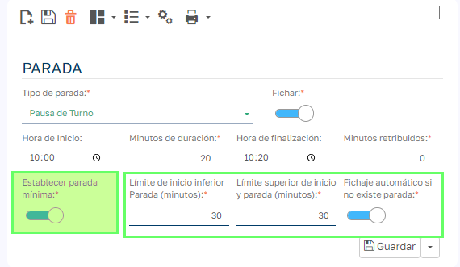
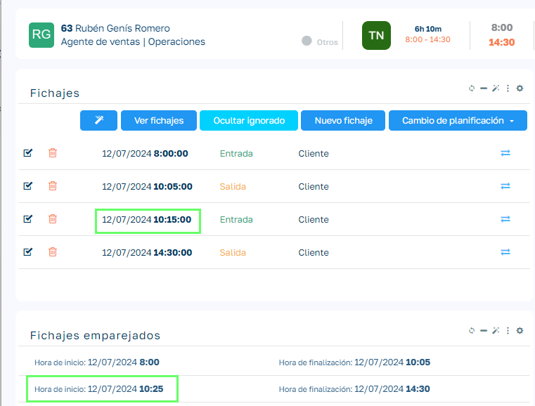
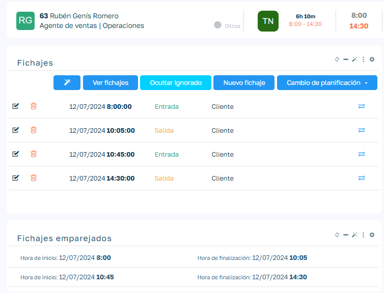
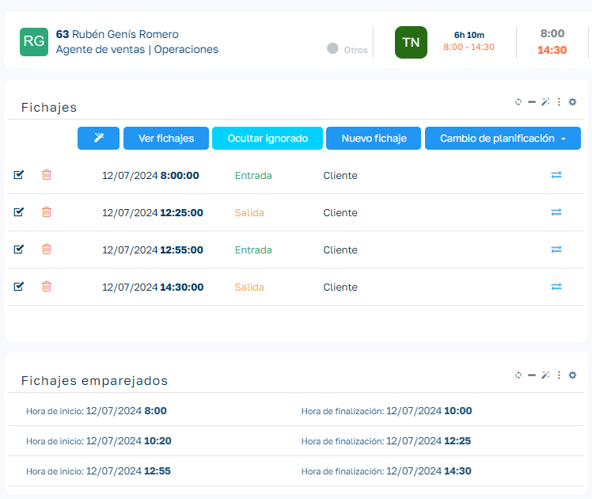
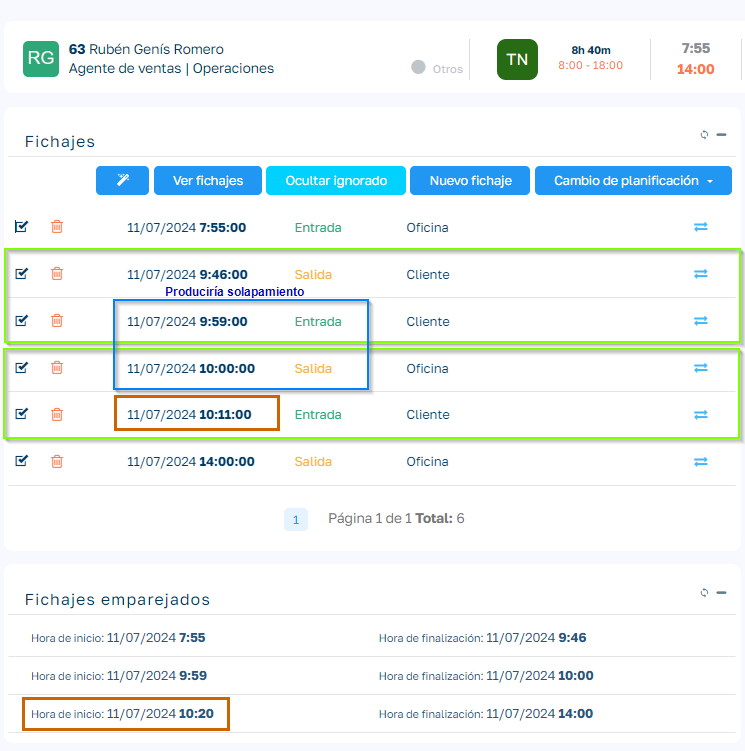

# Aplicar descanso mínimo de turno

En los descansos en los que activamos la opción _Fichar_ podemos indicar que queremos aplicar como mínimo los minutos de descanso establecidos en el turno opción _Establecer parada mínima_.

Al activar esta opción se nos habilitan tres campos más para indicar los límites del fichaje para entender que lo que se está fichando es un descanso y si queremos que en ausencia de fichajes de descanso, este se introduzca automáticamente.

## Límites inferior y superior del descanso

En Sebastian HR cuando fichamos no indicamos si estamos fichando un descanso o cualquier otra incidencia.

Para delimitar que fichajes pueden considerarse como candidatos a ser descansos establecemos unos límites inferior y superior sobre la hora de inicio del descanso. En el ejemplo vemos que la hora de inicio de descanso son las 10:00 y como hemos puesto un límite inferior y superior de 30 minutos, el sistema entenderá que cuando el empleado que fiche sobre este turno realice un fichaje de salida entre las 09:30 y 10:30 se entenderá que es posible que esté iniciando un descanso.

Por tanto el conjunto de fichajes que cumplan esa condición se tendrá en cuenta a la hora de realizar los cálculos de ajuste.

## Casos de uso

Partimos del ejemplo de descanso que veíamos en la imagen anterior.

Caso 1: El empleado no ficha el descanso

Al generar los pares se introduce automáticamente el descanso en base al horario del descanso establecido en el turno. En caso de no tener activada la opción _Fichaje automático si no existe parada_, el descanso automático no se genera.

Caso 2: El empleado ficha un descanso con tiempo inferior al tiempo de descanso del turno

Se actualiza el par correspondiente para que cumpla con el mínimo de tiempo establecido en el descanso.

Caso 3: El empleado ficha un descanso con tiempo superior al tiempo de descanso del turno

Los pares no se ven alterados al haber fichado como mínimo el tiempo establecido en el descanso del turno.

  

Caso 4: El empleado ficha una salida fuera de los límites del descanso

Los pares de los fichajes fuera de los límites del descanso no se ven alterados, pero además como tenemos que si no existe fichaje de descanso se fiche automáticamente, se ha introducido el descanso indicado en el turno. En caso de no tener configurado el fichaje automático no se habría generado el par de las 10 y 10.20

Caso 5: El empleado ficha varios fichajes intermedios dentro de los límites del descanso (sin solapamiento)

En este caso selecciona uno de los dos fichajes en los que puede aplicar los cambios y solo lo aplica en uno de ellos, aquel cuyo tiempo de no presencia es más largo, el otro lo deja sin modificar.

Caso 6: El empleado ficha varios fichajes intermedios dentro de los límites del descanso (con solapamiento)

En el caso de tener más de un candidato descartamos aquel que al modificarlo produzca un solapamiento con otro fichaje del empleado, aunque ese fichaje intermedio dé mayor tiempo de no presencia. Se aplicará el ajuste al siguiente candidato en duración de no presencia que no produzca solapamiento.

Caso 7: El empleado ficha fichajes intermedios dentro de los límites del descanso y todos producen solapamiento.

Este caso supone una secuencia de varios fichajes intermedios de duración inferior al descanso y dentro de los límites del descanso y que todos produzcan solapamiento. En este caso no se aplica regla de ajuste de descanso mínimo ya que se considera una jornada de trabajo demasiado irregular para aplicar el ajuste de descanso mínimo.

!!! warning "Importante"
    En turnos con varios descansos, los casos de usos vistos se aplican para cada uno de los descansos. En este caso los límites de los distintos descansos de un mismo turno no deben solaparse.
