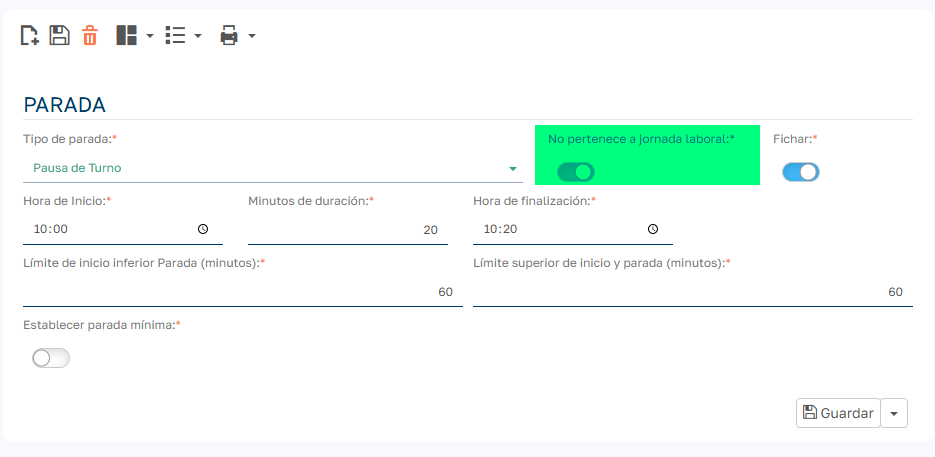
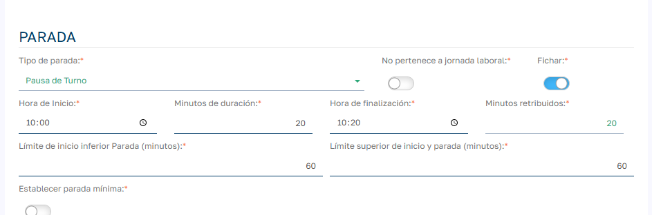

# Descansos remunerados

La funcionalidad de Descansos Remunerados en Sebastian HR permite configurar pausas dentro de la jornada laboral que pueden ser total o parcialmente computables como tiempo trabajado. A continuación, se detalla su configuración, funcionamiento y mejores prácticas.

## Descanso no perteneciente a la jornada

El campo `No pertenece a jornada laboral `determina si un descanso debe ser considerado como parte de la jornada laboral computable o no.

- `No pertenece a jornada laboral = 0`: El descanso SÍ pertenece a la jornada laboral
    - Se contabiliza en `Tiempo de parada computable`
    - Se suma al tiempo trabajado del empleado
    - Ejemplo: pausa para café pagada, descanso legal obligatorio
- `No pertenece a jornada laboral = 1`: El descanso NO pertenece a la jornada laboral
    - NO se contabiliza en `Tiempo de parada computable `
    - NO se suma al tiempo trabajado
    - Ejemplo: hora de comida no pagada, tiempo personal

## Minutos computables

En caso de que el descanso pertenezca a la jornada se habilita el campo para indicar los minutos retribuidos o computables.

Los Minutos Computables determinan cuánto tiempo de un descanso será considerado como trabajado o remunerado.

- Puede ser igual, menor o mayor que la duración real del descanso.

- Ejemplo: Un descanso de 20 minutos puede tener 20 minutos computables (totalmente remunerado) o 10 minutos (parcialmente remunerado).

- Para que el sistema compute correctamente estos minutos como parte del tiempo trabajado, el descanso debe formar parte de la jornada laboral.

## Límites de tolerancia

Estos límites permiten una ventana flexible alrededor del horario programado del descanso:

- **Límite Inferior de Inicio (Lower Start Limit)**: Minutos antes del inicio permitido.

- **Límite Superior de Inicio (Upper Start Limit)**: Minutos después del inicio permitido.

- **Valor por defecto**: 60 minutos para ambos.

!!! example "Ejemplo"
    Si el descanso está programado a las 10:00 con límites de 60 minutos, el sistema considerará válidos los fichajes entre las 9:00 y las 11:00.

- Descansos fuera de jornada laboral  
En caso de configurar descansos que no formen parte del tiempo laboral, estos no serán computados como tiempo trabajado, independientemente de los minutos definidos.  
Para que un descanso sea remunerado, asegúrate de que esté dentro del horario considerado como jornada del empleado.

- Requerir Fichaje (Signing)  
Obliga al empleado a fichar la salida y entrada del descanso.  
Si está desactivado, el sistema asumirá que el empleado tomó el descanso completo.

- Establecer Descanso Mínimo (Set Minimum Stop)  
Garantiza que se tome un descanso mínimo.  
Recomendado para cumplir con normativas laborales sobre pausas obligatorias.

## Cómo funciona el sistema

### Detección automática de descansos

1. El sistema analiza los fichajes del turno del empleado.

2. Detecta ausencias entre fichajes de salida y entrada.

3. Compara estos períodos con los descansos configurados.

4. Asigna automáticamente descansos que coincidan con los límites de tolerancia y formen parte de la jornada laboral.

### Cálculo de minutos trabajados

- Si "Fichaje" está desactivado ( el descanso no se ficha por parte del empleado y lo hará el sistema de forma automática):  
Se computan todos los minutos configurados como trabajados.

- Si "Fichaje " está activado (el empleado debe fichar el descanso):

    - Si el tiempo real del descanso es igual o mayor a los minutos computables → se computan todos.

    - Si el tiempo real es menor → se computa solo la diferencia.

    - Si no se realiza el fichaje del descanso no se añade tiempo computable de descanso.
