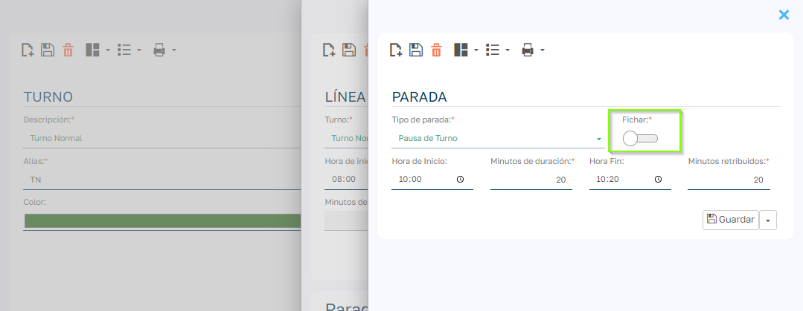
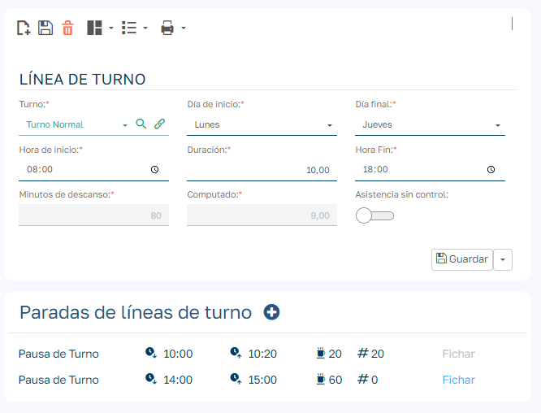
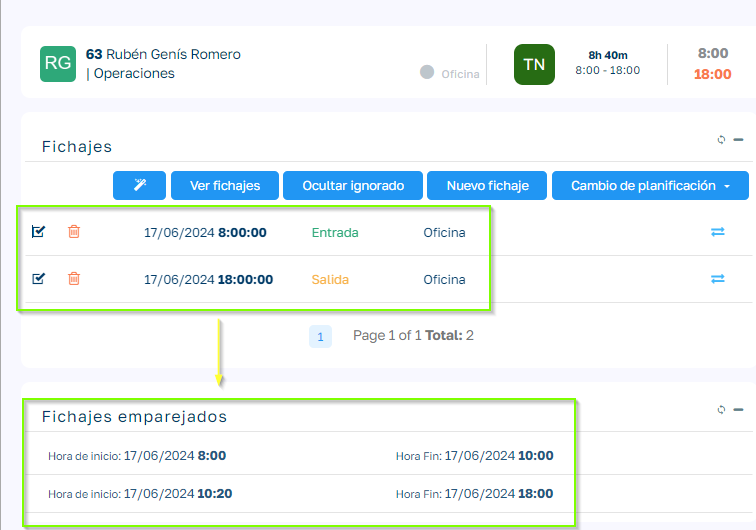
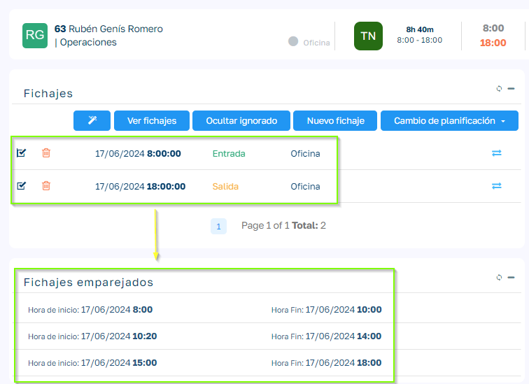
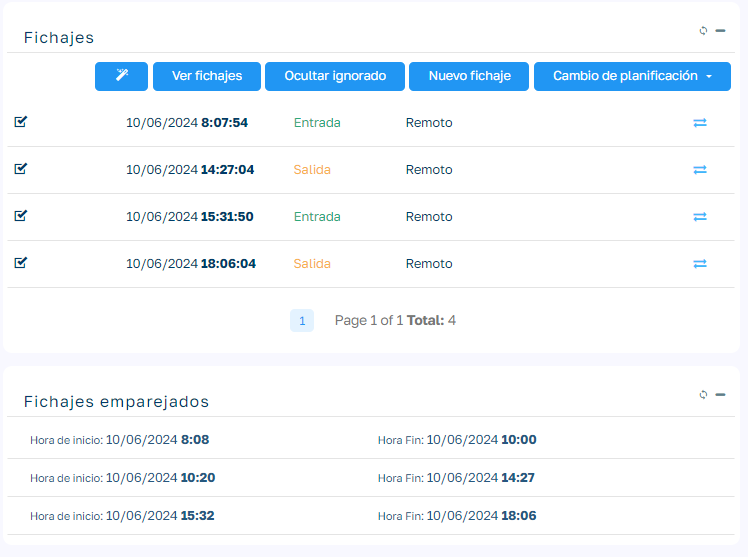

# Descuento automático de descansos de la jornada

En la configuración del turno podemos establecer si en un determinado turno los descansos se deben de fichar o si por el contrario se deben descontar de forma automática sin necesidad de realizar el fichaje de salida y entrada del descanso. 

  

Para ello vamos a las líneas del turno e indicamos como queremos que se comporte el descanso:

  

  

Si activamos "Fichar" el sistema entiende que el descanso se debe fichar por parte del empleado, si lo dejamos desactivado el sistema intentará descontar los descansos en función de los fichajes realizados por el empleado.

  

> Importante: Para que se puedan descontar los descansos debe existir un fichaje del empleado que englobe los descansos a descontar.

  

### Ejemplo de Caso de Uso

  

  

En el ejemplo de configuración de linea de turno tenemos dos descansos, el primero descanso tiene desactivada la opción fichar y el segundo la tiene activada. Esto supondrá que el primer descanso de descuenta de forma automática y el segundo no.

  

> Importante: El sistema no generar fichajes de empleado nuevos para fichar los descansos, lo que hace es calcular los pares resultantes de los fichajes de empleado incluyendo los descansos si fuera necesario.

  

Veamos como se comporta el calculo de fichajes:

  

  

  

En el ejemplo vemos que a la hora de calcular los pares el se incluye el descuento del primer descanso que teníamos configurado como descuento automático.

  

Vamos a ver como quedaría si configuramos el segundo descanso para que se descuente también de forma automática:

  

  

  

  

Ahora veremos un ejemplo en el que a pesar de estar configurado para que se realice el descuento automático de descanso, en el calculo se descarta por no cumplir los requisitos para ser descontado:

  

  

Vemos que el primero descanso se descuenta automáticamente, pero el segundo descanso no se descuenta porque no existe un fichaje de empleado que englobe este segundo descanso.

  

  

> Importante: Lógicamente, el descuento automático de descansos, se debe configurar únicamente en el caso de que los empleados no realicen el fichaje real de estos descansos.