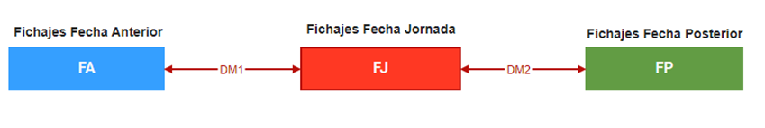
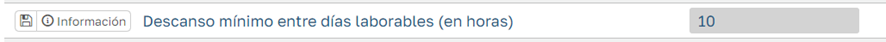
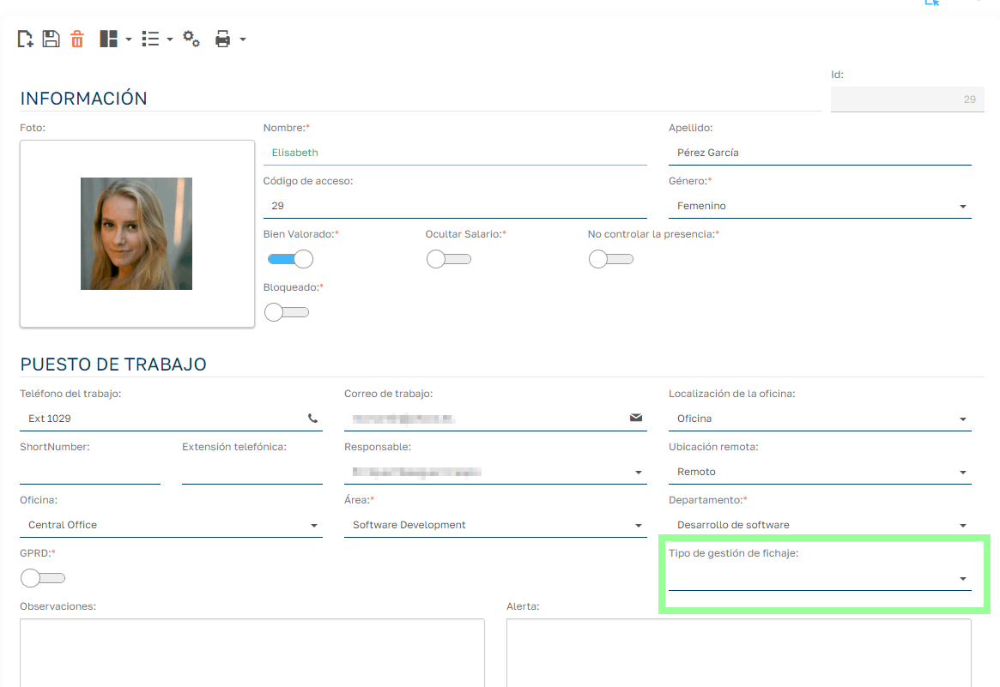
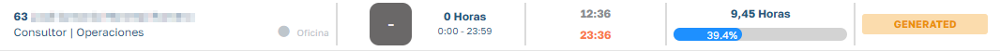

# Empleados sin planificación

## Disponible a partir de la versión 5.3

Lo habitual será que trabajemos asignando turnos / horarios a los empleados, para conocer el tiempo previsto de trabajo y poder compararlo con el real, así como tener una previsión de cuántos y quiénes empleados vamos a disponer en cada momento.

A pesar de esto, en ciertas ocasiones podemos decidir que ciertos empleados no requieren una planificación y queremos controlar las horas que realizan cuando acuden a su jornada laboral. A estos empleados los denominaremos como _empleados sin planificación_.

Estos empleados trabajarán en un turno especial “Sin Planificar”, a no ser que para un día determinado se le haya planificado un turno en el planificador de empleados, en ese caso trabajará sobre ese turno planificado. Cualquier otro tipo de planificación (por periodos de cualquier tipo, planificador de grupos, etc.) no se aplicará y como decíamos el trabajador tendrá asignado el turno especial “Sin Planificar”.

## Lógica del fichaje sobre el turno especial "Sin Planificar"

Como sabemos los fichajes se agrupan por fecha de jornada, es decir, la fecha en la cual computan las horas de esos fichajes y la fecha en la que gestionamos esos fichajes en la gestión de jornadas.

La fecha del fichaje no determina necesariamente la fecha de la jornada a la que se asigna ya que por ejemplo en fichajes de jornadas de tarde o nocturnas es habitual empezar en una fecha y seguir fichando en la fecha siguiente. Estos fichajes se agrupan en la fecha en que se inicia la jornada para poder computar y gestionar conjuntamente.

En el caso de fichajes en turno “Sin Planificar”, el empleado al fichar la entrada establecerá la fecha de jornada (FJ) como la fecha en la que realiza este primer fichaje. Los sucesivos fichajes se asignarán a FJ hasta que hagamos un fichaje que supere la distancia mínima entre jornadas establecida, en ese caso el sistema entenderá que estamos en una nueva jornada.

Figura 1

Lógica a tener en cuenta:

- Un fichaje será el primero de FJ siempre y cuando la distancia temporal con su fichaje precedente supere DM1. En caso contrario formara parte de FA.
- Si partimos de la situación de la _figura 1_ y realizamos fichajes en la línea temporal que ocupa DM1 y la nueva situación deja DM1 por debajo del tiempo mínimo entre jornadas los fichajes de FJ se reasignaran a FA (Siempre y cuando FJ no esté ya validada).
- Tanto la inserción de nuevos fichajes, como edición de horas de fichajes existentes, así como la eliminación de fichajes, modifican las DM1 o DM2 por lo que pueden provocar reasignación de fecha de jornada en los fichajes siempre y cuando los fichajes no estén cerrados por estar en una jornada validada.

## Configuración

En los parámetros de la aplicación estableceremos la distancia mínima entre jornadas de trabajo:

En la ficha del empleado indicaremos que el empleado trabaja sin planificación.

## Gestión de fichajes

En la gestión de fichajes visualizaremos los empleados en el turno especial “Sin planificación” de la siguiente forma:

En horas previstas tendremos 0 Horas y se calculara el tiempo trabajado derivado de los fichajes. No se aplicarán redondeos ni otros tipos de ajustes.
