# Gestión de tiempo extra

## Base de cálculo

La base del calculo de horas extras será la diferencia entre las horas planificadas para el empleado en una fecha concreta comparada con el tiempo de trabajo computable realizado por el empleado en esa fecha.

Recordar que el tiempo de trabajo computable incluye tanto el tiempo fichado por el empleado como el tiempo de ausencias de tipo computable que pueda tener el empleado en esa fecha.

## Horas extras vs. horas complementarias

Las horas extra solo pueden hacerlas los trabajadores a jornada completa. 

Los trabajadores con jornadas parciales, cuando esté haciendo más horas de las estipuladas en su contrato estarán haciendo horas complementarias, y nunca podrán llegar a trabajar entre horas ordinarias y complementarias el equivalente a la jornada completa. 

Estas horas complementarias se pagan como las horas ordinarias y únicamente se pueden utilizar en los contratos a tiempo parcial, no en otros. Mientras que las horas extra se pagan normalmente más que las ordinarias o se compensan con descanso, en las horas complementarias no hay retribución añadida. Por tanto estas horas complementarias se podrán incluir en bolsas de horas pero se liquidarán a precio de hora normal.

Finalmente cabe señalar que el cálculo de horas extras solo se realizará para empleados con tipo de salario mensual.

## Configuración convenio colectivo

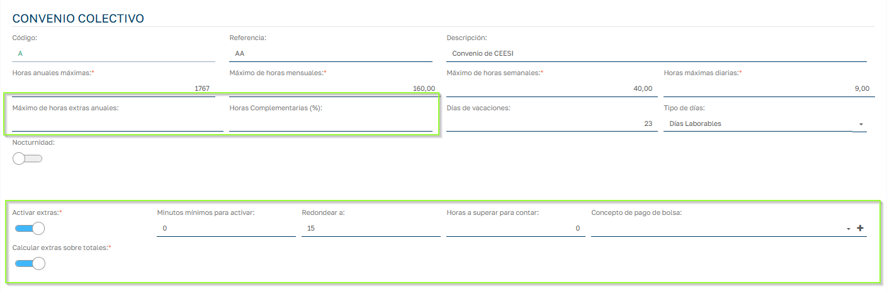

  - Máximo de horas extras anuales: En el convenio podemos establecer el máximo de horas extras pactado. A partir de este dato se podrá comparar con las horas extras realizadas para controlar el cumplimiento del convenio. Afecta a empleados con contrato de jornada completa.
  - % Horas complementarias: Porcentaje máximo de horas completarías a realizar en función del porcentaje de jornada del contrato del empleado. Afecta e empleados con contratos parciales (% Jornada < 100)
  - Activar Extras: Indica si en ese convenio se puede activar la gestión de horas extras. Si lo activamos, los contratos vinculados al convenio podrán gestionar y configurar horas extras. Al activar se visualizan las siguientes opciones:
    1. Minutos mínimos para activar: Cuando calculamos el tiempo extra de un empleado en una jornada, este tiempo en minutos debe superar esta cantidad para considerarlo tiempo extra. Si supera consideramos todo el tiempo extra sin descontar estos minutos.
    2. Redondear a: 0, 15, 30, 60, … redondeamos a la cantidad inferior. Si tengo 15 minutos de redondeo y tengo 10 min extras se convierten en 0.
    3. Horas a superar para contar: Empezará a contar tiempo extra cuando se supera el número de horas indicadas en este campo. Si lo dejamos vació no lo tendrá en cuenta, en caso contrario, se le hará caso únicamente si estas horas superan las horas teóricas de cada jornada.
    4. Concepto pago Bolsa: Si vamos a gestionar bolsas de horas, es necesario indicar el concepto de nomina que se utilizará para realizar el pago de las horas de bolsa de horas.

!!! note "Nota"
    Cualquiera que sea la combinación entre los puntos 3 y 4, las opciones 1 y 2 siempre se aplican.

## Modos de cálculo

A la hora de configurar la parametrización de horas extras en el convenio, tenemos que establecer el modo de cálculo que vamos a realizar, tenemos dos opciones.

  - Calcular en base a totales de horas. (Opción Calcular extras sobre totalesactivada)
  - Calcular en base a la suma de los diferentes tramos que ficha el trabajador durante su jornada.(Opción Calcular extras sobre totalesdesactivada)

### Calcular sobre totales

En este modo de calculo se calcula el total de tiempo fichado por el empleado en una jornada y se compara con el tiempo de presencia previsto del empleado para ese día y en caso de resultar un tiempo de exceso se ajusta en base a los puntos 1,2 y 3 del apartado anterior y se aplica el tiempo extra resultante.

### Calcular sobre tramos

Esta opción va a tratar cada par de E/S de fichajes del trabajador y va comprobar si cumple los requisitos para ser considerado tiempo extra. Además en cada tramo se calcula cuanto tiempo de fichaje esta incluido dentro del turno o fuera del turno, esto tiene relevancia porque tomamos como tiempo extra sólo el tiempo del fichaje que no esta incluido dentro del turno. Los descansos se estipulan como tiempo fuera del turno.

Los puntos 1,2 y 3 del apartado anterior y se aplica sombre la suma total de tiempo extra de todos los tramos del empleado en esa fecha.

Vamos a ver como se configura este calculo cuando desactivamos la opción Calcular extras sobre totales 
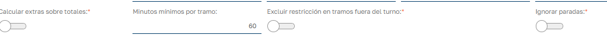  

  - Minutos mínimos por tramo: Estos minutos indican cuantos minutos fuera de turno se deben realizar en cada fichaje de E/S para que se tenga en cuenta como tiempo extra.
  - Excluir restricción en tramos fuera del turno: Esta opción está relacionada con _Minutos mínimos por tramo_ __ y nos permite dejar fuera de esta restricción de minutos mínimos, fichajes de E/S que estén completamente fuera del turno. Es decir el empleado ha fichado la entrada y la salida del fichaje fuera del horario del turno.
  - Ignorar Paradas: No tener en cuenta los descansos como tiempo fuera del turno, por lo que si un fichaje de E/S incluye internamente un descanso, el tiempo del descanso no se tendrá en cuenta a la hora de generar tiempo extra.

> En caso de un día festivo el modo de calculo por tramos actuará conforme lo hace el modo calcular por totales, al ser el tiempo previsto de trabajo 0 se tomará como tiempo extra todo el tiempo de fichaje del empleado.

## Configuración del contrato

  - Porcentaje de jornada de empleado: Establece si es un contrato a jornada completa (100%) o jornada parcial (<100%). Esto es importante ya que los contratos a jornada completa calcularan horas extras y los de jornada parcial calcularan horas complementarias. Como hemos visto en el primer apartado se tratan de forma distinta.
  - Gestión de Horas Extras (no afecta a horas complementarias): Indicamos como va a ser la gestión de horas extras para el empleado de ese contrato. En caso de multicontrato activo se tomará el contrato prioritario como válido para esta gestión. Tenemos 3 opciones que enumeramos y explicaremos más en detalle en siguientes apartados:
    1. No Gestionar: Es la forma de indicar que, aunque el convenio gestione horas extras, no queremos calcularlas para este contrato/empleado.
    2. Balance diario: Al generar el balance de cada jornada, se traspasarán las horas calculadas a los campos específicos de horas extras disponibles en el balance.
    3. Bolsa de horas: No se traspasa al balance diario del empleado y queda en el registro de horas extras para realizar la gestión de las mismas.
  - Regla de horas extras: Se habilita al seleccionar las opciones Balance diario o Bolsa de horas en el campo anterior. Aquí podremos seleccionar la regla de horas extras que queremos aplicar sobre el tiempo extra calculado. Esto lo veremos en detalle en el siguiente apartado. Estas reglas se utilizan para poder establecer una relación 1:N por la que una hora de tiempo extras se bonifica multiplicándola por N. Si no seleccionamos ninguna regla la relación que se aplicará será 1:1.
  - Tipo de Cotización: Esta opción hay que tenerla en cuenta ya que las horas extras solo se calculen para empleados de tipo Mensual, ya que son los empleados que tienen un sueldo establecido por un numero de horas mensuales previstas. El trabajador por horas tiene una gestión distinta donde ya se le calculan distintos precios de hora en función de cuando realiza las horas (nocturnas, festivas, nocturnas festivas) y un precio definido para cada tipo de hora y esto se aplica para cada una de las horas realizadas independientemente de si se sobrepasa o no la jornada prevista.

Definir precio de hora extra para el empleado.

Para el tipo de salario mensual, podemos definir en el contrato el empleado el precio para la hora extra. Este precio puede venir derivado de la categoría, del puesto de trabajo o del propio contrato, de menor a mayor prevalencia. 

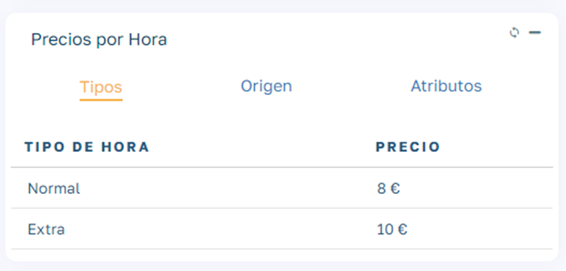

Para definir el precio de la hora extra añade el atributo de hora extra desde la pestaña Atributos del módulo Precios por Hora del contrato del empelado

## Reglas de horas extras

Desde el mantenimiento de la aplicación podemos acceder dar de alta y mantener las distintas reglas que queramos tener disponibles.

## Tipos de hora en reglas de horas extra

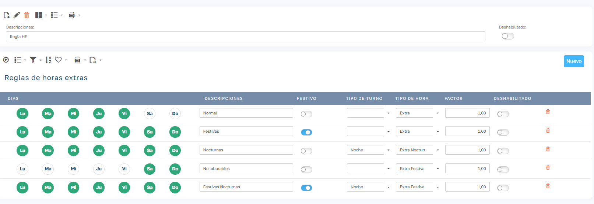

Cada regla permite definir un tipo de hora extra que se aplica a las horas extras en función de diferentes condiciones, como:

  - El día de la semana en que se realizaron.

  - Si se trata de un día laborable o festivo.

  - El tipo de turno durante el cual se llevaron a cabo.

El tipo de hora afecta al precio al que se van a pagar las hora afectadas por esta reglar. Es decir, permite incrementar el valor monetario de las horas extras según los criterios definidos.

> Si dejamos en blanco el tipo de hora de una linea de regla de horas extras por defecto aplicará el tipo de hora "Extra" que viene por defecto en la aplicación.

En un contrato con tipo de salario mensual podemos establecer los distintos tipos de horas que queremos aplicar:

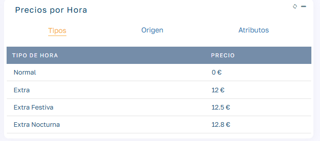

## Factores de cómputo en reglas de horas extra

Cada regla permite definir un factor multiplicador que se aplica a las horas extras en función de diferentes condiciones, como:

  - El día de la semana en que se realizaron.

  - Si se trata de un día laborable o festivo.

  - El tipo de turno durante el cual se llevaron a cabo.

El factor multiplicador afecta al tiempo computado, no al tiempo real trabajado. Es decir, permite incrementar el valor computable de las horas extras según los criterios definidos.

Por ejemplo, en una regla podemos establecer que:

  - Las horas extra realizadas durante un festivo y en un turno nocturno tengan un factor 2.

  - Esto significa que por cada hora trabajada, se computarán dos a efectos de cálculo.

Esta funcionalidad permite valorar de forma diferenciada el esfuerzo en situaciones especiales, como trabajo en días no laborables o en condiciones menos favorables.

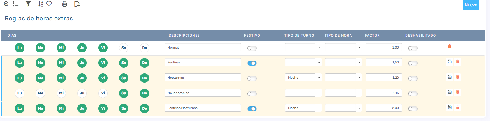

## Horas extras en gestión de jornadas

El calculo de tiempo extra se realiza en el momento que se valida la jornada del empleado. En caso de tener tiempo extra se visualiza una etiqueta verde con el numero de horas extras computables sobre la barra de progreso de horas realizadas. Además, disponemos de un preset para filtrar los registros que han generado tiempo extra:

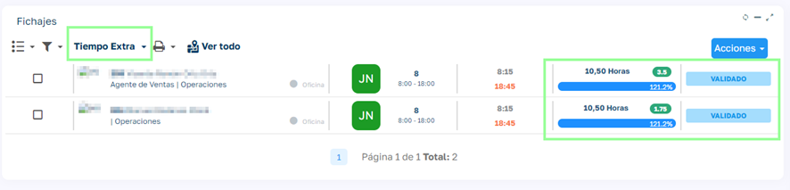

Si entramos al detalle de la jornada del empleado podemos ver un modulo con el tiempo extra, en el que vemos el tiempo extra realizado y el computado (ha podido ser bonificado por alguna regla de horas extra ya sea por factor o por tipo de hora):

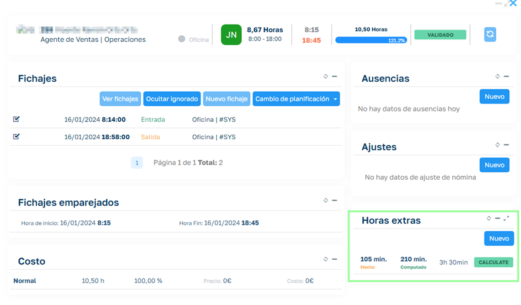

El tiempo extra computado es el que vamos a considerar como horas extras a efectos de compensar con dinero o descanso.

Podemos entrar el registro calculado y modificar el tiempo computado, así como eliminar las horas extras calculadas. En caso de modificar manualmente los datos del registro, cambiará la etiqueta de calculado a manual:

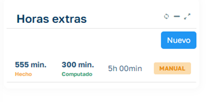

## Trabajo en festivos

Cuando trabajamos en un día marcado como festivo y el turno está marcado como “no trabaja en festivos”, en lugar de las horas previstas vemos la descripción Festive en este caso si tenemos activadas las horas extras, todo el tiempo imputado será tomado como extra:

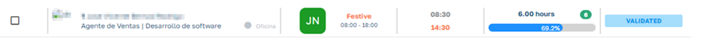

## Empleados sin planificar

Lo habitual de este tipo de empleados es que no gestionen horas extras. En caso de tenerlas activadas, como no se dispone de tiempo previsto, se toma todo el tiempo trabajado como extra:

## Histórico de horas extras

Las horas extras calculadas en la gestión de jornadas, independientemente del método de cálculo se registran en histórico de horas extras:

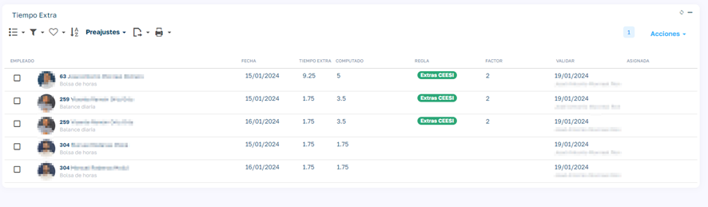

## Modo balance diario

En caso de que el empleado tenga establecido este modo de gestión, cuando pasemos la jornada a estado Balance se traspasaran los datos de tiempo extra al balance del empleado para ese día valorados al precio de hora extra que indica el contrato del empleado o el aplicado por un tipo de hora definido en la regla de horas extras que pueda tener definido el empleado.

Si durante una misma jornada el empleado realiza diferentes tipos de horas extra (por ejemplo, extra normal, extra festiva y extra nocturna), el sistema calculará la cantidad total de horas y el importe total como la suma de cada tipo de hora extra multiplicado por su precio correspondiente.

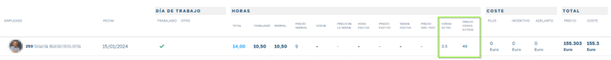

## Modo bolsa de horas

Este modo se basa convertir los datos acumulados en el registro de horas extras a Bolsas de horas del empleado, en el que acumula horas que pueden cambiarse por salario o por días/horas de descanso. Este modo al ser una gestión más extensa lo tratamos en un artículo a parte [Bolsa de horas](BolsaHoras.es.md)
