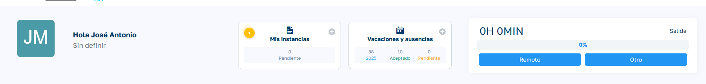
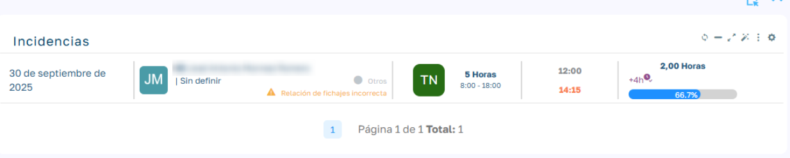

# Visualización de Incidencias

## Descripción general

Esta funcionalidad permite a los empleados visualizar y gestionar sus incidencias de fichaje directamente desde su dashboard personal, facilitando la identificación y resolución de problemas relacionados con el registro horario.

## Características principales

### Indicador visual en el dashboard

En la sección "Mis instancias" del dashboard del empleado, aparece un indicador circular amarillo con un número que representa las incidencias de fichaje pendientes de solventar.

  

### Acceso a la lista de incidencias

Al pulsar sobre el indicador amarillo, se despliega automáticamente la lista completa de incidencias de fichaje, mostrando información detallada de cada una.

### Información mostrada en las incidencias

Cada incidencia muestra los siguientes datos:

| Campo | Descripción | Ejemplo |
| --- | --- | --- |
| Fecha | Día en que se produjo la incidencia | 30 de septiembre de 2025 |
| Empleado | Nombre y avatar del empleado |  |
| Tipo de incidencia | Etiqueta descriptiva | Relación de fichajes incorrecta |
| Jornada programada | Horario planificado | 5 Horas 8:00 - 18:00 |
| Hora de entrada | Hora registrada de inicio |  |
| Hora de salida | Hora registrada de finalización |  |
| Horas trabajadas | Tiempo total registrado | 2,00 Horas |
| Porcentaje completado | Indicador visual del cumplimiento de la jornada | 66,7% |

### Beneficios de la funcionalidad

- **Visibilidad inmediata**: El empleado puede identificar rápidamente si tiene incidencias pendientes

- **Acceso directo**: Un solo clic permite acceder al detalle completo de las incidencias

- **Resolución proactiva**: Facilita la corrección oportuna de errores en el registro horario

- **Transparencia**: El empleado mantiene el control sobre su registro de horas trabajada

!!! note "Nota"
    Las incidencias no resueltas pueden afectar al cálculo de horas trabajadas, por lo que es importante atenderlas con prontitud.
