# Métodos de planificación de empleados

La planificación es el proceso mediante el cual Sebastian HR determina automáticamente qué turno debe trabajar cada empleado en una fecha específica.

## ¿Cómo funciona?

El sistema opera vinculando turnos de trabajo con fechas específicas o períodos de tiempo. Estos turnos se asocian a diferentes elementos organizacionales relacionados con cada empleado.

## Sistema de Prioridades

Para resolver conflictos cuando un empleado tiene múltiples asignaciones de turnos, el sistema utiliza niveles de prioridad jerárquicos. Cuando existen varias opciones de turno para una misma fecha, el sistema selecciona automáticamente el turno con mayor prioridad (nivel más bajo).

Vamos a ver cuales son estos métodos de asignación de turnos y su nivel de prioridad, ordenados de más a menos prioritario.

## Métodos de asignación de turnos

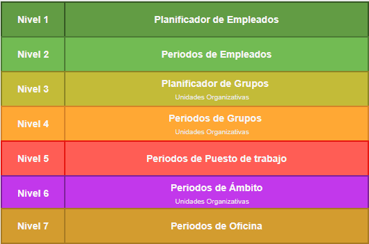

## Planificador de Empleados (nivel 1)

### Modos PRO y LITE

La mayor prioridad se otorga a la planificación realizada a través del planificador de empleados ya que esta supone una planificación directa que establece un turno para un empleado y una fecha.

Esta se realiza entrando en el planificador y arrastrando un turno a un empleado en una fecha determinada o aplicando un patrón de turnos a una serie de empleados en un periodo de fechas.

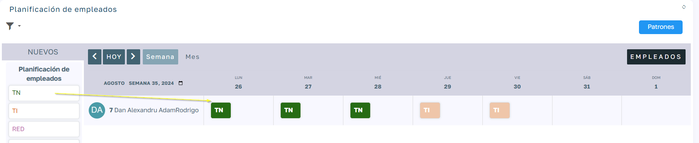

## Periodos de Empleado (nivel 2)

### Modos PRO y LITE

El siguiente método consiste en ir a la ficha del empleado y en el módulo de horario personal, asignarle un turno para un periodo determinado.

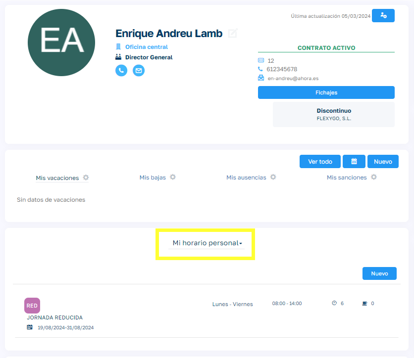

## Planificador de Grupos (nivel 3)

### Solo modo PRO

Hay una serie de métodos de asignación de turnos que se habilitan si usamos Unidades Organizativas, este es uno de ellos.

Desde las unidades organizativas podemos crear grupos de empleados y mediante el planificador de empleados de las unidades organizativas podemos asignar a un grupo de empleados un turno en una fecha determinada. También podemos hacer esta asignación insertando un patrón de turnos.

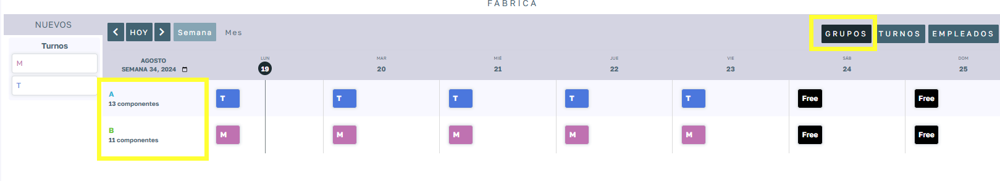

Para que esta opción de planificador de unidades esté habilitada la unidad organizativa tiene que tener configurado su método de planificación como "Turnos Planificados" :

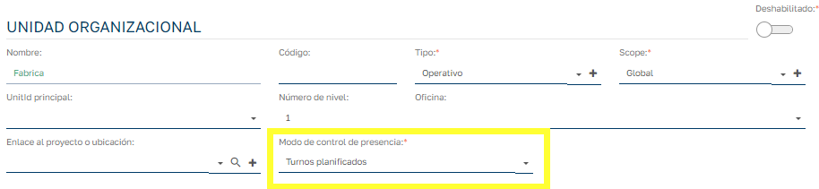

## Periodos de Grupos (nivel 4)

### Solo modo PRO

Este es similar al anterior pero en lugar de asignar turnos a través planificador se asignan por periodos. Para ello la unidad organizativa debe tener como Modo de Control de Presencia: "Turnos por Periodos":

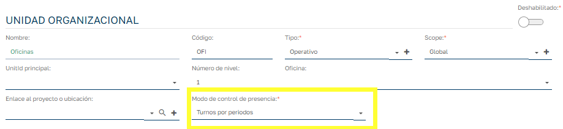

De esta forma al visualizar el Grupo tendremos la opción de asignarle turnos en base a un periodo de fechas:

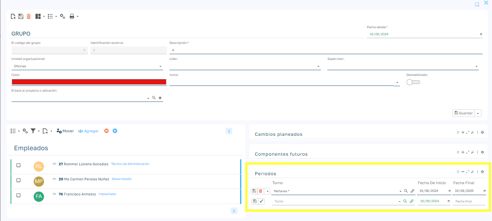

## Periodos de Puesto de trabajo o Posición (nivel 5)

### Solo modo PRO

Este es un método no tan común pero en ciertos sectores si resulta interesante poder asignar turnos en función del puesto de trabajo. Como en el resto de métodos que se basan en periodos, simplemente tenemos que ir al puesto de trabajo y definirle un turno para un periodo determinado.

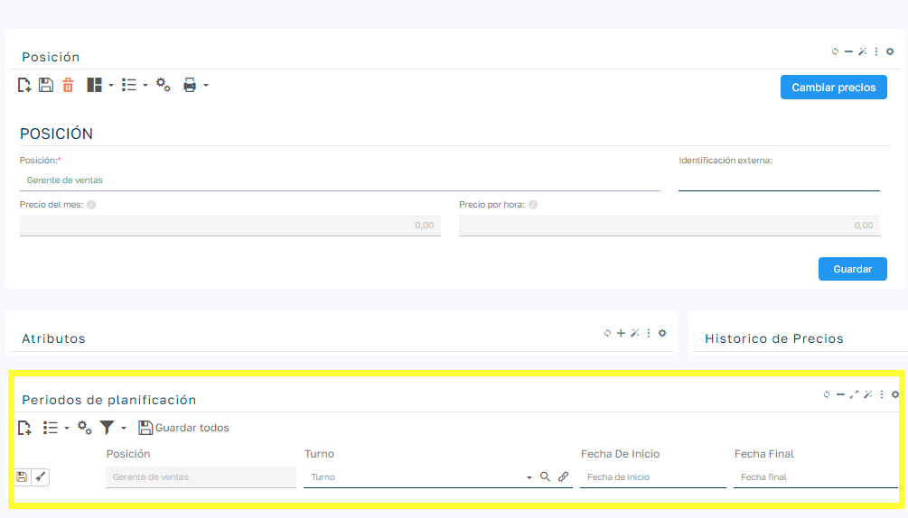

## Periodos de Ambito (nivel 6)

### Solo modo PRO

Este método se basa en el uso de unidades organizativas, las cuales pertenecen a un ambito determinado. La asignación de empleados a unidades organizativas nos permite saber a qué Unidad esta asignado un empleado en una fecha determinada y por tanto también a qué ámbito.

Para configurar este método simplemente hay que ir al ambito en cuestión y añadir un periodo de turno como lo hemos hecho en otros métodos por periodos.

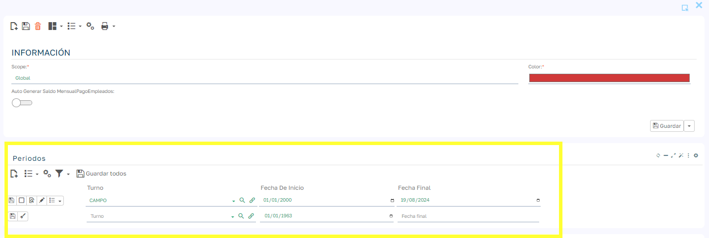

## Periodos de Oficina (nivel 7)

### Modos PRO y LITE

Este método suele ser bastante usual para asignar turnos en organizaciones donde no hay mucha variación de turnos. Se trata como en otros métodos de asignar un turno a un periodo de fechas.

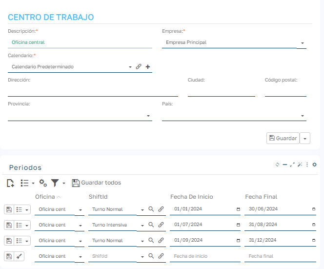

La oficina se asigna al empleado a través de su contrato activo. En caso de trabajar con multicontrato de empleado la oficina será la del contrato marcado como prioritario en el conjunto de contratos activos del empleado.

Cálculo del turno de empleado en una fecha determinada.

Una vez tenemos claro los distintos niveles de prioridad en los que se pueden asignar turnos a empleados, tendremos que analizar las diferentes casuísticas de horarios en nuestra organización para utilizar un método determinado o una combinación de varios métodos.

La aplicación, al calcular el turno de un empleado en una fecha específica, sigue el siguiente proceso:

  1. Verificación de fichaje existente : Si el empleado ha registrado un fichaje en la fecha consultada, el sistema asigna como turno planificado el correspondiente al fichaje registrado.

  2. Aplicación de métodos de planificación : Si no existe un fichaje para esa fecha, el sistema recorre los distintos niveles de prioridad en orden descendente. En el primer nivel que encuentre una configuración que devuelva un turno para el empleado en esa fecha, establecerá ese turno como el turno planificado.

Desde la ficha del empleado se puede visualizar el calendario de asignación de turnos, donde, además de ver el turno calculado para cada fecha, se puede identificar el nivel de prioridad que ha determinado dicho turno.

, en este caso a partir de "Periodo de Oficina" 

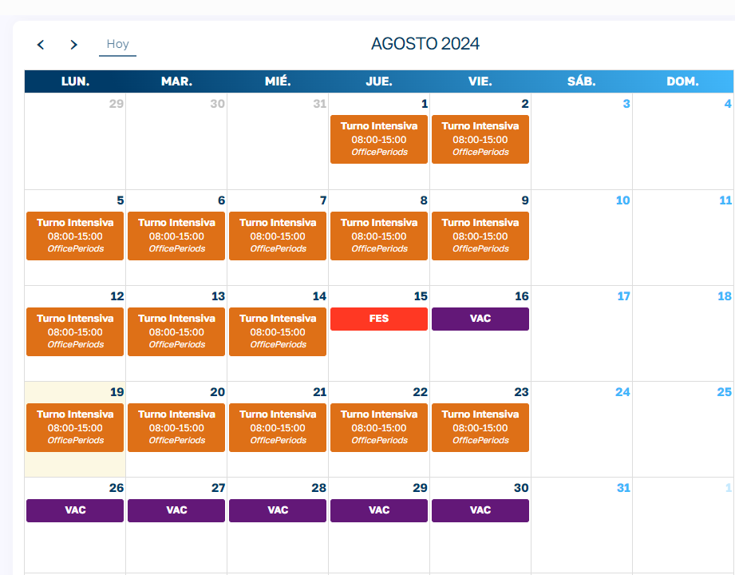
