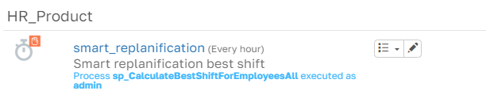
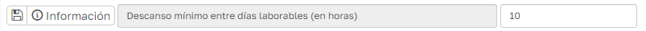
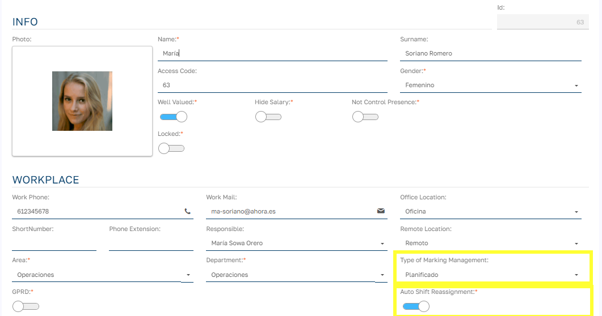
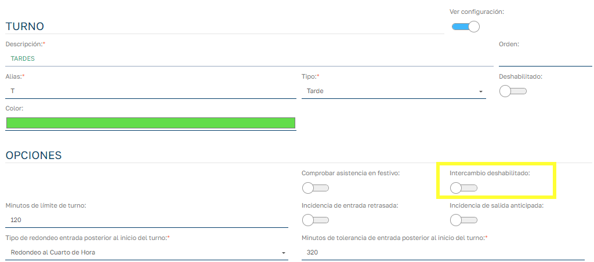

# Reasignación de turnos automática

Esta funcionalidad permite ajustar automáticamente el turno planificado de un empleado basado en los fichajes realizados durante una jornada específica. El proceso revisa todos los fichajes de un empleado en un día dado y determina cuál es el turno que mejor se ajusta a los horarios de entrada y salida reales. Si el turno planificado difiere del turno calculado como más adecuado, se procede a cambiar el turno del empleado y se registra este cambio para fines de trazabilidad.

## ¿Cómo se activa el proceso?

Este proceso se ejecuta desde un _cron job_ que debemos activar previamente.

Se ejecutará sobre el conjunto de fichajes de un empleado en los que haya transcurrido el tiempo de separación entre jornadas desde el último fichaje de salida del empleado en ese conjunto de fichajes y día. El tiempo de separación entre jornadas se define en el parámetro (_MinBreakBetweenWorkingDays_):

Para acceder a los parámetros de la aplicación lo haremos desde el menú principal: `Mantenimiento > Parámetros > Configuración`

## ¿Cómo configuro los empleados y turnos que pueden intervenir en el proceso?

Para que un empleado pueda ser objeto de una reasignación de turnos automática debemos establecerlo en su ficha.

El tipo de gestión de fichajes debe ser de tipo "Planificado" y además marchar la opción "Reasignación automática de turnos"

Para que un tuno pueda ser candidato a ser un turno reasignado debemos tener desmarcada la opción "Intercambio deshabilitado":

## ¿Cómo se calculan los turnos candidatos?

Los turnos candidatos son aquellos turnos que para un empleado y una fecha de terminada se tendrán en cuenta a la hora de calcular qué turno se ajusta más al conjunto de fichajes del empleado.

1. Para comenzar y como indicábamos en el punto anterior el turno debe estar habilitado para intercambio, a partir de esta condición ya se tendrán en cuenta las siguientes premisas. Obviamente el turno no debe estar deshabilitado

Rango de reasignación: Cuando seleccionamos la opción "Auto reasignación de Turnos" debemos indicar el rango de reasignación, esto nos indica a que nivel debemos ir a buscar los turnos candidatos y si establecemos un límite a este respecto. Las opciones son las siguientes:

A) Total:

1. Se tendrán en cuenta todos los turnos generales (turnos que no están asignados a ningún objeto)
2. Si es un turno asignado al objeto oficina, se tendrá en cuenta si para la fecha actual es la oficina del contrato del empleado.
3. Si es un turno asignado a una unidad organizativa, se tendrá en cuenta si para la fecha actual es la unidad organizativa del empleado.
4. Si es un turno asignado a una ámbito, se tendrá en cuenta si para la fecha actual es el ámbito de la unidad organizativa del empleado.
5. Si es un turno asignado a empleado se tendrá en cuenta si para la fecha actual está asignado para el empleado.

B) Oficina:

1. Como candidatos tendremos por todos los turnos asignados a la oficina del empleado.

C) Unidad del empleado:

1. Como candidatos tendremos por todos los turnos asignados a la unidad organizativa a la que pertenezca el empleado.

D) Unidad del empleado (con jerarquía):

1. Como candidatos tendremos por todos los turnos asignados a la unidad organizativa a la que pertenezca el empleado y o a cualquier unidad ancestro de la unidad del empleado.

E) Ámbito:

1. Como candidatos tendremos por todos los turnos asignados al ambito de la unidad organizativa a la que pertenezca el empleado.

## ¿Cuál es la lógica del proceso?

Premisas:

- Para poder reasignarle un turno a un empleado, el empleado debe tener una planificación inicial para esa fecha, en caso contrario no se realizar reasignación.
- Las horas que tienen en cuenta el proceso para la reasignación son las que vienen de los marcajes de los empleados y no de los pares generados.
- El proceso solo se ejecuta sobre jornadas de empleado en estado generado, una vez validadas el proceso no interviene.
- Una vez que el proceso de auto reasignación de turno se calcula para una jornada, la jornada se marca para que no vuelva a intervenir el proceso sobre ella.

### Flujo de funcionamiento

1. Fichajes del Empleado:

    - Los empleados registran sus fichajes de entrada y salida a lo largo del día. Estos pueden incluir pausas intermedias.
    - El sistema recopila la información de los fichajes para identificar el primer y último fichaje del día.
2. Cálculo del Mejor Turno:

    - Determina cuál de los turnos candidatos es el que mejor se ajusta a los fichajes realizados. La selección se basa en los siguientes criterios:
        - Diferencia mínima entre la hora de entrada y salida fichada y el turno propuesto.
        - Si hay varios turnos con diferencias similares, se selecciona el que tenga menos ausencia.
        - Se retorna el turno más adecuado junto con la ausencia generada y el turno planificado previamente.
3. Cambio del Turno:

    - Si el turno planificado es diferente del calculado como más adecuado, el sistema procede a actualizar el turno asignado en la planificación.
    - El cambio se registra en un log para tener un historial claro de los ajustes realizados.
