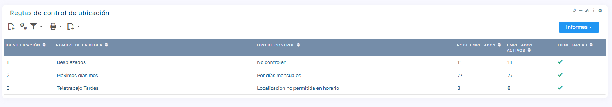
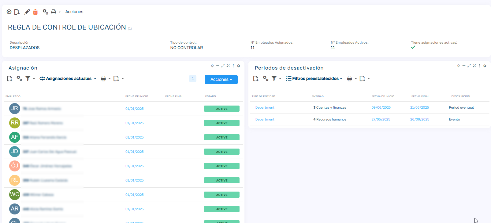
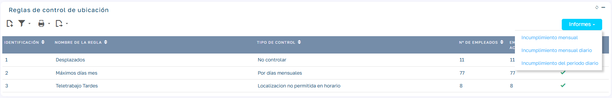

# Reglas de Control de Localizaciones

## Introducción

El módulo de Control de Localizaciones permite gestionar políticas de asistencia basadas en la ubicación de los empleados (ej: teletrabajo, oficina). Ofrece:

  - Creación de reglas de control reutilizables
  - Asignación masiva a empleados

  - Periodos de desactivación temporal

  - Reportes de cumplimiento en tiempo real

## Configuración de reglas

### Crear una nueva regla

  1. Acceder a: 
  
    `Mantenimiento > Fichajes > Reglas de control de localización`

  2. Hacer clic en "Nueva Regla" <i class="flx-icon icon-document-add"></i>

  3. Completar campos:

| Campo | Descripción |
| --- | --- |
| Nombre de Regla | Identificador único (ej: "Teletrabajo 8 días") |
| Tipo de Control | **No controlar**: es la regla que asignaremos a los empleados que no tienen una restricción de fichaje por localización. **Por días mensuales**: indicaremos un tipo de localización y un máximo de días al mes en los que se permite fichar en ese tipo de localización. En caso de superarlos se incumple la regla. **Localización requerida en horario**: indicaremos un tipo de localización y un horario. Si algún día no se ficha en ese tipo de localización se incumple la regla. **Localización no permitida en horario**: indicaremos un tipo de localización y un horario. Si algún día se ficha en ese tipo de localización se incumple la regla. |

## Asignación a empleados

### Asignar reglas

  1. Navegar a: `Empleados > Asignación de Reglas`

  2. Seleccionar empleado(s):

    - Búsqueda individual o selección masiva por departamento

  3. Elegir regla:

    - Desplegable con todas las reglas activas

  4. Definir vigencia:

    - _Fecha Inicio_: Obligatoria

    - _Fecha Fin_: Opcional (dejar vacío para permanente)

  5. Confirmar con "Asignar"

## Periodos de desactivación

### Crear desactivación

  1. Hacer clic en "Nueva Desactivación"

  2. Seleccionar alcance:

    - Entidad: Jerarquía aplicable:

        - _Oficina/Departamento/Área_: Seleccionar entidad

        - _Empleado_: Elegir empleado específico

        - _Regla_: Desactivar regla específica

    - Regla asociada: Opcional (si aplica solo a una regla)

  3. Definir fechas: Inicio y fin del periodo

  4. Agregar descripción (ej: "Vacaciones colectivas")

  5. Guardar.

## Reportes y monitoreo

### Reportes Excel

Desde la lista de Reglas tenemos un botón Reportes:

  1. Incumplimiento mensual (seleccionamos un mes): Muestra los empleados con incumplimiento agrupado por mes. Indica los que han incumplido en ese mes.
  2. Incumplimiento mensual diario(seleccionamos un mes):Muestra los empleados con incumplimiento agrupado por mes. Indica los que han incumplido en ese mes pero muestra el detalle de cada día que ha incumplido
  3. Incumplimiento de periodo diario(seleccionamos un mes inicio y un mes final):Indica los que han incumplido en el periodo pero muestra el detalle de cada día que ha incumplido
