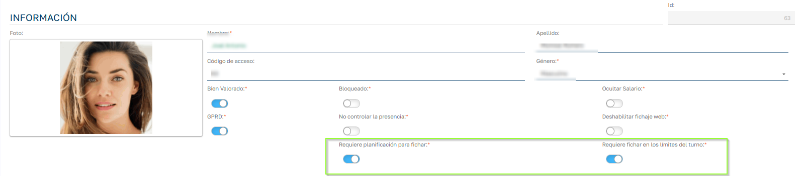

# Restricciones de fichaje

### ¿Qué hace esta funcionalidad?

Sebastian HR incorpora una validación automática que impide registrar fichajes si el empleado no cumple ciertas condiciones relacionadas con:

  * Su contrato

  * Su planificación de turno

  * El horario permitido para fichar

Estas restricciones son configurables por empleado y se aplican en tiempo real, al realizar cualquier fichaje.

 

### ¿Cuándo se impide fichar?

Se aplican las siguientes validaciones:

### 1\. Contrato activo obligatorio (solo modo PRO)

El sistema verifica que el empleado tenga un contrato en vigor en la fecha del fichaje.  
Si el contrato no está activo (por ejemplo, está en baja o sin contrato asignado), el fichaje se deniega.

  

Mensajes posibles:

  * "Does not have active contract. Check with administrator."

  * "Discontinuous contract interrupted. Check with administrator."

  * "Active work leave. Check with administrator."

 

Para los siguientes casos existen dos campos habilitados en la ficha del empleado para activar cada una de las restricciones:

  

###   

### 2\. Requiere planificación para fichar

Si esta opción está activada en la ficha del empleado, solo se permitirá fichar si tiene asignado un turno para ese día.

Mensaje si no tiene turno asignado:

  * 'Bloqueo de fichaje. Motivo: No dispone de planificación asignada para hoy.'

 

### 3\. Fichaje dentro del horario permitido

Si el empleado tiene activada esta restricción, el sistema solo permite fichar dentro del margen horario configurado por el turno asignado (dentro de los límites establecidos en el turno)

Mensaje si ficha fuera del horario permitido:

  * 'Bloqueo de fichaje. Motivo: No puede fichar fuera de los límites del turno.'

 

### Condición de exclusión de validaciones

Si el campo de tipo de fichaje del empleado está configurado con valor "Sin Planificación" las restricciones 2 y 3 no se aplican.  
En ese caso, el empleado podrá fichar en cualquier momento, aunque no tenga planificación o lo haga fuera de horario.

  

 

### ¿Cuándo se aplica esta validación?

Esta validación se aplica automáticamente en los siguientes casos:

  * Fichajes manuales desde la aplicación web

  * Fichajes desde los Access point disponibles.

  

### ¿Cuándo no se aplica esta validación?

  

  * Cuando se introducen fichajes manualmente desde la aplicación ya sea por parte del personal de RRHH o vía instancias de empleado.
  * Cuando se realiza el fichaje desde la APP 1.0 de Fichajes.

 

### ¿Quién puede modificar estas opciones?

Estas configuraciones solo pueden ser modificadas por:

  * Responsables de Recursos Humanos

  * Administradores de la aplicación

 

### Beneficios de esta funcionalidad

  * Control más riguroso de los fichajes

  * Validación en tiempo real de planificación y horarios

  * Evita errores y fichajes indebidos

  * Configurable por empleado, de forma flexible