# Turnos

Los turnos son cada una de los distintos horarios que podemos establecer y posteriormente asignar a los empleados en una jornada especifica convirtiéndose en ese momento en la planificación horaria de ese empleado en esa jornada.

## ¿Desde donde podemos crear nuevos turnos?

  1. Configuración-Turnos: desde aquí no quedan vinculados a ningún otro objeto y podrán utilizarse desde la mayoría de opciones de la aplicación. A estos les llamaremos turnos globales.
  2. Mis turnos exclusivos(em la ficha del empleado): Al crear el turno desde aquí, este se queda vinculado al empleado y solo se podrá asignar a ese empleado en el módulo “Mi horario personal” de la ficha del empleado.
  3. Oficina o Centro de trabajo: Al crear el turno asignado a una oficina, este solo podrá ser usado en la planificación de periodos de esa oficina.
  4. Unidad Organizativa: Al crear el turno asignado a una unidad organizativa, este solo podrá ser usado en la planificación de periodos de esa unidad o en el planificador cuando estemos planificando dicha unidad dependiendo del tipo de planificación de la unidad. Desde las unidades organizativas tenemos además la opción de clonar turnos globales o turnos asignados a otra unidad organizativa.
  5. Ámbito: Al crear el turno asignado a un ámbito, este solo podrá ser usado en la planificación de periodos de ese ámbito. Cabe señalar que el concepto ámbito va ligado al concepto unidad organizativa en la medida que las unidades se pueden agrupar en ámbitos. Un empleado pertenece al ámbito al que pertenece la unidad organizativa a la que esta asignado el empleado en cada momento.

## ¿Cómo creamos un nuevo turno?

Para dar de alta un turno rellenamos las distintas secciones que componen el turno:

## Cabecera

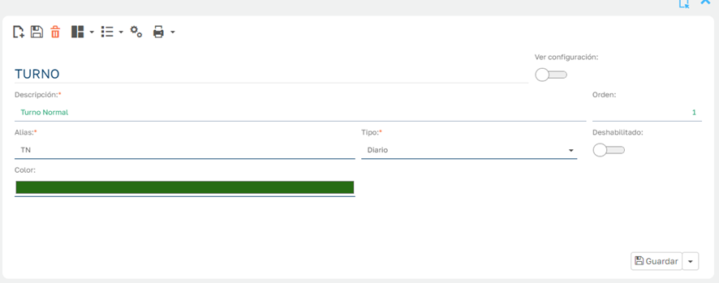

  * Alias: Nombre corto del turno que aparecerá a modo Tag en distintos apartados de la aplicación que requieran usar un nombre corto (ej. El planificador)
  * Tipo: Clasificación de turnos, es un dato de sistema que puede tener repercusiones en ciertos procesos, aunque su utilizada principal es la de tipificar el turno a modo informativo.
  * Color: Color de fondo de Tag que junto al Alias identificarán al turno.
  * Deshabilitado: Una vez que los empleados hayan fichado usando un turno determinado este ya no podrá ser eliminado, si queremos dejar de usarlo debemos deshabilitarlo.

## Contadores

Podemos asignar un tipo de contador para que cuando el empleado realice horas sobre ese turno se añadan al contador indicado. Para más información visitar el siguiente enlace: [Contadores de Horas](ContadoresHoras.es.md)

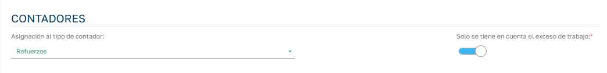

## Límites del turno

Podemos trabajar con un limite simétrico para inicio o fin del turno:

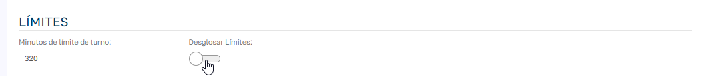

O bien podemos desglosar los limites de diferente para el inicio y el fin del turno.

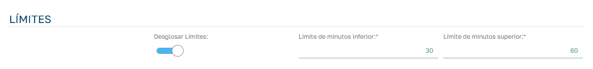

## Opciones

Si activamos “Ver Configuración” de la cabecera del turno accedemos al modulo para definir las opciones.

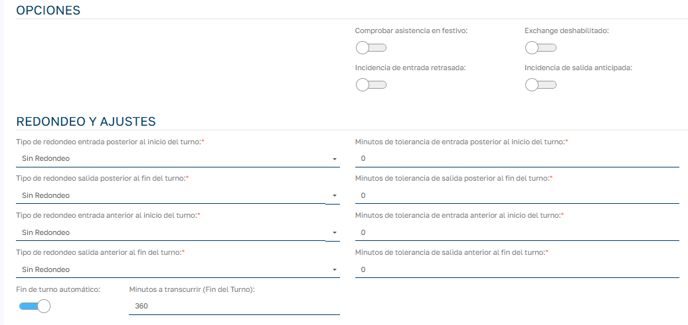

  * Minutos de límite de turno: la cantidad especificada se aplicará al inicio del turno para establecer el límite inferior del turno y al final del turno para establecer el límite superior del turno. La franja de tiempo entre el límite inferior y superior del turno es en la cual se van a admitir fichajes en ese turno.
  * Redondeos: Son franjas anteriores y posteriores a los inicios y fin de turno en las que podemos aplicar un redondeo en caso de que algún fichaje caiga dentro de una de estas franjas. Los tipos de redondeo existentes en la aplicación son los siguientes:

  1. Sin Redondeo: No realiza ninguna acción sobre la hora del fichaje.
  2. Redondeo al Turno: Modifica la hora del fichaje a la hora de inicio o fin de turno según la franja en la que se localice el fichaje.
  3. Redondeo al Cuarto de Hora: Modifica la hora del fichaje al cuarto de hora superior o inferior según la franja en la que se localice el fichaje.

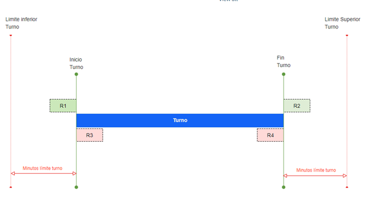

Las distintas franjas que en las que podemos definir el tipo de redondeo y los minutos que dura cada franja:

  * Tipo de redondeo entrada anterior al inicio del turno (R1)
  * Minutos de tolerancia de entrada anterior al inicio del turno (R1)
  * Tipo de redondeo salida posterior al fin del turno (R2)
  * Minutos de tolerancia de salida posterior al fin del turno (R2)
  * Tipo de redondeo entrada posterior al inicio del turno (R3)
  * Minutos de tolerancia de entrada posterior al inicio del turno (R3)
  * Tipo de redondeo salida anterior al fin del turno (R4)
  * Minutos de tolerancia de salida anterior al fin del turno (R4)

  * Comprobar asistencia en festivo: Al marcar esta opción estamos indicando que el turno trabaja en días festivos, por lo que el sistema planificará como horas teóricas a trabajar, las horas del turno al empleado para ese día a pesar de ser un día festivo. En caso de no marcarlo, aunque la planificación por periodos del empleado indique que tiene asignado el turno, el sistema no hará caso al turno y entenderá que el empleado tiene el día festivo.
  * Incidencia entrada retrasada: Si activamos, marca como incidencia en la gestión de marcajes cuando un empleado llega tarde al inicio del turno.
  * Incidencia salida anticipada: Si activamos, marca como incidencia en la gestión de marcajes cuando un empleado sale antes del fin del turno.
  * Fin de turno automático y minutos a transcurrir: Al activar la opción fin de turno automático se habilita el campo para introducir los minutos a transcurrir a partir del fin de turno para que se ejecute un _cron job_ que genera un fichaje de salida automático a los empleados que estén trabajando en ese turno y no hayan realizado ya su fichaje de salida. El fichaje de salida con hora salida igual a hora fin de turno.

## Líneas de turno

En las líneas de turno definimos los horarios de trabajo y descansos para cubrir todos los días de la semana en el que el turno deba de estar activo.

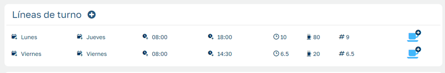

En cada línea definimos la siguiente información:

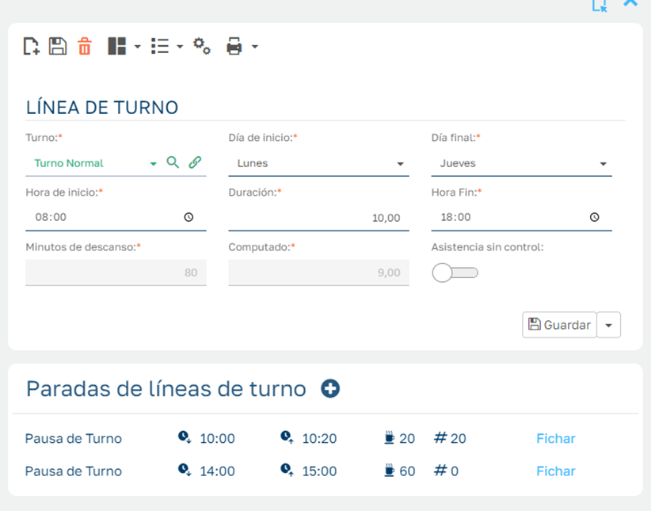

  * Día de inicio y día final: Indicamos los días de la semana que cubre la especificación de la línea. En el ejemplo lunes – jueves, indica que cubre los días lunes, martes, miércoles y jueves.
  * Hora inicio, hora fin y duración: Hora que inicia el turno y hora que finaliza, la duración es las horas que transcurren entre hora inicio y fin.
  * Minutos de descanso: El sumatorio de minutos de todos los descansos que tenemos definidos para la definición de la línea. 
  * Computado: Horas de trabajo teórico del turno, es la duración menos los minutos de descanso.
  * Asistencia sin control: Indica que el sistema no va a establecer una ausencia no planificada si el empleado no acude a trabajar en los días que especifica la línea de turno.

## Paradas o descansos

Como veíamos, en cada línea establecemos las distintas paradas que se programan para esa línea. En caso de turnos partidos la franja horaria entre las dos partes del turno es también un descanso o parada.

Veamos la información que define el descanso:

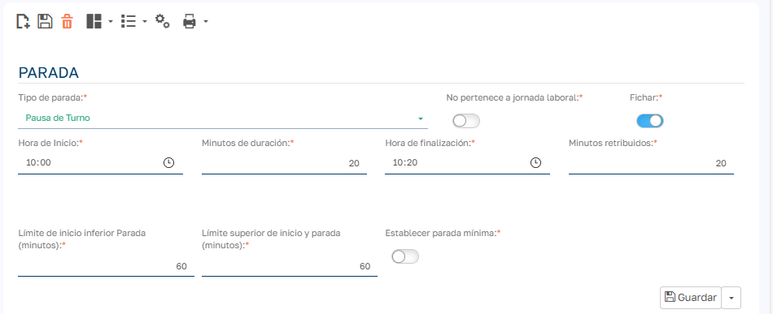

  * Tipo de parada: Es una clasificación para diferenciar tipos de descanso a modo informativo, no implica ninguna distinción a nivel de procesos.
  * No pertenece a la jornada: Sirve para especificar que es una pausa en la jornada laboral del empleado. Es la forma de especificar que es una jornada partida mediante este descanso.
  * Fichar : Activamos esta opción en caso de que el empleado deba fichar la salida de presencia y fichar la vuelta al trabajo en sus tiempos de descanso. En Sebastián HR no se fichan explícitamente que se comienza un descanso y se finaliza, lo que hacemos es fichar una salida de presencia y una entrada de presencia. En caso de no activar la opción _Fichar_ el sistema introduce automáticamente el descanso ( ver [Descuento automático de descansos de la jornada](DescuentoAutomaticoDescansos.es.md))
  * Hora inicio, hora fin y minutos de duración: definimos el horario y minutos del descanso.
  * Minutos retribuidos: Los minutos del descanso que se consideran como tiempo trabajado sin necesidad de que el empleado realice ese tiempo mediante fichajes de presencia. ( ver [Descansos remunerados](DescansosRemunerados.es.md))
  * Límite Inferior de Inicio : Minutos de tolerancia antes del inicio programado. Cuando debe realizarse el descanso en los fichajes para que el sistema identifique que estamos realizando este descanso.
  * Límite Superior de Inicio : Minutos de tolerancia después del inicio programado
  * Establecer parada mínima: Sirve para indicar que queremos ajustar el tiempo de descanso como mínimo al tiempo establecido en el descanso del turno. (ver [Aplicar descanso mínimo de turno](DescansoMinimoTurno.es.md))

## Días especiales

Para añadir excepciones a la norma que define el turno para días específicos en el que podemos definir un horario distinto al que indica el turno para ese día de la semana.

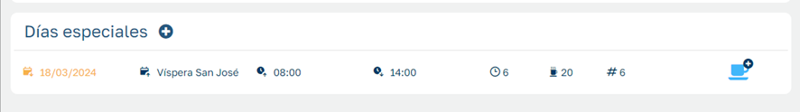

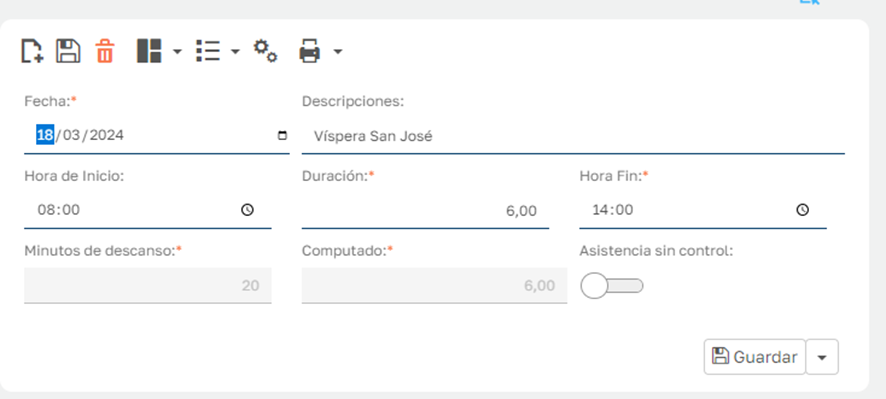

Aquí indicamos que para el 18/03/24 el horario a realizar será el que indiquemos aquí, que será valido para ese día independientemente de en que día caiga esa fecha y lo que diga el turno para ese día.
