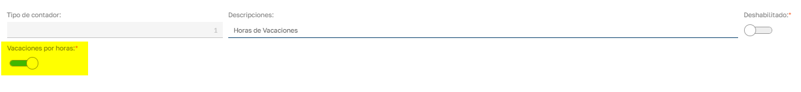
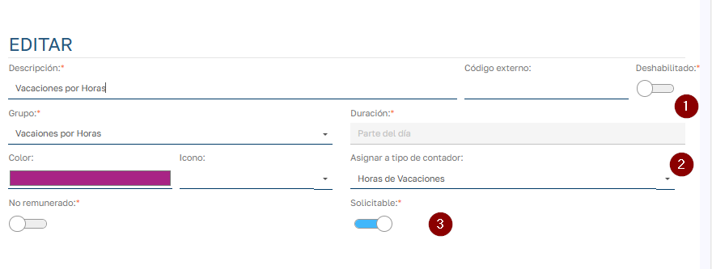
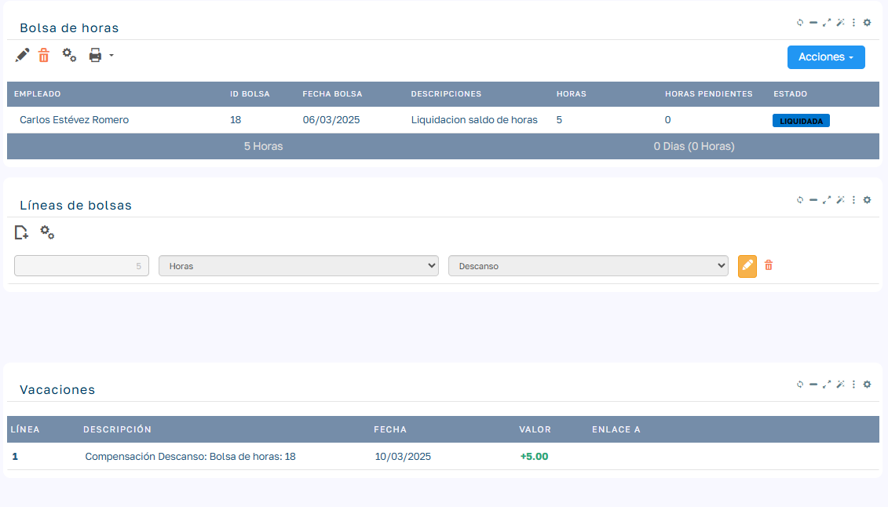
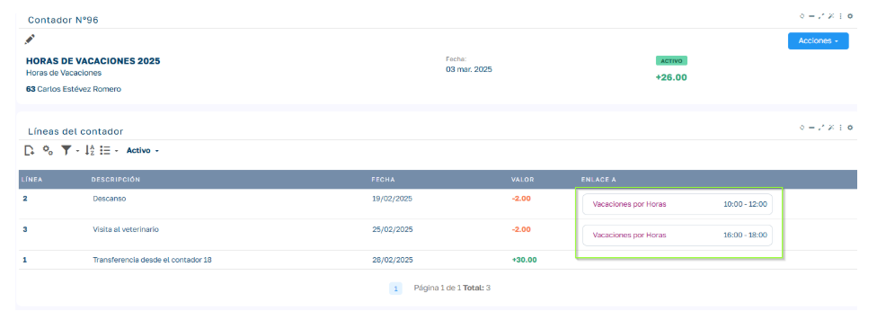
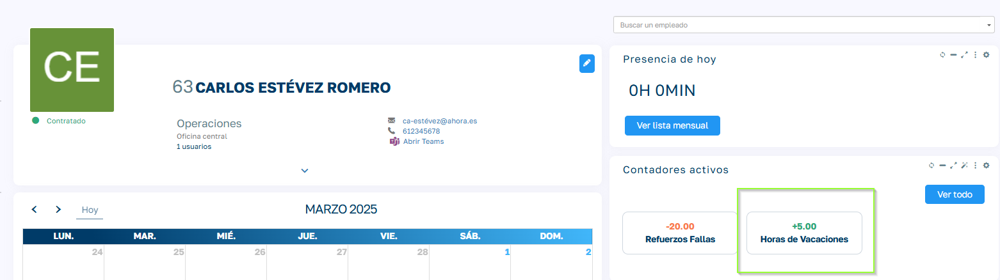

# Horas de Vacaciones

En Sebastian HR , la gestión de vacaciones se adapta a los convenios laborales que combinan días y horas de descanso. Algunos convenios establecen un número determinado de días de vacaciones más un saldo adicional de horas , que los empleados pueden utilizar de manera flexible.

  

Para manejar esta situación, el sistema permite:

  1. Asignar vacaciones por días : Cada empleado tiene un saldo de días de vacaciones que puede solicitar según su disponibilidad.
  2. Llevar un control paralelo de horas adicionales : Estas horas pueden ser utilizadas en fracciones dentro de la jornada laboral sin consumir un día completo de vacaciones.

Por ejemplo, un empleado podría:

  * Tomar un día completo de vacaciones restando 1 día del saldo.
  * Usar 4 horas de sus 20 horas adicionales en una tarde libre sin afectar sus días de vacaciones.

  

Este sistema permite una gestión más precisa y flexible de las vacaciones, asegurando que se respeten los convenios sin limitar la autonomía del empleado en la distribución de su tiempo libre.

  

### Configuración

  

Para poder comenzar a utilizar esta funcionalidad debemos de realizar una configuración inicial de los objetos que intervienen en el proceso.

  

### Alta de tipo de contador para horas de vacaciones

  

Podemos más a cerca del funcionamiento de contadores en el siguiente documento [Contadores de Horas](Contadores%20de%20Horas.md)

  

Aquí nos vamos a centrar exclusivamente en la configuración para la gestión de horas de vacaciones, para ello empezaremos dando de alta un tipo de contador marcado como _Vacaciones por horas:_

  

__

En este tipo de contador agruparemos los sucesivos contadores de horas de vacaciones de los empleados._  

  

### Alta de tipo de ausencia para horas de vacaciones

  

Necesitamos un tipo de ausencia con la que registrar las solicitudes de vacaciones por horas que vayan realizando los empleados a lo largo del año.

  

El sistema viene por defecto con un grupo de ausencias para incluir el nuevo tipo de ausencia que tenemos que generar, lo que nos permitirá asignarle su propio flujo de aprobación a nivel de este grupo.

  

Para dar de alta el nuevo tipo de ausencia vamos a Mantenimientos/Tipos de Ausencia y damos de alta una nueva:

  

  

  1. En el grupo de vacaciones por horas solo se pueden generar tipos de ausencia con duración parcial.
  2. Asignaremos el tipo de contador que hemos generado en el apartado anterior para indicar que este tipo de ausencia se contabiliza con un contador de este tipo.
  3. Si queremos que los empleados puedan hacer solicitudes de vacaciones por horas marcamos la opción _Solicitable._

  

Una vez generada tendremos el tipo de ausencia listo para usarse:_  
_

  

Añadir horas a un contador de horas de vacaciones.

  

Podemos añadir horas al contador de horas de vacaciones de la misma forma que lo haríamos para cualquier otro tipo de contador. 

  

Para conocer las distintas opciones consultar el documento [Contadores de Horas](Contadores%20de%20Horas.md).

  

Lo habitual en este tipo de contadores es que se inicialicen con la cantidad de horas que indique el convenio o que finalmente disponga la empresa. En el cambio de año podemos cerrar contadores de horas de vacaciones y trasferir su saldo a nuevos contadores para el nuevo año de forma masiva con los procesos de transferencia y cierre de contadores. Podemos añadir mas horas del nuevo año a los nuevos contadores con la inserción de líneas masiva.

  

Añadir Horas de Descanso desde liquidación de Bolsa de horas.

  

Cuando vamos a liquidar una bolsa de horas podemos indicar que queremos compensar horas de la bolsa con horas de descanso.

  

Esto añadirá horas al contador activo de tipo Horas de Vacaciones del empleado de la bolsa de horas.

  

En la bolsa liquidada podemos ver el enlace a la linea de contador asignada a la liquidación.

  

  

La vinculación de la linea del contador con la bolsa de horas implica las siguientes restricciones para asegurar la trazabilidad:

  

  * No podremos deshacer la liquidación de horas si hemos cerrado el contador de horas de vacaciones de la linea vinculada. Tendremos que activar el contador en cuestión para poder deshacer la liquidación.
  * No podremos eliminar la linea de contador si esta vinculada a una bolsa de horas liquidada. Tendremos que deshacer la liquidación de la bolsa para poder eliminar la linea de contador.

  

Descuento de horas del contador de horas de vacaciones.

  

El saldo positivo de horas de vacaciones se irá compensando a medida que el empleado vaya solicitando ausencias del tipo de ausencia que hayamos configurado en el grupo de ausencias "Horas de Vacaciones".

  

Una ves la solicitud de ausencia por horas de vacaciones del empleado llega a estado Aceptado, se inserta una linea de contador en negativo con las horas de esta ausencia:

  

  

  

  

### Visualización de Horas de Vacaciones por parte del Empleado

  

El empleado puede visualizar el saldo actual de su contador de horas de vacaciones desde su área personal. Pulsando sobre el contador puede visualizar el detalle de las líneas que componen sus saldo.

  

###