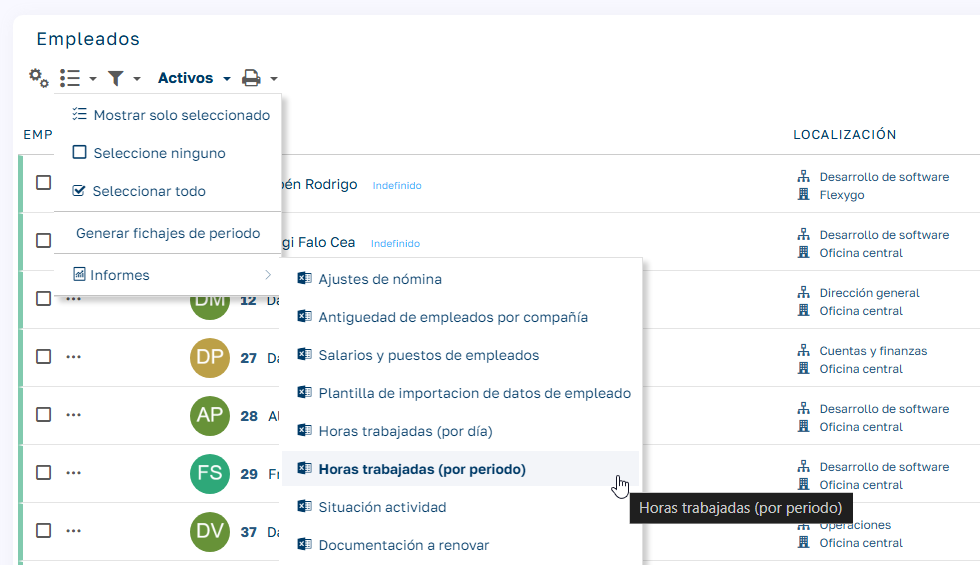
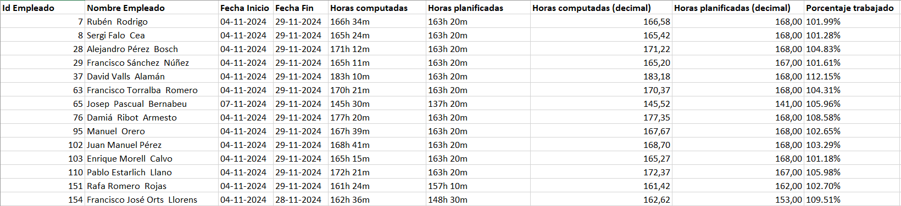

# Empleados:   Horas trabajadas (por periodo)

Este informe proporciona información detallada sobre las horas trabajadas por cada empleado, agrupadas en el periodo seleccionado.

### 

### Tipo

  * Formato: Excel

### Parámetros

  * Fecha de inicio: Primer día del periodo a consultar.

  * Fecha final: Último día del periodo a consultar.

### Campos del informe

  1. ID y nombre del empleado.

  2. Fecha de inicio: Primera fecha dentro del periodo con fichajes del empleado.

  3. Fecha fin: Última fecha dentro del periodo con fichajes del empleado.

  4. Horas computadas: Suma de las horas trabajadas más las horas de ausencias computables en todo el periodo.

  5. Horas planificadas: Suma de las horas planificadas en todo el periodo.

  6. Horas computadas y horas planificadas (decimal): Lo mismo que los campos anteriores, pero expresado en formato decimal.

  7. Porcentaje: Proporción de horas computadas sobre las horas planificadas en todo el periodo, expresada en porcentaje.

  

  

