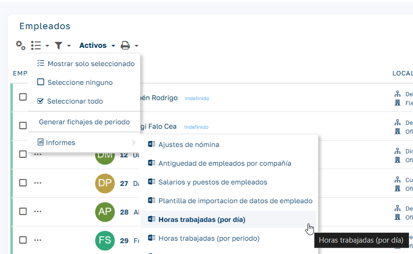
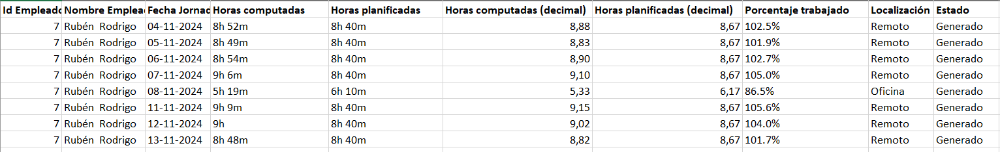

# Empleados:  Horas trabajadas (por día)

Este informe proporciona información detallada sobre las horas trabajadas por cada empleado, agrupadas por día, dentro del periodo seleccionado.

  

###   

### Tipo

  * Formato: Excel

### Parámetros

  * Fecha de inicio: Primer día del periodo a consultar.

  * Fecha final: Último día del periodo a consultar.

### Campos del informe

  1. ID y nombre del empleado.

  2. Fecha jornada: Jornada a la que pertenecen los fichajes. Es posible que fichajes de dos días diferentes pertenezcan a la misma jornada (por ejemplo, entrada a las 22:00 y salida a las 06:00 del día siguiente).

  3. Horas computadas: Suma de las horas trabajadas más las horas de ausencias computables.

  4. Horas planificadas: Horas planificadas para ese día, incluyendo las horas teóricas de trabajo más las ausencias computables.

  5. Horas computadas y horas planificadas (decimal): Lo mismo que los campos anteriores, pero expresado en formato decimal.

  6. Porcentaje: Proporción de horas computadas sobre las horas planificadas, expresada en porcentaje.

  7. Localización: Ubicación con mayor prevalencia en ese día.

  8. Estado: Estado de los fichajes para ese día, con posibles valores:

     * Generado : Datos registrados pero no validados.

     * Validado : Datos revisados.

     * En balance : Datos aprobados y en el balance diario.

  

