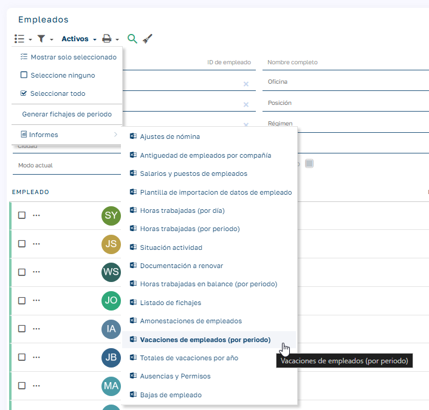
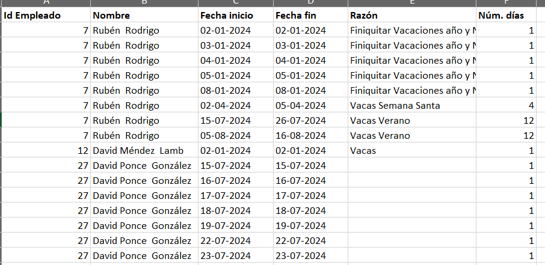

# Vacaciones (por período)

## Descripción

Este informe proporciona un **excel** con información detallada sobre las vacaciones de los empleados dentro del periodo seleccionado.

## Parámetros

| Parámetro | Descripción |
| --- | --- |
| Fecha de inicio | Primer día del periodo a consultar |
| Fecha final | Último día del periodo a consultar |

## Campos del informe

| Campo | Descripción |
| --- | --- |
| Id | Identificación única del empleado |
| Nombre del empleado | Nombre con apellidos del empleado |
| Fecha de inicio del periodo | Primer día de las vacaciones dentro del periodo. |
| Fecha de fin del periodo | Último día de las vacaciones dentro del periodo. |
| Razón | Motivo de la solicitud de vacaciones. |
| Número de días | Días consecutivos de vacaciones dentro de la misma instancia de solicitud. |

