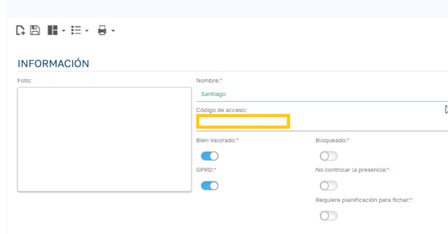
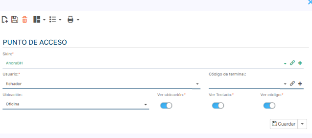
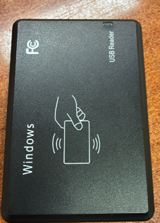
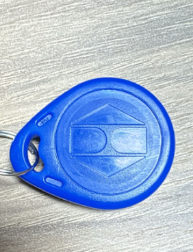

# Dispositivos RFID para Integración con Sebastian (Access Point)

> Importante: El método de lectura se basa exclusivamente en la emulación de teclado por parte del lector RFID, que inyecta el código como si fuera una entrada manual. No se trata de una captura de código NFC (o RFID) por un proceso específico de la aplicación Sebastian, sino de una integración a nivel de hardware que simula pulsaciones de teclas en el campo activo.

  

### 1\. Asignación del Dispositivo RFID al Usuario

  

Para registrar un dispositivo RFID (tag o tarjeta) en la ficha del empleado:

  1. Abrir la ficha del empleado en Sebastian.
  2. Localizar el campo Código de Acceso.
  3. Escanear o introducir el código RFID del empleado.
  4. Guardar los cambios.

  

_(Imagen 1 : Interfaz de ficha de empleado)._

  

### 2\. Creación y Configuración de Access Points

Crear en Sebastian un Access Point por cada punto físico de fichaje, asignándolo a un terminal con lector RFID.

Para más información puedes visitar el documento [Configurar un Punto de Acceso](../Primeros%20pasos/Configurar%20un%20Punto%20de%20Acceso.md)

  

  

 _(Imagen 2: Creación de Access Points)._

  

### 3\. Instalación de Dispositivos RFID

Los dispositivos RFID compatibles actúan estrictamente como emuladores de teclado : al leer un tag o tarjeta, escriben automáticamente el código en el campo activo del sistema, simulando una entrada de teclado. Esto no implica ninguna captura de código NFC por un proceso de la aplicación Sebastian , sino una transmisión directa a nivel de dispositivo HID (Human Interface Device), sin software intermediario.

  

_(Imagen 3._ lector de tarjetas RFID USB (USB RFID Card Reader))_._

  

Es un lector de tarjetas RFID USB (USB RFID Card Reader). Se trata de un dispositivo portátil y compacto que se conecta directamente a un puerto USB de un ordenador o tablet.

  

Lee códigos de tarjetas o etiquetas RFID/NFC de forma inalámbrica (generalmente a corta distancia, como 1-5 cm), emulando un teclado para ingresar el código automáticamente en aplicaciones o software.

  

__

__(Imagen 4._ llavero o tag RFID de proximidad (RFID Proximity Key Fob))_

_Llavero o tag RFID de proximidad (RFID Proximity Key Fob), típicamente de 125 kHz, diseñado para control de acceso, fichaje o identificación._

Función: Al acercarlo a un lector RFID (como el que mostraste antes), transmite un código único de forma inalámbrica para autenticación rápida. No requiere batería; usa energía del lector.

  

### 4\. Funcionamiento con Sebastian

  

Sebastian interpreta el código RFID recibido mediante emulación de teclado como una entrada manual estándar, permitiendo fichajes rápidos sin interacción adicional. Reiteración clave: No hay procesamiento nativo de códigos NFC en la aplicación; la integración depende íntegramente de la emulación hardware para inyectar el código en el flujo de fichaje.

  

  

### 5\. Recomendaciones

  * Validar el funcionamiento del lector RFID antes de usarlo, confirmando su modo de emulación de teclado.
  * Confirmar que el código leído coincide con el del empleado.
  * Asegurar que el lector funcione exclusivamente como emulador de teclado, sin configuraciones de captura NFC.
  * Realizar pruebas en cada Access Point para verificar la inyección correcta del código.