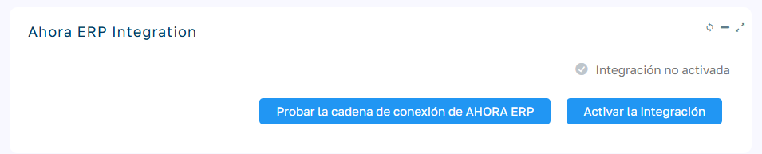
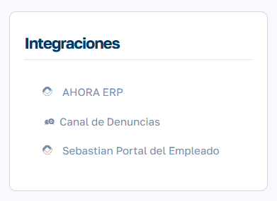
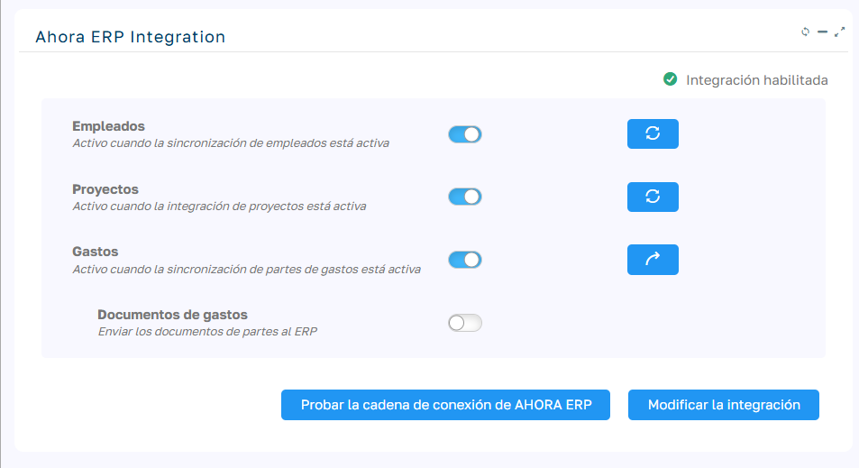

# Integración con Ahora ERP

La integración entre Sebastian HR y Ahora ERP permite sincronizar empleados, proyectos y partes de gastos de forma automática, asegurando que ambos sistemas trabajen con información coherente y actualizada.

  

  

Configuración inicial

  * Configurar la cadena de conexión

En el archivo `web.config` de Sebastian HR, añade la cadena de conexión `ERPConnectionString`, apuntando a la base de datos de Ahora ERP. Esta cadena debe añadirse a continuación de las cadenas de conexión existentes (Datos y Configuración).

  

        
        <add name="ERPConnectionString " connectionString="Data Source=TUSERVER ;Initial Catalog=TUBD ;Persist Security Info=True;User ID=sa ;Password=TUPASSWORD" providerName="System.Data.SqlClient"/>

  

> Nota:  
>  Si las cadenas de conexión están encriptadas, consulta el artículo[ Desencriptar cadenas de conexión ](../../Flexygo/FAQ%20(flexygo)/Cómo%20modificar%20las%20cadenas%20de%20conexión%20encriptadas.md)para obtener instrucciones detalladas sobre cómo proceder.
> 
>   
> 

  * Validar la conexión: Ejecuta el proceso “Probar la cadena de conexión del ERP” para verificar que está correctamente configurada.

⚠️ Importante : Una vez establecida la sincronización, no es posible deshacerla.

### Activar la integración

Una vez configurada la conexión desde el menú `Mantenimiento > Integraciones > Ahora ERP`. 

### 

### Objetos que se pueden sincronizar

La integración contempla los siguientes objetos:

  * Empleados (obligatorio)

  * Proyectos (opcional, activable posteriormente)

  * Partes de gastos (opcional, activable posteriormente)

  

  

  

 

### Empleados

La sincronización de empleados es obligatoria y funciona de manera bidireccional :

  * Correspondencia de IDs

    * `EmployeeId` en Sebastian HR

    * `IdEmpleado` en Ahora ERP

  * Flujo de sincronización

    * Los cambios en Sebastian HR se reflejan inmediatamente en el ERP.

    * Los cambios en el ERP se trasladan a Sebastian HR mediante un cron job que se activa con la integración. Este proceso también puede ejecutarse manualmente desde `Mantenimiento > Integraciones > Ahora ERP`.

  * Objetos asociados :

    *Categorías, Departamentos y Nivel de estudios se mapean con el `id` del ERP y el `externalid` de Sebastian.

    * Si un objeto no existe en Sebastian, se crea automáticamente al enviarlo desde el ERP.

    * En caso de crear un objeto nuevo en Sebastian, también debe crearse en el ERP.

  * Direcciones : Los campos de dirección, población, provincia y país que se utilizan del ERP son los campos de texto, no los campos de Id.

  

Los campos obligatorios para la sincronización son:

  

  

<table border="1" class="ticket-editor-apply-border" style="width: 100%;"><tbody><tr><td dir="ltr" style="width: 33.3333%; background-color: rgb(239, 239, 239);">CAMPO SEBASTIAN HR</td><td dir="ltr" style="width: 33.3333%; background-color: rgb(239, 239, 239);">CAMPO ERP - TABLA Empleados_Datos</td></tr><tr><td dir="ltr" style="width: 33.3333%;">EmployeeId</td><td dir="ltr" style="width: 33.3333%;">IdEmpleado </td></tr><tr><td dir="ltr" style="width: 33.3333%;">Name</td><td dir="ltr" style="width: 33.3333%;">Nombre</td></tr><tr><td dir="ltr" style="width: 33.3333%;">Surname</td><td dir="ltr" style="width: 33.3333%;">Apellido</td></tr><tr><td dir="ltr" style="width: 33.3333%;">Department </td><td dir="ltr" style="width: 33.3333%;">Departamento</td></tr><tr><td dir="ltr" style="width: 33.3333%;">Gender</td><td dir="ltr" style="width: 33.3333%;">SexoH</td></tr></tbody></table>

 

 

### Proyectos

  * Al activar la integración de proyectos:

    * No se permite crear ni modificar proyectos en Sebastian HR.

    * Todos los cambios deben gestionarse en el ERP y se traspasan a Sebastian.

  * La sincronización se realiza mediante un cron job automático, o con la opción de ejecución manual desde `Mantenimiento > Integraciones > Ahora ERP`.

 

### Partes de gastos

  * Los partes de gastos se sincronizan con Ahora ERP cuando su estado es “Confirmado”.

  * Mapeo de tipos de gastos y de Tipos de pagos:  
Deben configurarse en Sebastian HR y vincularse con sus equivalentes en el ERP desde `Mantenimiento > Gastos`.

  * Una vez activa la sincronización:

    * Un cron job envía automáticamente los partes confirmados al ERP.

    * También puede ejecutarse manualmente desde `Mantenimiento > Integraciones > Ahora ERP`.

  * Opciones adicionales :

    * Se puede habilitar o deshabilitar la opción _“Enviar documentos de partes al ERP”_ , lo que permite transferir también los documentos asociados a las líneas de gasto al gestor documental del ERP.  
  

Los campos Cliente (en partes de gastos y viajes) se alimentan de la tabla `Clientes_Datos` del ERP, garantizando la vinculación automática con el cliente correspondiente

  

