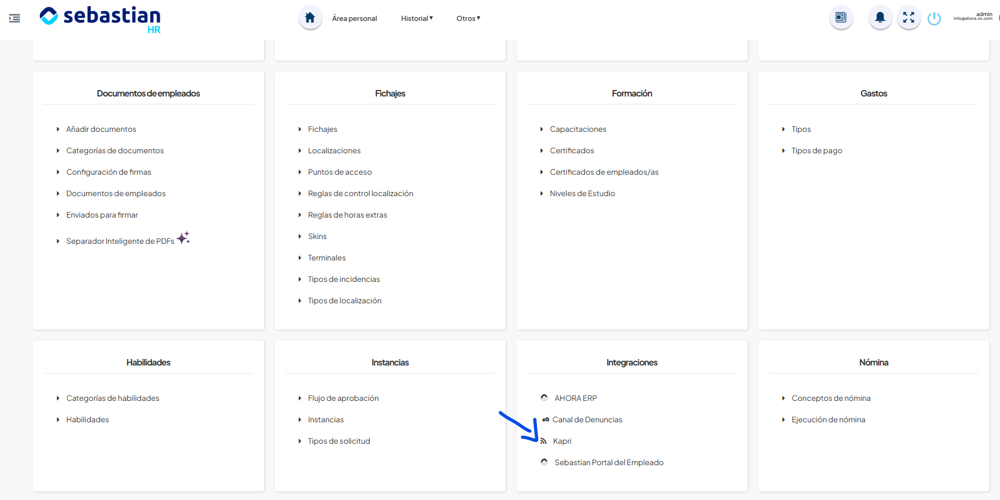
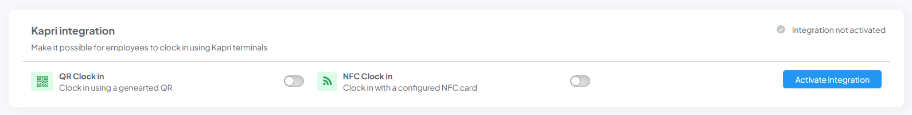
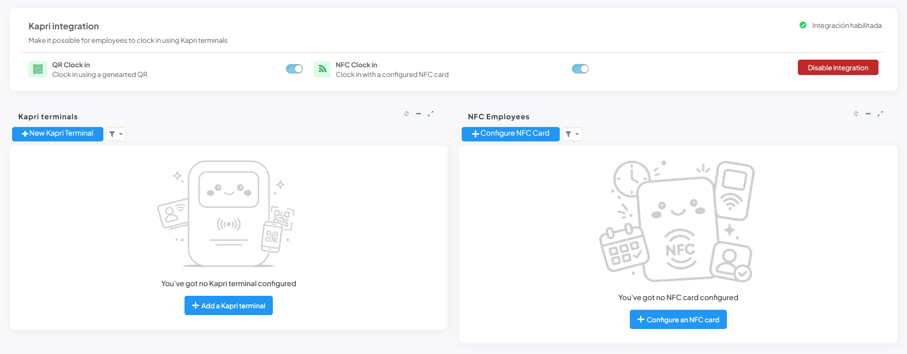
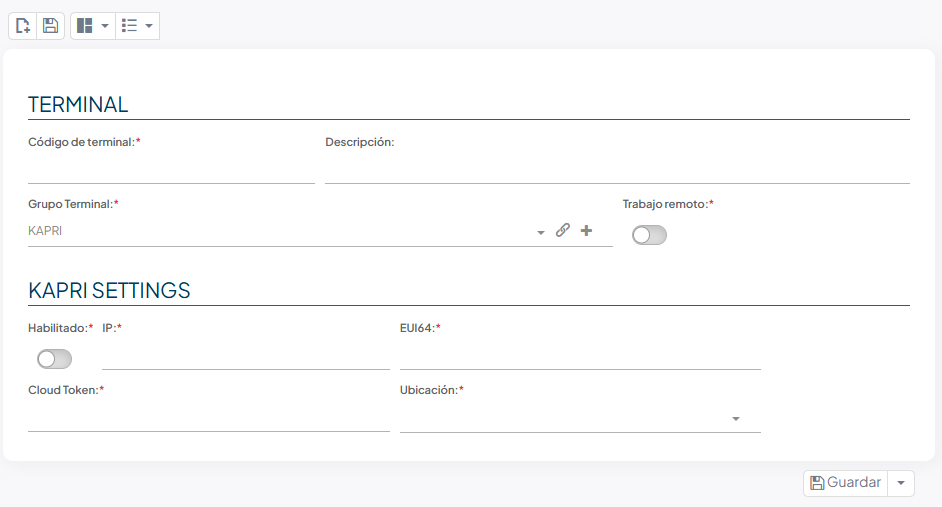
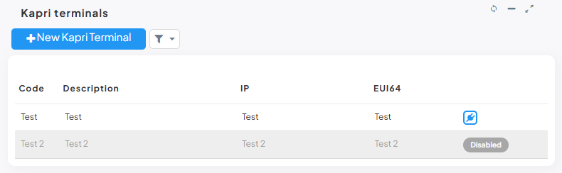
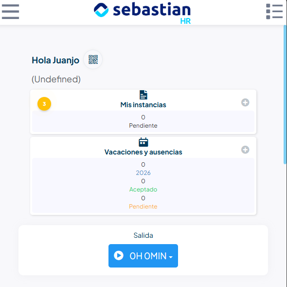
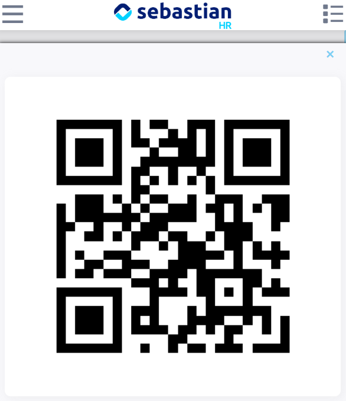
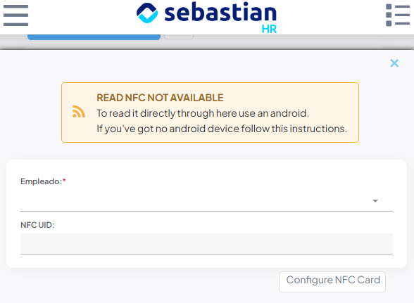
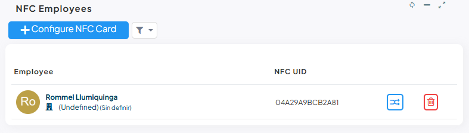

# Integración con terminales Kapri (Kimaldi)

Un **terminal Kapri** es un dispositivo físico de Kimaldi que identifica al empleado (leyendo un código QR o una tarjeta NFC) y avisa a Sebastian HR para que registre el fichaje. El terminal avisa a Sebastian HR cada vez que alguien ficha y Sebastian automáticamente crea dicho fichaje.

## Iniciar la configuración

Para comenzar la configuración de tu dispositivo Kapri tendrás que aceder al siguiente menú:  
`Integraciones > Kapri`

Al entrar a la página verás un único módulo con tres interruptores que son **independientes** entre sí:

| Interruptor | Qué controla |
|---|---|
| **Activate integration / Disable integration** | Enciende o apaga toda la integración |
| **QR Clock in** | Permite fichar mostrando un código QR |
| **NFC Clock in** | Permite fichar acercando una tarjeta NFC |

!!! warning "Importante"
    Tener la integración activada pero los interruptores QR y NFC apagados significa que el terminal lee la tarjeta o el QR, pero **el fichaje se rechaza** y el empleado ve un mensaje de error en la pantalla del dispositivo.

Para continuar con la integración tendrás que encender el switch de `Activar integración` se mostrarán todos los módulos de la página:

| Zona | Contenido |
|---|---|
| Superior | Estado de la integración, interruptores QR y NFC, botón de activar/desactivar |
| Izquierda | Listado de terminales Kapri |
| Derecha | Empleados con tarjeta NFC asignada |

## Dar de alta un terminal

### Crear el terminal

En el panel **«Kapri terminals»** pulsa **«New Kapri Terminal»** (o, si la lista está vacía, **«Add a Kapri terminal»**).

Rellena los campos del bloque **«Kapri Settings»**:

| Campo | Obligatorio | Qué es |
|---|---|---|
| **Terminal Code** | Sí | Código con el que identificas el terminal en Sebastian HR. Es el que queda grabado en cada fichaje |
| **Description** | No | Texto descriptivo (ubicación, planta…) |
| **Enabled** | Sí | Si lo apagas, el terminal queda dado de alta pero **sus lecturas se rechazan** |
| **IP** | Sí | Dirección IP del terminal en la red. Sin ella no se puede probar la conexión ni mostrar mensajes en su pantalla |
| **EUI64** | Sí | Identificador único del dispositivo, indicado en la etiqueta o el menú del propio terminal. **Es el dato con el que Sebastian HR reconoce qué terminal le está avisando** |
| **Cloud Token** | Sí | Clave compartida con el terminal. Debe escribirse **exactamente igual** que la configurada en el dispositivo |

### Configurar el dispositivo Kapri

En la propia pantalla/menú de administración del terminal:

1. Ponlo en modo **CLOUD**.
2. Añade la **Cloud URL** como en este ejemplo sustituyendo `MiDireccion.com` por la direccion de tu Sebastian HR:
    <fh-copy>https://MiDireccion.com/webhook/guest/Kapri</fh-copy>
3. Configura el **cloud token** con el mismo valor que has escrito en *Cloud Token*.
4. Asegúrate de que el terminal es accesible desde el servidor de Sebastian HR por red (puerto **9445**).

### Probar la conexión

En la fila del terminal, pulsa el icono de **enchufe** («Test connection»). Solo aparece si el terminal está *Enabled*; si no lo está, verás en su lugar la etiqueta gris **«Disabled»**.

La prueba comprueba, en este orden, que: el terminal existe, tiene IP y token configurados, responde correctamente cuando se le pregunta, su identificador coincide con el que tienes guardado, y su clave coincide con la tuya.

Si todo va bien recibes el mensaje **«Connection with the Kapri terminal was successful»** seguido de la descripción del dispositivo.

| Mensaje que puedes ver | Causa habitual |
|---|---|
| *This terminal is not configured on Sebastian HR* | El código de terminal no existe |
| *The terminal does not have an IP address configured* | Falta la IP |
| *The terminal does not have a cloud token configured* | Falta el Cloud Token |
| *Could not connect to the Kapri terminal* | Red, firewall o puerto 9445 cerrado |
| *The terminal responded with an error* | El dispositivo contesta pero rechaza la petición |
| *…does not match the configured EUI64* | En esa IP hay otro terminal distinto al que esperabas |
| *The cloud token configured in Sebastian HR does not match the one stored in the terminal* | La clave no coincide entre la aplicación y el dispositivo |

!!! warning "Mayúsculas y minúsuclas"
    La comparación de la clave **distingue mayúsculas de minúsculas**; la del identificador del dispositivo no.

## Configurar el modo QR

### Activarlo

En la cabecera de la página, activa el interruptor **«QR Clock in»**.

Al activarlo, Sebastian HR genera automáticamente un código QR para cada empleado, listo para usarse. Al desactivarlo, esos códigos dejan de estar disponibles.

!!! info "Rotación de códigos"
    Los códigos QR se **renuevan automáticamente cada 30 minutos**. Es una medida de seguridad: un QR capturado en una foto deja de servir en menos de media hora.

### Cómo lo usa el empleado

En la pantalla de inicio de la app del empleado, junto al saludo, aparece un **icono de QR**.

Al pulsarlo se abre el código a pantalla completa, listo para acercarlo al lector del terminal.

!!! info "Icono visible"
    El icono solo se muestra si el modo QR está dactivado, si no es así no aparece.

## Configurar el modo NFC

### Activarlo

En la cabecera, activa el interruptor **«NFC Clock in»**.

A diferencia del QR, **activar NFC no asigna nada automáticamente**: las tarjetas hay que asignarlas una a una a cada empleado.

### Asignar una tarjeta a un empleado 

En el panel derecho **«NFC Employees»**, pulsa **«Configure NFC Card»**.

El formulario tiene dos campos:

- **Employee** — el empleado al que asignas la tarjeta (obligatorio).
- **NFC UID** — el identificador de la tarjeta.

En el caso de no disponer de un **Android** tendrás que rellenarlo manualemnte copiando el id del nfc de un lector de nfcs. En caso de tener un **Android** consulta el siguiente punto para hacer la integración mucho más fluida.

### Asignación de NFC por Android

Cuando abres el formulario de asignaión de una tarjeta NFC en un **Android** se solicitarán permisos de lectura de NFC. Si aceptas estos permisos podrás rellenar todos los nfcs con tan solo acercar la tarjeta tras haber seleccionado el empleado a quien deseas asignársela.

Tú dispositivo leerá el NFC y rellenará automáticamente el campo NFC ID con lo que tan solo quedará darle a guardar y ya tendrá dicho empleado su tarjeta asignada.

!!! warning "Selecciona primero el empleado"
    Si acercas la tarjeta antes de elegir el empleado, verás el aviso *«You need to set the employee first»*. **Selecciona siempre primero el empleado.**

### Gestionar tarjetas ya asignadas

El listado de la derecha muestra foto, nombre, área y centro de trabajo de cada empleado con tarjeta, junto con su identificador.

Cada fila ofrece:

- **Clic en la fila** — reabre el formulario para cambiar el identificador.
- **Icono de flechas cruzadas** — traspasa la tarjeta a otro empleado en un único paso. Es la forma correcta de reasignar una tarjeta física cuando alguien cambia de puesto o causa baja.
- **Icono de papelera** — desvincula la tarjeta de ese empleado.

## Qué ve el empleado al fichar

Cuando un empleado se identifica en el terminal (con QR o con tarjeta), el sistema comprueba, por este orden, que:

1. El terminal que avisa está dado de alta en Sebastian HR.
2. Ese terminal tiene el interruptor **Enabled** activado.
3. La clave que envía el terminal coincide con su **Cloud Token**.
4. El modo usado (QR o NFC) está activado en la cabecera de la página.
5. Existe un empleado con ese código QR o esa tarjeta.

Si alguna comprobación falla, la pantalla del propio terminal muestra un mensaje de error correspondiente (por ejemplo *«Terminal disabled»*, *«QRs disabled»*, *«NFCs disabled»* o *«No employee found»*) y el fichaje no se registra.

Si todo es correcto, la pantalla del terminal muestra **«Welcome»** o **«Bye»** según corresponda, junto con el nombre del empleado y la hora, y el fichaje queda registrado.