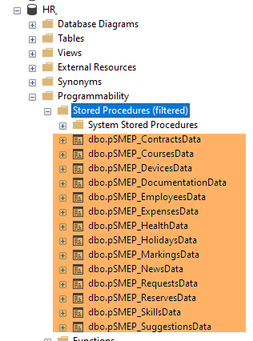
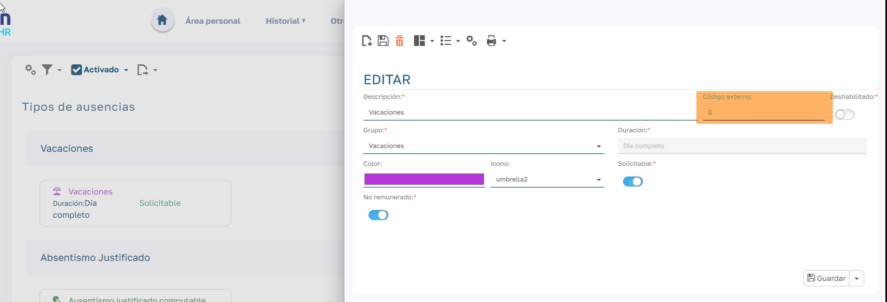
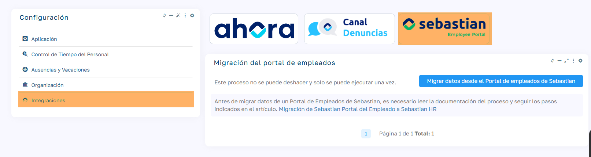

# Migración de Sebastian Portal del Empleado a Sebastian HR

Esta guía describe el proceso completo de migración desde Sebastian Portal del Empleado (PE) hacia Sebastian HR, incluyendo requisitos previos, configuraciones necesarias, funcionalidades migrables y recomendaciones posteriores al proceso.

La ruta de ejecución es: `Mantenimiento > Integraciones> Sebastian Portal del empleado`

## Consideraciones previas

Para poder migrar datos desde Sebastian Portal del Empleado, no pueden haber datos de Empleados en la aplicación.

!!! note "Ten paciencia"
    Este proceso puede tardar. El tiempo estimado depende del tamaño de la base de datos de origen.

!!! warning "¡Atención!"
    Una vez ejecutado, no podrá volver a ejecutarse. Asegúrese de realizar todas las comprobaciones previas.

    Este proceso es irreversible.

## Requisitos de ejecución

  - Este proceso solo puede ser ejecutado por usuarios con perfil administrador .
  - Conocimientos técnicos: Es un proceso desatendido pero requiere:
    - Conocimientos en implantación de productos Flexygo
    - Manejo de SQL para resolver posibles incidencias
  - Arquitectura técnica:
    - Se ejecuta mediante una DLL
    - Por cada funcionalidad, se llama a un procedimiento almacenado (SP) modificable
    - Los JSON contienen todos los datos de las tablas de PE (excepto vacaciones que genera dos JSON: Uno para el tipo 5 -Bajas- y el resto)

## Antes de migrar

### Configuraciones iniciales

  - Instalación de Sebastian HR: Asegúrate de tener Sebastian HR correctamente instalado.
  - Actualización de Sebastian PE: Debe estar en la última versión disponible. _(6.9.0.5 o posterior)_
  - Modo de Operación: Elegir entre PRO o LITE según la instalación prevista.
  - Este paso es previo a la integración de Sebastian HR con Ahora ERP.
  - Conexiones necesarias en el web.config:
    - `SPEConnectionString`: Referencia a la base de datos de Sebastian PE.
    - `SPEConfConnectionString`: (opcional, si se migran documentos) Referencia a la base de datos de la IC de Sebastian PE.

     <add name="SPEConnectionString" connectionString="Data Source=TUINSTANCIA;Initial Catalog=BD_SEBASTIAN_DATOS;Persist Security Info=True;User ID=sa;Password=TUPASS;TrustServerCertificate=true" providerName="System.Data.SqlClient" />
     <add name="SPEConfConnectionString" connectionString="Data Source=TUINSTANCIA;Initial Catalog=BD_SEBASTIAN_CONF;Persist Security Info=True;User ID=sa;Password=TUPASS;TrustServerCertificate=true" providerName="System.Data.SqlClient" />

!!! note "Nota"
    Si las cadenas de conexión están encriptadas, primero tendrás que desencriptarlas. Sigue los pasos del artículo [Cómo modificar las cadenas de conexión encriptadas](https://help.flexygo.com/support/solutions/articles/154000130216-c%C3%B3mo-modificar-las-cadenas-de-conexi%C3%B3n-encriptadas).

### Consideraciones especiales

  - Tablas personalizadas: Este proceso solo migra las tablas estándar. Las tablas personalizadas deben gestionarse manualmente.
  - Objetos personalizados(solo si se migran documentos):
    - Crear previamente en HR los objetos personalizados existentes en PE.
    - Solo se migrarán documentos de objetos estándar o personalizados existentes antes de ejecutar la migración.
  - Tablas Conf_(si existen en Sebastian PE):
    - Crear previamente en HR, incluyendo triggers necesarios.

!!! warning "Importante"
    Asegúrate de que las personalizaciones de Sebastian Portal del Empleado no son una funcionalidad estándar de Sebastian HR.

### Migración de vacaciones

  - Mapear tipos de vacaciones entre PE y HR mediante el campo `ExternalId`. (Los Tipos con OriginId 1 en Sebastian PE ya están guardados en el ExternalId correspondendiente de HR)

  - El tipo 5 de PE no se sincroniza como vacaciones, se trata como baja laboral (`Employees_Leaves`) en HR y se migran sin necesidad de mapear el tipo.
  - Lo grupos de los tipos de vacaciones (tabla `Holidays_Types_Groups`) no se migran, ya que en Sebastian HR estos grupos llevan una funcionalidad interna asociada y únicamente pueden existir los de producto.
  - Los tipos que se hayan creado en Sebastian Portal del Empleado y no estén relacionados con los tipos estándar de Sebastian HR (no se hayan mapeado con el campo ExternalId) se crearán dentro del grupo Otros. Estos tipos se pueden asignar al grupo correspondiente una vez realizada la migración.

!!! warning "Importante"
    Si los tipos de tu Sebastian PE son diferentes a los tipos de Sebastian PE estándar, asegúrate de controlar esos cambios editando el procesamiento de las vacaciones en el proceso almacenado en la base de datos de HR `pSMEP_HolidaysData`.

    Por ejemplo, si en tu Sebastian PE hay más tipos de bajas o la id del tipo baja no es el 5.

### Migración de usuarios

Los Roles y la seguridad no se migran.

La migración de usuarios se hace siguiendo la siguiente regla:

Los usuarios con rol admin se migran como admin.

Los usuarios con rol hresources se migran como hresources.

Los usuarios con rol AccessPoint se migran como access-points.

El resto de usuarios se migran como users, independientemente del rol que tuvieran en Sebastian PE.

### Configuraciones adicionales

  - Establecer `OriginId` de las bases de datos de Sebastian HR:
    - En la base de datos de configuración (IC) desde Sebastian HR
    - En la base de datos de datos desde el SQL.

## Funcionalidades migrables

Estas funcionalidades pueden activarse o desactivarse en el proceso mediante parámetros:

| Funcionalidad | Descripción |
| --- | --- |
| **Empleados** | Se migran siempre |
| **Habilidades** | Habilidades de los empleados |
| **Reservas** | Sistema de reservas |
| **Sugerencias** | Buzón de sugerencias |
| **Documentos** | Documentación asociada |
| **Noticias** | Comunicados internos |
| **Vacaciones** y permisos | Gestión de ausencias |
| **Contratos** | Contratos de los empleados |
| **Cursos** | Formación de empleados |
| **Gastos** | Gestión de gastos |
| **Dispositivos** | Equipos informáticos, móviles, etc. asignados |
| **Equipos** | Equipos de los empleados |
| **Evaluaciones de desempeño** | Registros de las evaluaciones de desempeño |
| **Salud y supervisión** | Datos médicos |
| **Solicitudes** | Gestión de peticiones |
| **Fichajes** | Control horario |
| **Documentos de la IC** | Gestión documental de objetos estándar y personalizados que estén creados antes de ejecutar el proceso de migración y AbhSign. |
| **Usuarios** | Todos los usuarios, sin los roles (siguiendo las reglas expuestas anteriormente) |

!!! note "Localización de tablas migradas"
    Todas las tablas migradas se registran en la tabla de la BD de datos `SMEP_MigratedData` para poder consultarlas.

## Pasos posteriores a la migración

### Configuraciones básicas

  - Asignar convenio (Solo en modo PRO):
    - Relacionarlo con las categorías.
    - Relacionar categorías con los puestos.
  - Configurar oficinas:
    - Asignar compañía.
    - Vincular calendario.

### Migración de documentos

  - Si los documentos están en `/custom`, copiar la carpeta a la nueva ubicación `/custom`.
  - Si están en otra carpeta, y la ruta no cambia, solo configurar `impersonate` en Admin Area > Parámetros > Impersonate.
  - La configuración de AbhSign correspondiente (claves y configuración de los objetos)

### Tipos de vacaciones

  - Si se han migrado nuevos tipos de vacaciones, recuerda asignarlos al grupo correspondiente.

Completar la configuración inicial faltante.

Siguiendo los artículos de la carpeta[Primeros pasos](https://help.flexygo.com/support/solutions/folders/154000552698).

## Casos especiales

### Contratos duplicados abiertos

  - Se mantiene el último abierto.
  - Los anteriores se cierran con fecha de fin un día antes del siguiente inicio.

### Vacaciones totales

Se migran como días laborables.

### Bajas

Migradas con ID = 100 (Baja laboral por enfermedad).
