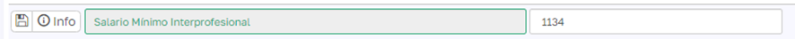
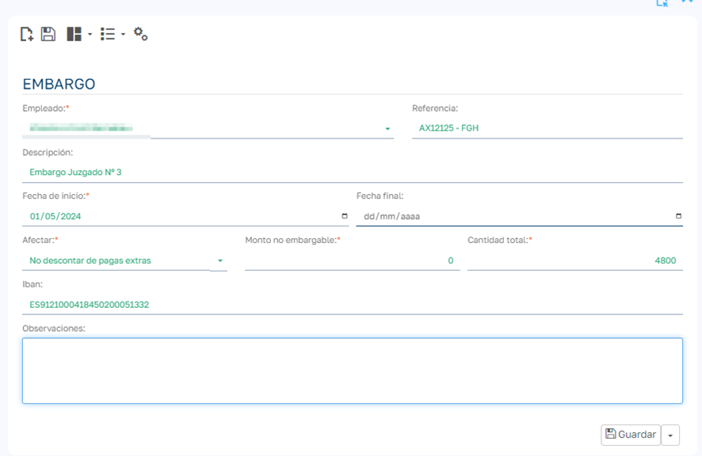
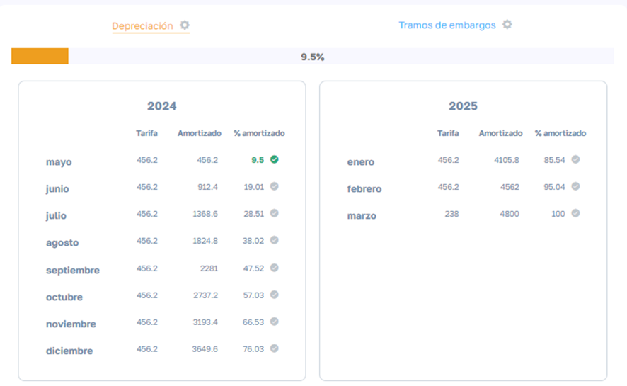
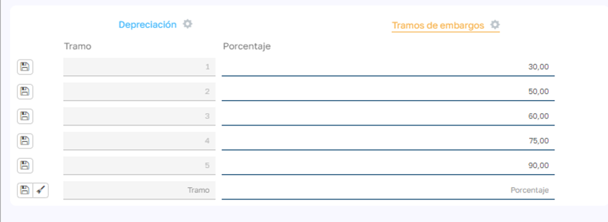
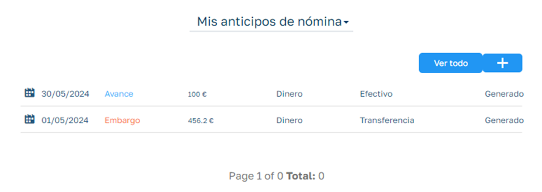
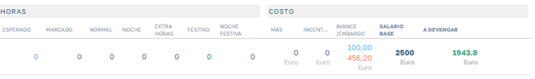

# Embargos de nómina

### Descripción

  

Los embargos en las nóminas a los trabajadores son medidas legales que permiten retener una parte del salario de un trabajador para satisfacer deudas que este tenga pendientes. Estos embargos son ordenados por un juez o autoridad competente y se realizan siguiendo ciertas normativas y procedimientos establecido.

#### Causa del Embargo

  

El embargo de nómina puede deberse a diversas razones, entre las cuales se incluyen:

  * Deudas con Hacienda (Agencia Tributaria).
  * Deudas con la Seguridad Social.
  * Deudas por impago de préstamos o créditos.
  * Deudas por pensiones alimenticias.
  * Multas impuestas por órganos administrativos.

  

#### Procedimiento

  

Para que se realice un embargo en la nómina, generalmente se siguen estos pasos:

  1. Resolución Judicial o Administrativa: Una autoridad judicial o administrativa emite una resolución ordenando el embargo.
  2. Notificación al Empleador: La resolución es notificada al empleador del trabajador, quien tiene la obligación de cumplir con el embargo.
  3. Cálculo del Embargo: El empleador calcula la cantidad a embargar según lo estipulado por la ley.

  

#### Límites y Cantidades Embargables

  

La legislación española establece unos límites en las cantidades que se pueden embargar del salario de un trabajador para garantizar que este disponga de recursos mínimos para su subsistencia. Estos límites se establecen en función del Salario Mínimo Interprofesional (SMI). Los porcentajes de embargo son los siguientes:

  * Hasta el SMI (1.134 euros en 2024): No se puede embargar.
  * Entre el SMI y el doble del SMI: Se puede embargar el 30%.
  * Entre el doble y el triple del SMI: Se puede embargar el 50%.
  * Entre el triple y el cuádruple del SMI: Se puede embargar el 60%.
  * Entre el cuádruple y el quíntuple del SMI: Se puede embargar el 75%.
  * Más del quíntuple del SMI: Se puede embargar el 90%.

####  Ejemplo Práctico

  

Supongamos que un trabajador tiene un salario mensual de 2.500 euros y el SMI es de 1.134 euros. El cálculo del embargo sería:

  * Primer tramo (1.134 euros): No embargable.
  * Segundo tramo (1.134 euros a 2.268 euros): 30% de 1.134 euros = 340,20 euros.
  * Tercer tramo (2.268 euros a 2.500 euros): 50% de 232 euros = 116 euros.

Total embargado: 340,20 euros + 116 euros = 456,20 euros.

  

### Configuración inicial de embargos

La base de cálculo de los embargos es el salario mínimo interprofesional (SMI) y el escalado de tramos de porcentajes de retención, estos datos los podemos modificar en los mantenimientos de la aplicación:

En el caso del SMI iremos a los parámetros de la aplicación para poder modificarlo:

  

En el caso del escalado de tramos iremos al menú superior:

  * Otro/Tablas Maestras/Embargos/Tramos

### Alta de un Embargo

Es importante recalcar que para que se pueda aplicar un embargo a un trabajador este debe tener un salario mensual superior al SMI ya que de lo contrario no se calculará la cuota mensual del embargo.

Para dar de alta un embargo iremos al módulo de embargos de la ficha del empleado:

  

  

  

Y rellenamos la información de la ficha del embargo:

  

  

  

  * Empleado : sobre el que recae el embargo.
  * Referencia : campo de texto para indicar una referencia sobre el embargo
  * Descripción : descripción que le queramos dar al embargo.
  * Fecha de Inicio: Fecha en la que se va a empezar a aplicar el embargo, es obligatoria e interviene en el proceso de calculo del embargo y su asignación a la prenómina.
  * Fecha Final: Esta fecha nos permitirá parar el calculo de un embargo. Normalmente estará sin rellenar durante la vida de un embargo, pero si queremos que se deje de calcular la cuota del embargo (siempre y cuando quede amortización pendiente ya que si no se finaliza independientemente de la fecha) podemos indicar la fecha en la que queremos que se deje de calcular la cuota mensual.
  * Afecta: Podemos indicar si queremos que se descuente o no también de las pagas extras.
  *Monto no embargable: Si el empleado con un importe de su nomina que no se puede embargar por cualquier motivo que haya establecido el juzgado, podemos añadir el importe en este campo y se sumará al importe de SMI para no incluirse en el importe embargable.
  *Cantidad total: Aquí indicamos el importe total del embargo, el cual se va a satisfacer durante la amortización mensual de cuotas en nómina.
  *IBAN: Indicamos el IBAN donde tenemos que ingresar el embargo mensual del trabajador. El campo dispone de un validador de IBAN.
  *Observaciones: Cualquier comentario que queramos adjuntar al embargo.

Una vez dado de alta el embargo se puede visualizar el cuadro de amortización del embargo y además se puede acceder al escalado de tramos propio del embargo en el que podemos modificar los porcentajes por defecto en caso de que el juzgado haya establecido un cálculo distinto al habitual para ese embargo:

  

### Cálculo de cuotas y prenómina

El objeto anticipo pasa a tener dos tipologías:

  * Tipo anticipo: para indicar los anticipos que nos solicita el empleado.
  * Tipo embargo: donde se generan las cuotas de los embargos a la hora de calcular la prenómina.

  

Las cuotas de los embargos dependen de la generación de nóminas, es decir en cada nomina del empleado que generemos se calculará la cuota correspondiente a esa nomina y se creará un avance o anticipo de nómina (de tipo embargo) vinculado tanto a la nomina como al embargo del empleado.

Podemos acceder a ellos desde la ficha del empleado módulo de anticipos, donde podremos ver diferenciados los avances de tipo Embargo de los de tipo Avance/Anticipo:

  

Podríamos modificar el importe de la cuota calculada en ese avance de nómina para aplicar un importe distinto al calculado, amortizándose este nuevo importe para la cuota de ese mes.

Si eliminamos la nomina se eliminarán los avances de nómina vinculados.

En la prenómina podemos visualizar en la columna de anticipos/embargos ambas entidades de forma diferenciada:

  

