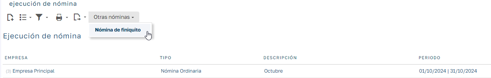
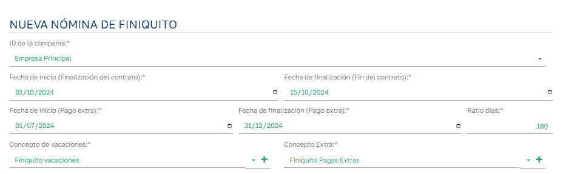
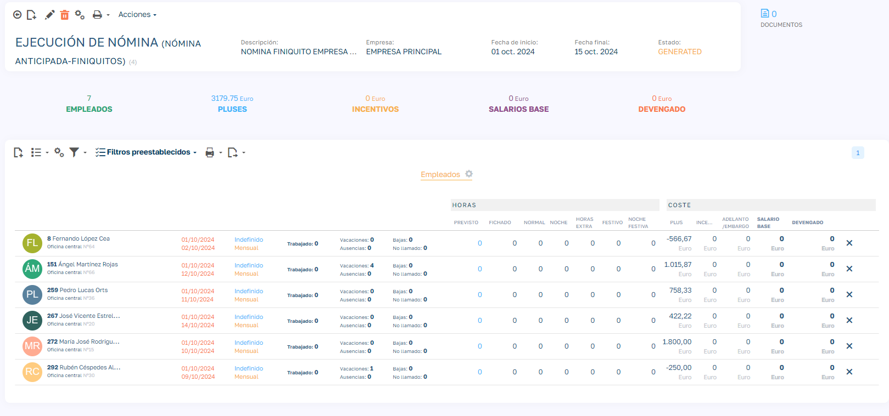
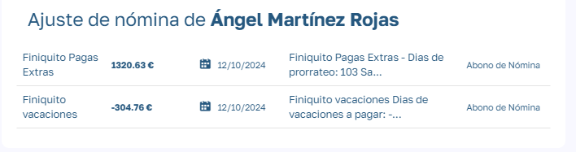
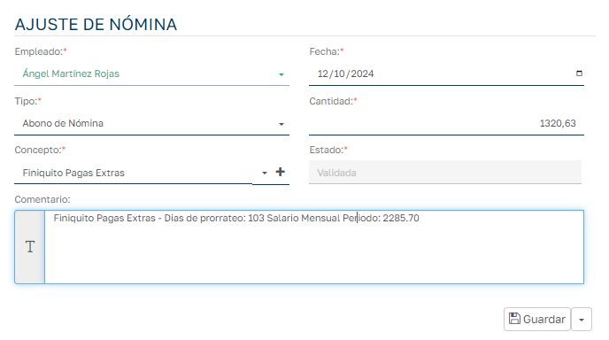

# Prenómina Finiquitos

A la hora de liquidar a un empleado que finalice contrato lo haremos mediante la generación de dos prenóminas:

  1. Nómina ordinaria: mediante la nómina ordinaria del mes en que finalice contrato calcularemos el total a liquidar en concepto del salario de los dias trabajados en el mes en cuestión.
  2. Nómina de finiquito: mediante la nómina de finiquito calcularemos:
    - _Días de vacaciones acumulados pero no utilizados_: si al finalizar tu contrato has acumulado días de vacaciones que no has llegado a disfrutar, estos deben compensarse. En caso contrario, si has disfrutado más días de vacaciones de los que te correspondían, se te descontarán del finiquito.
    - _Proporción de las pagas extras:_ esto solo se aplica si no recibes las pagas extras prorrateadas durante el año dentro de tu salario (ya que, en ese caso, están incluidas en el salario mensual pendiente de pago). Para ello el empleado tiene que tener definido en su contrato un numero de pagas mayor a 12.

En este documento nos vamos a centrar en como generar la nómina de finiquito.

Para generar una nómina de finiquito lo haremos desde el listado de nominas, seleccionado el proceso: `Otras Nóminas > Nomina de Finiquito`.

Al seleccionar se nos muestra los parámetros que necesitamos introducir para generar la nómina de finiquito:

  - Compañia: A la que pertenecen los trabajadores (contratos) de los cuales vamos a generar el finiquito.
  - Fecha de inicio y Fecha finalización (fin contrato): Entrarán en esta nomina de finiquito aquellos que hayan finalizado el contrato en el periodo definido por estas dos fechas.
  - Fecha de inicio y Fecha finalización (periodo Extra): Aquí definimos el periodo de paga extra que queremos liquidar. Lo habitual si tenemos 14 pagas es que haya un periodo del 1 enero a 30 de junio y otro periodo del 1 de julio al 31 de diciembre, indicamos cual corresponde para la fecha a liquidar.
  - Ratio dias: especificamos el ratio de dias, teniendo en cuenta que para un año corresponde el ratio 360.
  - Concepto de vacaciones: Indicamos el concepto de nómina con el que vamos a liquidar las vacaciones.
  - Concepto Extra: Indicamos el concepto de nómina con el que vamos a liquidar las pagas extras.

Al generar la nómina de finiquito se nos muestra de la siguiente forma:

Añade los empleados/contratos que se han finalizado en el periodo indicado, y para cada uno de ellos calcula los conceptos de vacaciones y extras y muestra el total en la columna PLUS. 

Podemos quitar a un empleado de la nómina actual pulsando la X del final del registro, esto lo eliminará de la nómina actual.

Si pulsamos sobre el importe del plus se nos muestra el desglose:

Podemos pulsar en cada desglose para ver el detalle y editarlo si fuera necesario:

El resto de la gestión de la nomina de finiquito es similar a la nómina ordinaria, la validaremos antes de pasar a liquidarla:

El resto de procesos (deshacer la validación, generar el fichero Excel correspondiente, liquidarla, etc.) son igual que para una nómina ordinaria.