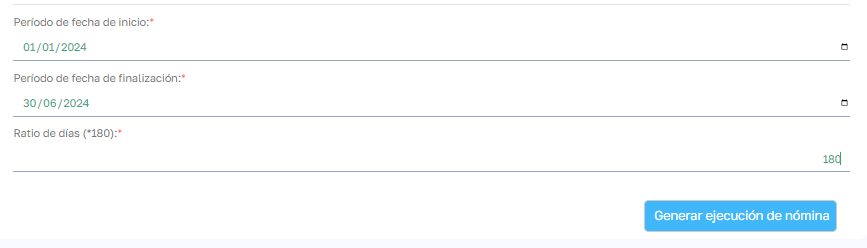
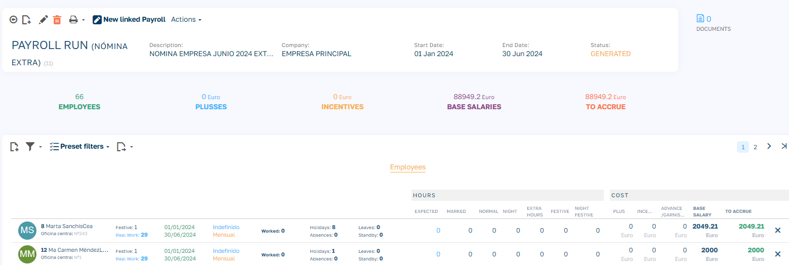

# Prenómina Pagas Extras

Para calcular la nómina de pagas extras partiremos de una nómina ORDINARIA en estado VALIDADO.

Mediante la opción _Nómina Extra_ se nos solicita los siguientes parámetros para el cálculo:

- **En ficha inicio y fin**: indicaremos el periodo que cubre la nómina extra, en el ejemplo vamos a generar la paga extra de verano que cubre los 6 primeros meses del año.
- **Ratio de días**: es el valor que tomaremos como referencia de días que cubre ese periodo y que utilizaremos en el cálculo. Lo veremos más adelante en los ejemplos.

A la hora de calcular qué empleados deben añadirse en el cálculo de la nómina extra se tiene en cuenta los siguientes requerimientos:

- El empleado debe tener contrato activo en la empresa vinculada a la nómina.
- El contrato debe ser de _tipo salario: Mensual_
- El contrato debe de tener un número de pagas mayor a 12.
- El contrato debe estar activo a fecha fin de la liquidación de la paga extra (ya que si no es así, se entiende que esta se habrá liquidado en el finiquito correspondiente).

Hay que tener en cuenta que la aplicación permite un histórico de cambios de condiciones en el contrato del empleado, además de que se puede dar el caso de que el empleado tenga varios contratos consecutivos en el misma empresa durante el periodo de cálculo de la nómina extra. En cualquier caso se tendrá en cuenta las condiciones de contrato afecha fin del periodo del tramo del contrato que se incluya dentro del periodo de liquidación.

El cálculo del salario de la nómina extra existen dos casos posibles:

1. Que el empleado haya estado contratado durante todo el periodo que abarca la nómina extra: En ese caso se devengará el sueldo mensual del empleado a fecha fin del periodo de la nómina extra.
2. Que el empleado haya iniciado su contrato a fecha posterior que el inicio del periodo que abarca la nómina extra: En ese caso se calculan los días entre el inicio de contrato y el final del periodo de pagas extras y se multiplica por el prorrateo de salario mensual del empleado a fecha fin del periodo de nómina extra y el ratio de días:

Salario Extra: N * Días contratado * (Salario mensual/Ratio días nómina)

Para finalizar, recordar que cabe la posibilidad de que la nómina extra se vea afectada por embargos activos que tenga el empleado. Para más información visitar el siguiente link: [Embargos de nómina](EmbargosNomina.es.md)