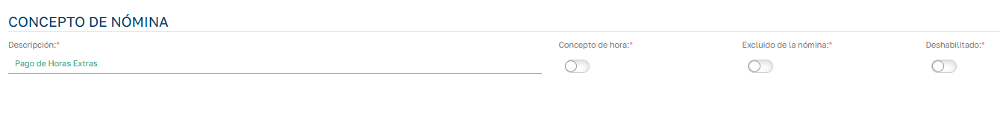
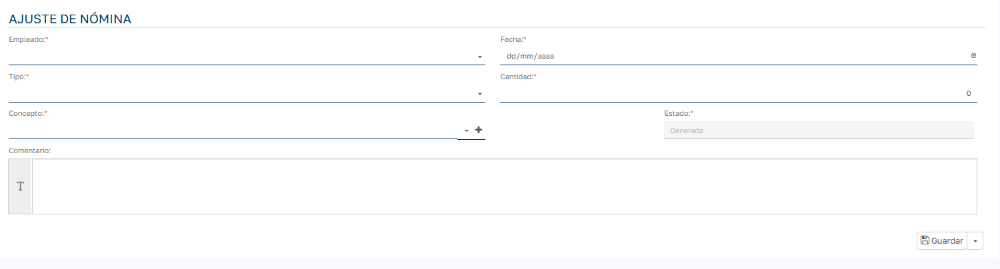
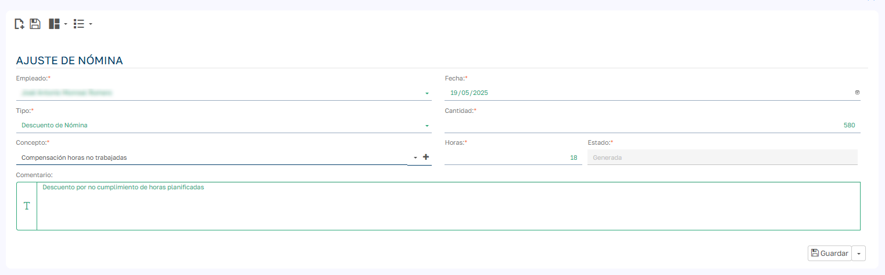
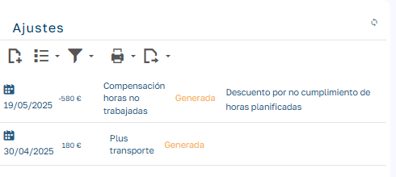
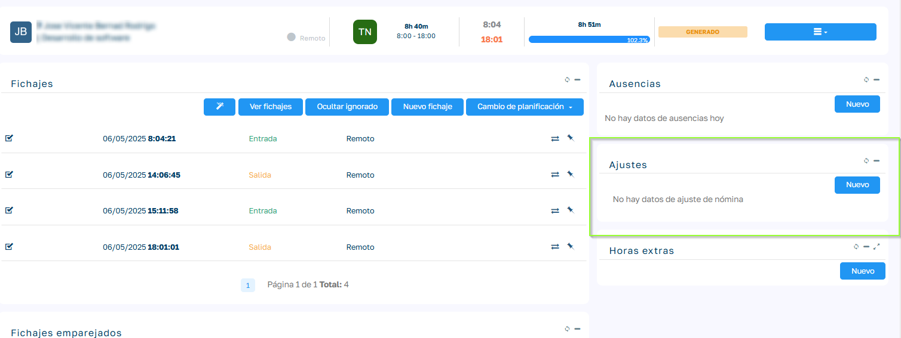
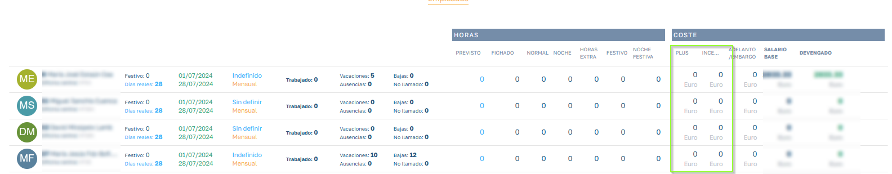
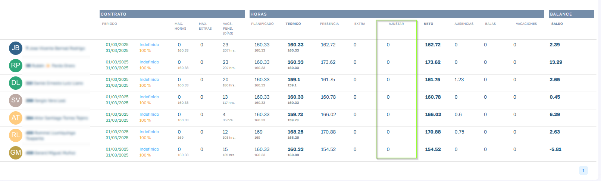

# Ajustes de Nómina

A través de los ajustes de nómina podemos añadir importes adicionales a liquidar al empleado, más allá de los conceptos que conforman su salario base. 

  

### Conceptos de Nómina

  

Los conceptos de nómina son las distintas categorías o tipos que asignamos a cada ajuste de nómina. Para utilizarlos, es necesario darlos de alta previamente en:  
Mantenimientos → Nómina → Conceptos de Nómina. 

  

Cada concepto cuenta con las siguientes opciones configurables:

  * Descripción : Es el nombre que identificará al concepto.

  * Concepto de hora : Por defecto, los conceptos se refieren a importes monetarios. Sin embargo, si el ajuste está vinculado a una cantidad de horas, activaremos esta opción.  
Por ejemplo, si añadimos un ajuste para compensar horas que el empleado no ha trabajado según su planificación, podremos indicar cuántas horas representa ese importe. Esto nos permitirá reflejar la compensación en los cuadrantes o balances de horas, asegurando que dichas horas han sido justificadas mediante el ajuste.

  * Excluido de nómina : Activa esta opción si necesitas registrar un ajuste que no debe trasladarse a la prenómina. Aunque no es lo más habitual, puede ser útil en casos puntuales donde se desea llevar un control interno sin que afecte el cálculo final de la nómina.

  * Deshabilitado : Permite dejar de utilizar un concepto de nómina en cualquier momento, sin necesidad de eliminarlo.

  

### Ajuste de Nómina

  

A continuación se describen los campos que conforman el formulario de Ajuste de Nómina , utilizado para registrar abonos o descuentos en la prenómina de un empleado:

  

  

  * Empleado:  
Selecciona el empleado al que se aplicará el ajuste.

  * Fecha:  
Indica la fecha en la que se registra y aplica el ajuste.

  * Tipo:  
Define la naturaleza del ajuste. Existen dos opciones:

    * Abono de nómina: El importe se añade en positivo, aumentando el total a liquidar al empleado.

    * Descuento de nómina: El importe se añade en negativo, reduciendo el total a liquidar al empleado.

  * Cantidad:  
Importe económico del ajuste. Representa la cantidad que se sumará o restará en la prenómina, según el tipo de ajuste seleccionado.

  * Estado:  
Refleja la situación del ajuste en relación con la prenómina:

    * Generado: El ajuste ha sido creado pero aún no se ha asignado a una prenómina.

    * Validado: El ajuste ya ha sido asignado a una prenómina y no podrá volver a utilizarse en otra.

  * Concepto:  
Selecciona el concepto de nómina que clasifica el ajuste.  
Si el concepto es de tipo hora , se habilitará un campo adicional para indicar la cantidad de horas relacionadas con el importe del ajuste.

  * Comentario:  
Campo libre para incluir una descripción adicional o justificación del ajuste.

  

  

### ¿Cómo generamos un ajuste de nomina?

  

Los ajustes de nomina se pueden generar manualmente desde la ficha del empleado, menú Nóminas y Ajustes o bien son generados automáticamente por distintos procesos de la aplicación. 

  

Ejemplo de imputación manual: Descuento de importe por no cumplir las horas planificadas de trabajo.

  

  

Procesos automáticos que generan un ajuste de nómina.

  

  * Liquidación de Bolsa de horas Extras compensadas con salario.
  * Suplementos de contrato que generan importes adicionales como pueden ser pluses o incentivos definidos en el contrato.
  * Finiquitos en nominas de finiquito.

  

> Cualquier otro proceso que definamos que tenga que generar importes a incluir en las liquidaciones del empleado, podemos hacer uso de los ajustes.

  

### ¿Dónde visualizamos los ajuste de nomina?

  

Para ver la lista de ajustes aplicados a un empleado podemos verlo desde la ficha del empleado menú Nominas y Ajustes en el apartado Ajustes.

  

  

Desde la gestión de jornadas podemos añadir ajustes vinculados a la jornada de un empleado:

  

  

En la prenómina se visualizarán agrupados en las columnas Pluses (incluido en nomina) / Incentivos (se visualizan en la nomina pero no se liquidan esto depende del campo excluido en nomina del concepto del ajuste):

  

  

En los cuadrantes podremos ver los ajustes de nomina con conceptos de tipo hora, ya que afectan el balance de horas:

  

###