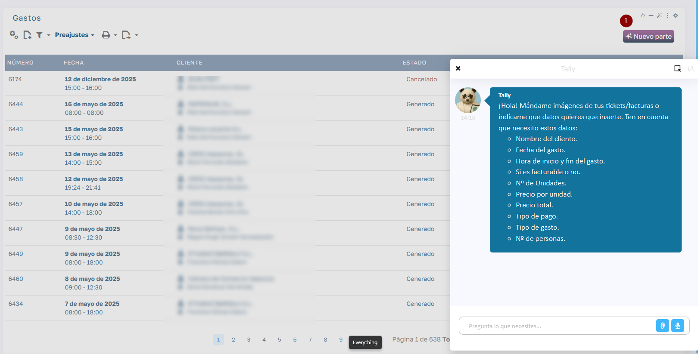
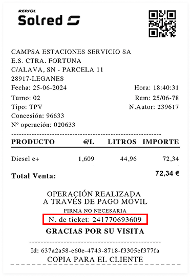

# Asistente IA Tally para Introducción de Gastos

## ¿Qué es Tally?

Tally es tu asistente virtual inteligente que facilita la introducción de partes de gastos en el sistema. Puede entender tus instrucciones por texto o voz, y extraer automáticamente los datos de tickets y facturas que le envíes.

  

 

### Formas de Introducir un Gasto

### 1\. Por Texto

Simplemente escribe los detalles del gasto en el chat. Por ejemplo:

  * "Necesito registrar un gasto de gasolina de 72,34€ del cliente QUALYPACK"
  * "Comida con el cliente PAPRIKO por 45€ el 16 de mayo"

### 2\. Por Voz

Haz clic en el botón del micrófono y dicta la información:

  * "Tally, registra un gasto de taxi de 25 euros"

### 3\. Adjuntando Ticket/Factura

Haz clic en el botón de adjuntar y sube una imagen del ticket. Tally extraerá automáticamente:

  * Fecha y hora
  * Importe total
  * Proveedor
  * Concepto/productos
  * Forma de pago (si está visible)
  * Tipo de gasto
  * Etc.

 *

### Ejemplo Práctico con Ticket de Gasolina

  

  

Datos Extraídos Automáticamente del Ticket Repsol:

Lo que Tally detecta solo:

  * Proveedor: Repsol Solred / Campsa Estaciones
  * Ubicación: E.S. Ctra. Fortuna, Leganés
  * Fecha: 25/06/2024
  * Hora: 18:40:31
  * Concepto: Diesel e+ (44,96 litros)
  * Importe total: 72,34 €
  * Forma de pago: Pago móvil
  * N.º de ticket: 241770693609
  * Tipo de Gasto: Gasolina

Lo que Tally te preguntará:

  * ¿A qué cliente corresponde este gasto? → Ej: "QUALYPACK"
  * ¿Es facturable? → Sí/No
  * ¿Número de personas? (si aplica)

 

### Datos para Crear un Gasto

  * Nombre del cliente
  * Fecha del gasto
  * Tipo de gasto (combustible, comida, transporte, etc.)
  * Importe total
  * Hora de inicio y fin
  * Si es facturable o no
  * Número de unidades
  * Precio por unidad
  * Tipo de pago
  * Número de personas

 

### Flujo de Trabajo Recomendado

### Opción A: Adjuntar Ticket Primero

  1. Haz clic en el botón "+" o adjuntar
  2. Selecciona la foto del ticket
  3. Espera a que Tally procese la imagen
  4. Responde las preguntas que te haga (normalmente solo el cliente)
  5. Confirma y el gasto se genera automáticamente

### Opción B: Descripción por Texto/Voz

  1. Escribe o dicta: _"Necesito crear un gasto de [concepto] por [importe] del cliente [nombre]"_
  2. Tally te pedirá los datos faltantes
  3. Proporciona la información
  4. Confirma y listo

 

### Consejos y Buenas Prácticas

✅ Haz esto:

  * Saca fotos claras de los tickets con buena iluminación
  * Incluye toda la información visible en una sola foto
  * Menciona el cliente al principio si lo sabes
  * Responde de forma concisa a las preguntas de Tally

❌ Evita esto:

  * Fotos borrosas o con sombras
  * Tickets arrugados o cortados
  * Dar información contradictoria
  * Adjuntar múltiples tickets a la vez (hazlo uno por uno)

 

### Ejemplos de Conversación con Tally

### Ejemplo 1: Gasto de Combustible

Usuario: [Adjunta foto del ticket Repsol]

Tally: "He detectado un gasto de combustible Diesel e+ por 72,34€ del 25/06/2024 en Leganés. ¿A qué cliente corresponde este gasto?"

Usuario: "QUALYPACK"

Tally: "¿Es facturable?"

Usuario: "Sí"

Tally: "Perfecto. He generado el gasto nº 6175 asociado al cliente QUALYPACK."

 

### Ejemplo 2: Gasto de Comida

Usuario: "Comida de trabajo con PAPRIKO, 3 personas, 145€"

Tally: "Entendido. ¿Qué fecha fue la comida?"

Usuario: "Hoy"

Tally: "¿Tienes el ticket o quieres que lo registre sin comprobante?"

Usuario: [Adjunta foto]

Tally: "Perfecto. Gasto registrado correctamente."

 

### Acceso a Tally

Desde la pantalla de Gastos:

  * Haz clic en el botón "+ Nuevo parte"
  * Se abrirá el chat de Tally en el lateral derecho

 

### Privacidad y Seguridad

  * Tally solo procesa la información necesaria para crear gastos
  * Los datos de los tickets se almacenan de forma segura
  * Las conversaciones quedan registradas por motivos de auditoría
  * Puedes revisar y editar cualquier gasto antes de confirmar

 

### Preguntas Frecuentes

¿Puedo adjuntar varios tickets a la vez? Se pueden adjuntar varios tickets y se agruparan en orden por el cliente 1 cliente = 1 parte con 1 linea por ticket

¿Tally entiende tickets en otros idiomas? Sí, puede procesar tickets en español, inglés y otros idiomas principales.

¿Qué hago si Tally no entiende algo? Intenta reformular o proporciona los datos manualmente.

¿Puedo usar Tally desde el móvil? Sí, la funcionalidad está disponible en la versión móvil de la aplicación.

###   

 

_Última actualización: Octubre 2025_