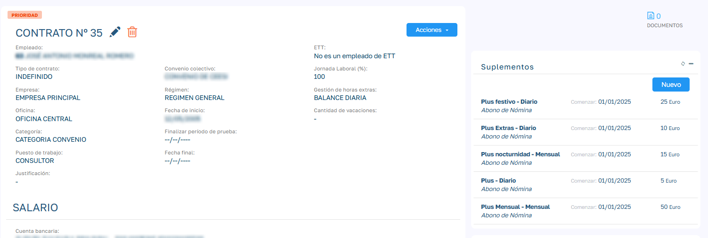
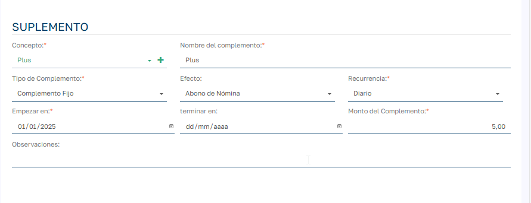
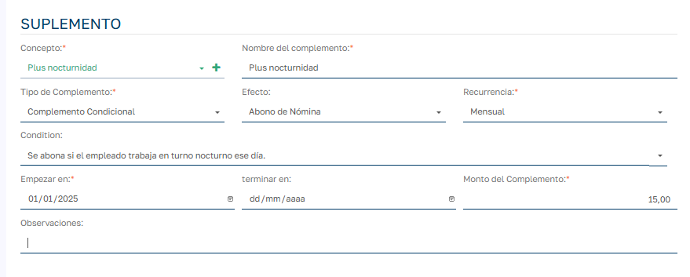

# Suplementos de Contrato

###  ¿Qué son los Suplementos de Contrato?

  

Los suplementos de contrato son pagos adicionales que se aplican a los empleados según condiciones específicas definidas en su contrato laboral. Estos suplementos pueden ser:

  * Fijos : Se aplican automáticamente en función del contrato y el período trabajado.

  * Condicionales : Se aplican solo cuando se cumplen ciertas condiciones específicas durante el período (por ejemplo, trabajar en turno nocturno, realizar horas extras, trabajar en días festivos, etc.).

  

En el proceso de calcular la prenómina, se calculan los suplementos del empleado en ese periodo y se generar los ajustes de nómina correspondientes para liquidar en la nomina en cuestión. Para saber más sobre ajustes de nómina visitar el documento [Ajustes de Nómina](Ajustes%20de%20Nómina.md).

  

> Para calcular los ajustes de nómina referentes a los suplementos de contrato del empleado del empleado en unas fecha determinadas, estas jornadas del empleado deben estar en estado BALANCE.

  

Los damos de alta en el modulo Suplementos del contrato del empleado:

  

  

  

### Tipos de Suplementos

###  Suplementos Fijos

  * Se asignan directamente según el contrato.

  * Se calculan generalmente en base a días trabajados o un monto fijo mensual.

  * Se aplican automáticamente sin necesidad de validar condiciones adicionales.

  

  

Cálculo según el tipo de recurrencia:

  

  * Diario : suma que aparecen como trabajados en el balance del empleado en el periodo de la nomina y los multiplica por el monto para generar un solo ajuste de nomina con el total.
  * Mensual: genera un ajuste de nómina con el importe del suplemento sin necesidad que el empleado tenga días trabajados en el balance.

  

### Suplementos Condicionales

  * Dependen de condiciones específicas que deben cumplirse para que el suplemento se aplique.

  * Ejemplos de condiciones:

    * Trabajar en horario nocturno.

    * Realizar horas extras validadas.

    * Trabajar en días festivos.

  * El sistema verifica automáticamente estas condiciones día a día o de forma mensual, aplicando el suplemento solo cuando corresponda.

  

  

  

Cálculo según el tipo de recurrencia:

  * Diario : genera tantos ajustes de nómina como días se cumple la condición. Cada ajuste con el importe definido en el suplemento.
  * Mensual: genera un solo ajuste de nómina con el importe resultante de multiplicar el importe definido en el suplemento por los días trabajados en que se cumple la condición.

### Uso en el sistema

###  Consultar suplementos

  * Se puede consultar la lista de suplementos activos por contrato y empleado.

  * Ver detalles como el tipo de suplemento, importe, condición, y fechas de vigencia.

### Registrar suplementos en nómina

  * El sistema inserta automáticamente los ajustes de nómina basados en los suplementos configurados.

  * Para suplementos condicionales, el sistema ejecuta una función que verifica las condiciones día a día.

  * Los ajustes se incluyen en la nómina del período correspondiente.

### Aspectos técnicos

  * Las condiciones de los suplementos se definen mediante códigos que corresponden a reglas internas (ej. ‘NOCTURNIDAD’, ‘HORAS_EXTRA’, ‘FESTIVO_TRABAJADO’).

  * El sistema evalúa estas condiciones automáticamente para cada empleado y día.

  * Para generar nuevas condiciones se deben desarrollar en producto.

