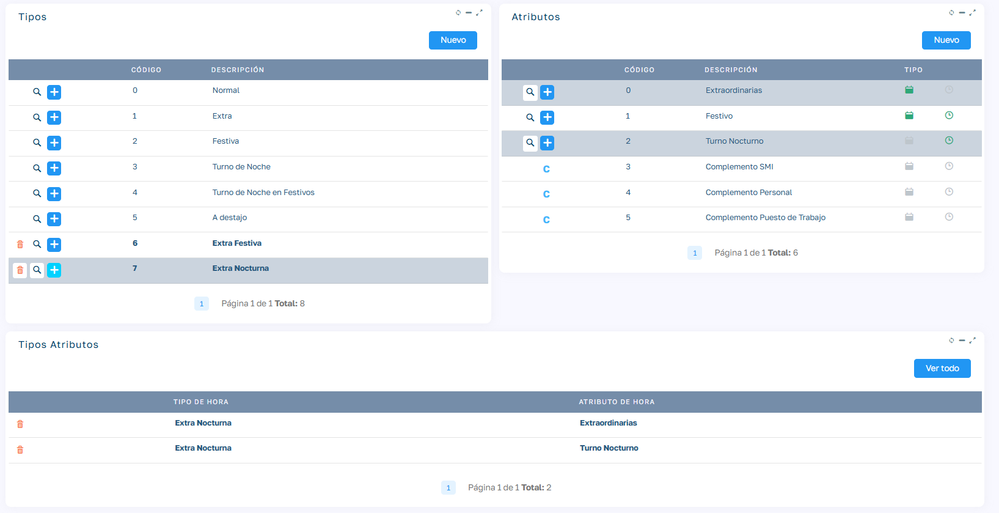
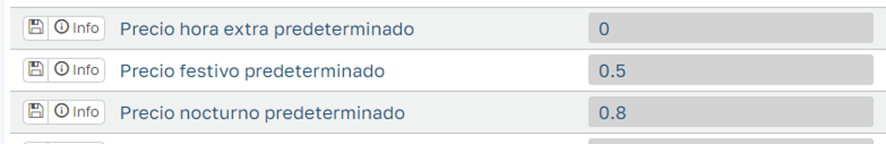
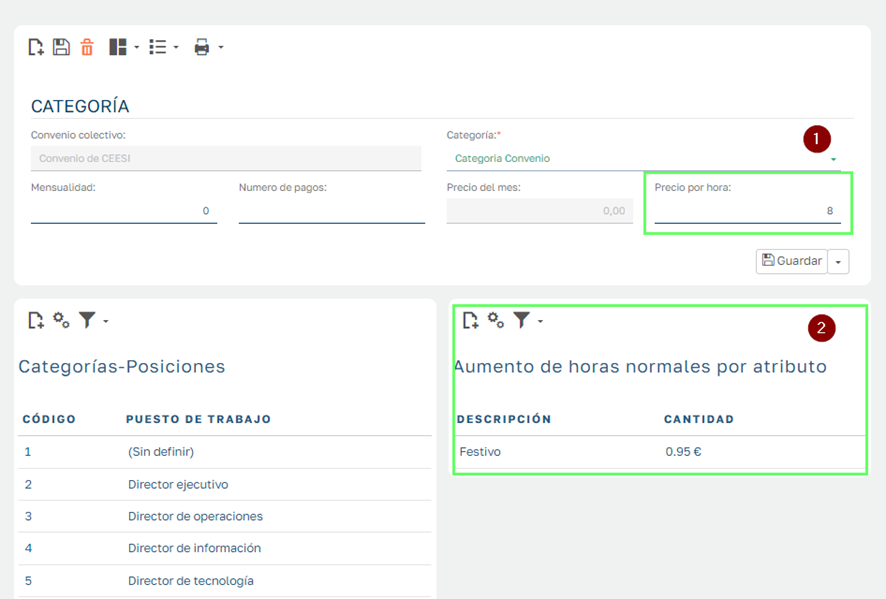
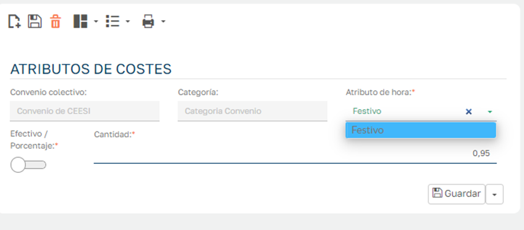
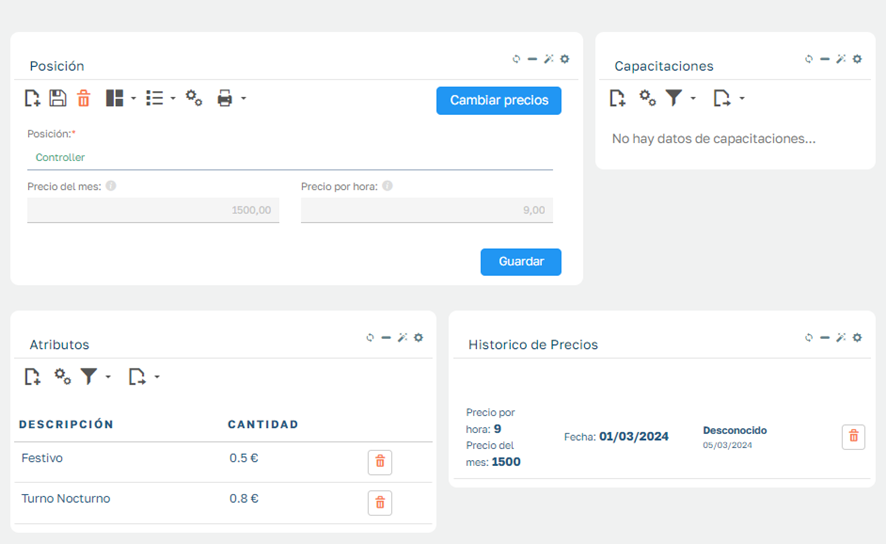
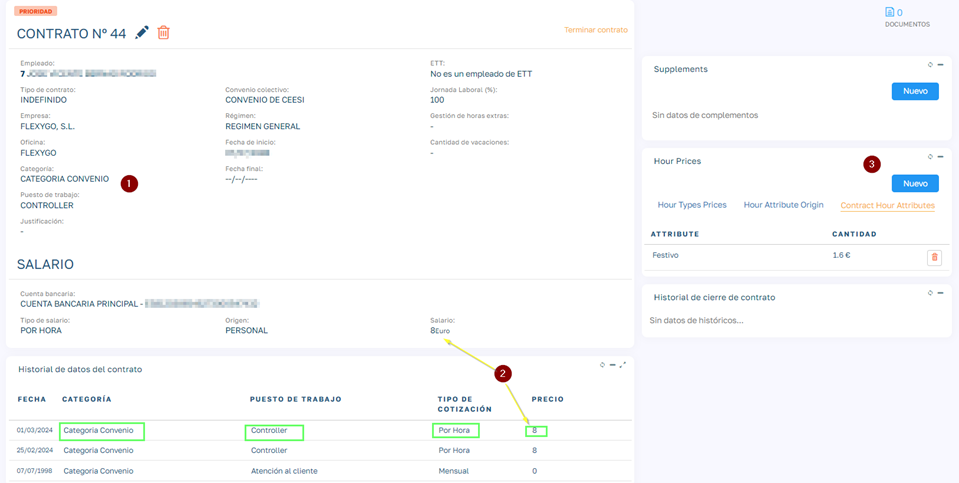
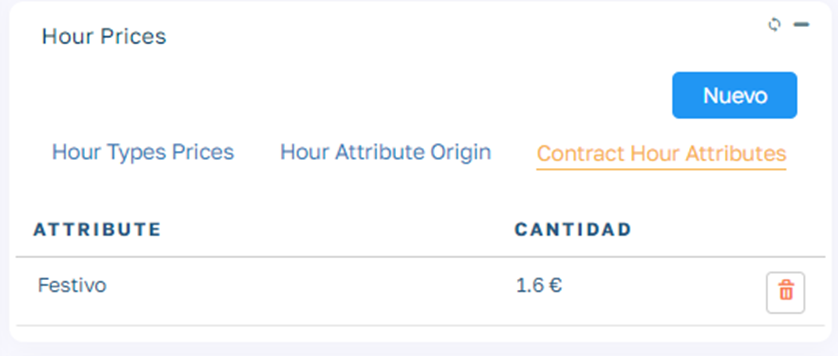
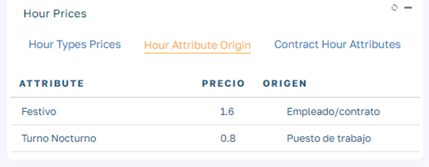
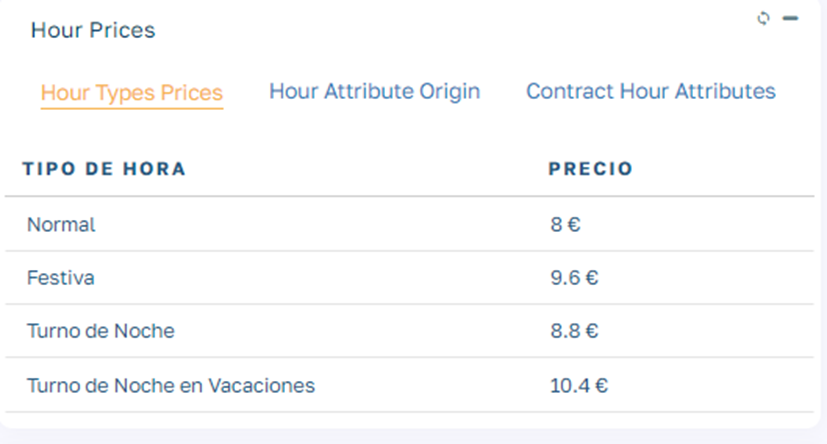
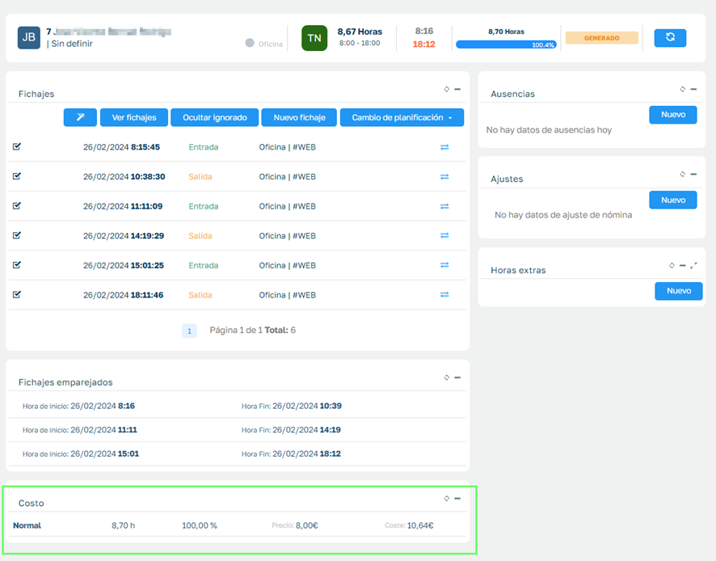

# Tipo Salarios y cálculos de precios por tipo horas.

En un contrato de empleado establecemos el tipo de salario de entre dos opciones:

  * Mensual
  * Por Horas

Salario Mensual: En este caso se establece un salario mensual y no se calcularán los distintos tipos de hora que realiza un empleado en una jornada determinada, todas las horas serán de tipo normal a no ser que realicemos tiempo de trabajo extra y tengamos habilitada la gestión de horas extras.

Salario Por Horas: En ese caso el empleado no tiene establecido un salario mensual y se le paga en función de las horas que realiza a lo largo del mes. Por tanto, necesitamos una configuración, lo suficientemente flexible para poder valorar cada tipo de hora y la cantidad de horas de cada tipo que realiza un empleado en cada jornada.

  

### Mantenimiento de Tipos de Hora y Atributos

  

En configuración Tablas Maestras / Gestión de tipos de horas podemos acceder al mantenimiento de tipos de horas.

  

Tenemos una serie de tipos de hora que se establecen como tipos principales, pero podemos crear otro tipos de horas que dependan de estos tipos principales.

  

En la imagen vemos que hemos creado nuevos tipos de hora para definir mas tipos de horas extras ya que esto nos permitirá poder establecer distinto precio a pagar al empleado por cada tipo de hora extra (normal, nocturna, festiva...), pero a la hora de mostrarlas en balances y liquidaciones de nomina, se agruparan todos los nuevos tipos dentro del tipo principal, en este ejemplo todas las horas extras de diferente tipos se agruparan dentro del epígrafe Extras a la hora de mostrarlas en balances o nominas.

  

### Tipos de Hora y Atributos de hora

  

  

A la hora de trabajar con distintos tipos de horas es importante el tipo de salario establecido en el contrato del empleado. Tenemos dos opciones Salario por Mes (SM) y Salario por Horas (SH).Salario por Horas (SH):  
En este tipo de salario, la remuneración del empleado se calcula en función del número de horas trabajadas, clasificadas según su tipo (por ejemplo, horas nocturnas, festivas, etc.), cada una con un valor diferente. El salario total resulta de la suma de estas horas según su categoría. No se contemplan horas extras, ya que no existe una planificación previa de horas ordinarias a partir de las cuales calcularlas. En cambio, en cada jornada laboral se realiza un desglose de las horas trabajadas según el momento en que se hayan efectuado (si fueron nocturnas, en días festivos, etc.).

Salario por Mes (SM):  
En este caso, el empleado recibe un salario fijo mensual que corresponde a una cantidad determinada de horas ordinarias. A partir de ese umbral, se pueden calcular las horas extras. Todas las horas ordinarias se consideran normales, sin importar cuándo se hayan trabajado, por lo que no se realiza un desglose por tipo de hora.

>  _Para ve el establecimiento de precios y la composición de horas vamos a suponernos que estamos en un tipo de Salario por Horas_

En la aplicación disponemos de los siguientes tipos de hora:

<table border="1" cellpadding="0" cellspacing="0" style="border-collapse:collapse;border:none;"><tbody><tr><td style="width: 212.35pt; border-width: 1pt 1pt 1.5pt; border-style: solid; border-color: rgb(180, 198, 231) rgb(180, 198, 231) rgb(142, 170, 219); border-image: initial; padding: 0cm 5.4pt;" width="50%">
<strong>Tipo de Hora</strong>
</td><td style="width: 212.35pt; border-top: 1pt solid rgb(180, 198, 231); border-left: none; border-bottom: 1.5pt solid rgb(142, 170, 219); border-right: 1pt solid rgb(180, 198, 231); padding: 0cm 5.4pt;" width="50%">
<strong>Descripción</strong>
</td></tr><tr><td style="width: 212.35pt; border-right: 1pt solid rgb(180, 198, 231); border-bottom: 1pt solid rgb(180, 198, 231); border-left: 1pt solid rgb(180, 198, 231); border-image: initial; border-top: none; padding: 0cm 5.4pt;" width="50%">
<strong>0</strong>
</td><td style="width: 212.35pt; border-top: none; border-left: none; border-bottom: 1pt solid rgb(180, 198, 231); border-right: 1pt solid rgb(180, 198, 231); padding: 0cm 5.4pt;" width="50%">
Normal
</td></tr><tr><td style="width: 212.35pt; border-right: 1pt solid rgb(180, 198, 231); border-bottom: 1pt solid rgb(180, 198, 231); border-left: 1pt solid rgb(180, 198, 231); border-image: initial; border-top: none; padding: 0cm 5.4pt;" width="50%">
<strong><s>1</s></strong>
</td><td style="width: 212.35pt; border-top: none; border-left: none; border-bottom: 1pt solid rgb(180, 198, 231); border-right: 1pt solid rgb(180, 198, 231); padding: 0cm 5.4pt;" width="50%">
<s>Extra</s>
</td></tr><tr><td style="width: 212.35pt; border-right: 1pt solid rgb(180, 198, 231); border-bottom: 1pt solid rgb(180, 198, 231); border-left: 1pt solid rgb(180, 198, 231); border-image: initial; border-top: none; padding: 0cm 5.4pt;" width="50%">
<strong>2</strong>
</td><td style="width: 212.35pt; border-top: none; border-left: none; border-bottom: 1pt solid rgb(180, 198, 231); border-right: 1pt solid rgb(180, 198, 231); padding: 0cm 5.4pt;" width="50%">
Festiva
</td></tr><tr><td style="width: 212.35pt; border-right: 1pt solid rgb(180, 198, 231); border-bottom: 1pt solid rgb(180, 198, 231); border-left: 1pt solid rgb(180, 198, 231); border-image: initial; border-top: none; padding: 0cm 5.4pt;" width="50%">
<strong>3</strong>
</td><td style="width: 212.35pt; border-top: none; border-left: none; border-bottom: 1pt solid rgb(180, 198, 231); border-right: 1pt solid rgb(180, 198, 231); padding: 0cm 5.4pt;" width="50%">
Nocturna
</td></tr><tr><td style="width: 212.35pt; border-right: 1pt solid rgb(180, 198, 231); border-bottom: 1pt solid rgb(180, 198, 231); border-left: 1pt solid rgb(180, 198, 231); border-image: initial; border-top: none; padding: 0cm 5.4pt;" width="50%">
<strong>4</strong>
</td><td style="width: 212.35pt; border-top: none; border-left: none; border-bottom: 1pt solid rgb(180, 198, 231); border-right: 1pt solid rgb(180, 198, 231); padding: 0cm 5.4pt;" width="50%">
Festiva Nocturna
</td></tr><tr><td style="width: 212.35pt; border-right: 1pt solid rgb(180, 198, 231); border-bottom: 1pt solid rgb(180, 198, 231); border-left: 1pt solid rgb(180, 198, 231); border-image: initial; border-top: none; padding: 0cm 5.4pt;" width="50%">
<strong><s>5</s></strong>
</td><td style="width: 212.35pt; border-top: none; border-left: none; border-bottom: 1pt solid rgb(180, 198, 231); border-right: 1pt solid rgb(180, 198, 231); padding: 0cm 5.4pt;" width="50%">
<s>Destajo</s>
</td></tr></tbody></table>

 

En la aplicación disponemos de los siguientes atributos de hora:

<table border="1" cellpadding="0" cellspacing="0" style="border-collapse:collapse;border:none;"><tbody><tr><td style="width: 212.35pt; border-width: 1pt 1pt 1.5pt; border-style: solid; border-color: rgb(180, 198, 231) rgb(180, 198, 231) rgb(142, 170, 219); border-image: initial; padding: 0cm 5.4pt;" width="50%">
<strong>Atributo de Hora</strong>
</td><td style="width: 212.35pt; border-top: 1pt solid rgb(180, 198, 231); border-left: none; border-bottom: 1.5pt solid rgb(142, 170, 219); border-right: 1pt solid rgb(180, 198, 231); padding: 0cm 5.4pt;" width="50%">
<strong>Descripción</strong>
</td></tr><tr><td style="width: 212.35pt; border-right: 1pt solid rgb(180, 198, 231); border-bottom: 1pt solid rgb(180, 198, 231); border-left: 1pt solid rgb(180, 198, 231); border-image: initial; border-top: none; padding: 0cm 5.4pt;" width="50%">
<strong>0</strong>
</td><td style="width: 212.35pt; border-top: none; border-left: none; border-bottom: 1pt solid rgb(180, 198, 231); border-right: 1pt solid rgb(180, 198, 231); padding: 0cm 5.4pt;" width="50%">
Extra
</td></tr><tr><td style="width: 212.35pt; border-right: 1pt solid rgb(180, 198, 231); border-bottom: 1pt solid rgb(180, 198, 231); border-left: 1pt solid rgb(180, 198, 231); border-image: initial; border-top: none; padding: 0cm 5.4pt;" width="50%">
<strong>1</strong>
</td><td style="width: 212.35pt; border-top: none; border-left: none; border-bottom: 1pt solid rgb(180, 198, 231); border-right: 1pt solid rgb(180, 198, 231); padding: 0cm 5.4pt;" width="50%">
Festivo
</td></tr><tr><td style="width: 212.35pt; border-right: 1pt solid rgb(180, 198, 231); border-bottom: 1pt solid rgb(180, 198, 231); border-left: 1pt solid rgb(180, 198, 231); border-image: initial; border-top: none; padding: 0cm 5.4pt;" width="50%">
<strong>2</strong>
</td><td style="width: 212.35pt; border-top: none; border-left: none; border-bottom: 1pt solid rgb(180, 198, 231); border-right: 1pt solid rgb(180, 198, 231); padding: 0cm 5.4pt;" width="50%">
Nocturnidad
</td></tr></tbody></table>

 

Los precios de cada tipo de hora se establecen en base a la hora normal a la que se añaden los distintos atributos que conforman cada tipo de hora.

Por ejemplo:

  * Precio Tipo de Hora Festiva = Precio Hora Normal + Precio Atributo Festiva 
  * Precio Tipo de Hora Nocturna = Precio Hora Normal + Precio Atributo Nocturnidad 
  * Precio Tipo de Hora Nocturna Festiva = Precio Hora Normal + Precio Atributo Nocturnidad + Precio Atributo Festiva

Niveles de establecimiento y prevalencia de precios.

Como vemos para establecer el precio de un tipo de hora tenemos en cuenta dos parámetros: el tipo de hora normal y un conjunto de atributos.

Cada uno de estos parámetros podemos especificarlo en 3 niveles diferentes, donde existe una prevalencia entre ellos. Estos niveles son 3 de menor a mayor prevalencia:

  * Categoría de Convenio. (menor prevalencia)
  * Puesto de trabajo.
  * Contrato del empleado. (mayor prevalencia)

La definición de precios en niveles se establece para el precio normal y para el conjunto de atributos de manera independiente, cada parámetro se puede establecer en el nivel que se requiera y el sistema aplicará el de mayor prevalencia.

Vamos a poner un ejemplo:

Empleado Contrato: Manolo Pérez.

Categoría Contrato: Mozo de almacén

Puesto de trabajo Contrato: Responsable turno

Establecemos en la aplicación la siguiente configuración de precios para los niveles que intervienen en el ejemplo anterior.

<table border="1" cellpadding="0" cellspacing="0" style="border-collapse:collapse;border:none;"><tbody><tr><td style="width: 106.15pt; border-width: 1pt 1pt 1.5pt; border-style: solid; border-color: rgb(180, 198, 231) rgb(180, 198, 231) rgb(142, 170, 219); border-image: initial; padding: 0cm 5.4pt;" width="25%">
<strong>Categoría</strong>
</td><td style="width: 106.15pt; border-top: 1pt solid rgb(180, 198, 231); border-left: none; border-bottom: 1.5pt solid rgb(142, 170, 219); border-right: 1pt solid rgb(180, 198, 231); padding: 0cm 5.4pt;" width="25%">
<strong>Precio Hora Normal</strong>
</td><td style="width: 106.2pt; border-top: 1pt solid rgb(180, 198, 231); border-left: none; border-bottom: 1.5pt solid rgb(142, 170, 219); border-right: 1pt solid rgb(180, 198, 231); padding: 0cm 5.4pt;" width="25%">
<strong>Festiva </strong>
</td><td style="width: 106.2pt; border-top: 1pt solid rgb(180, 198, 231); border-left: none; border-bottom: 1.5pt solid rgb(142, 170, 219); border-right: 1pt solid rgb(180, 198, 231); padding: 0cm 5.4pt;" width="25%">
<strong>Nocturnidad</strong>
</td></tr><tr><td style="width: 106.15pt; border-right: 1pt solid rgb(180, 198, 231); border-bottom: 1pt solid rgb(180, 198, 231); border-left: 1pt solid rgb(180, 198, 231); border-image: initial; border-top: none; padding: 0cm 5.4pt;" width="25%">
<strong>Mozo de almacén</strong>
</td><td style="width: 106.15pt; border-top: none; border-left: none; border-bottom: 1pt solid rgb(180, 198, 231); border-right: 1pt solid rgb(180, 198, 231); padding: 0cm 5.4pt;" width="25%">
8
</td><td style="width: 106.2pt; border-top: none; border-left: none; border-bottom: 1pt solid rgb(180, 198, 231); border-right: 1pt solid rgb(180, 198, 231); padding: 0cm 5.4pt;" width="25%">
1.5
</td><td style="width: 106.2pt; border-top: none; border-left: none; border-bottom: 1pt solid rgb(180, 198, 231); border-right: 1pt solid rgb(180, 198, 231); padding: 0cm 5.4pt;" width="25%">
0.5
</td></tr></tbody></table>

 

<table border="1" cellpadding="0" cellspacing="0" style="border-collapse:collapse;border:none;"><tbody><tr><td style="width: 106.15pt; border-width: 1pt 1pt 1.5pt; border-style: solid; border-color: rgb(180, 198, 231) rgb(180, 198, 231) rgb(142, 170, 219); border-image: initial; padding: 0cm 5.4pt;" width="25%">
<strong>Puesto de Trabajo</strong>
</td><td style="width: 106.15pt; border-top: 1pt solid rgb(180, 198, 231); border-left: none; border-bottom: 1.5pt solid rgb(142, 170, 219); border-right: 1pt solid rgb(180, 198, 231); padding: 0cm 5.4pt;" width="25%">
<strong>Precio Hora Normal</strong>
</td><td style="width: 106.2pt; border-top: 1pt solid rgb(180, 198, 231); border-left: none; border-bottom: 1.5pt solid rgb(142, 170, 219); border-right: 1pt solid rgb(180, 198, 231); padding: 0cm 5.4pt;" width="25%">
<strong>Festiva </strong>
</td><td style="width: 106.2pt; border-top: 1pt solid rgb(180, 198, 231); border-left: none; border-bottom: 1.5pt solid rgb(142, 170, 219); border-right: 1pt solid rgb(180, 198, 231); padding: 0cm 5.4pt;" width="25%">
<strong>Nocturnidad</strong>
</td></tr><tr><td style="width: 106.15pt; border-right: 1pt solid rgb(180, 198, 231); border-bottom: 1pt solid rgb(180, 198, 231); border-left: 1pt solid rgb(180, 198, 231); border-image: initial; border-top: none; padding: 0cm 5.4pt;" width="25%">
<strong>Responsable turno</strong>
</td><td style="width: 106.15pt; border-top: none; border-left: none; border-bottom: 1pt solid rgb(180, 198, 231); border-right: 1pt solid rgb(180, 198, 231); padding: 0cm 5.4pt;" width="25%">
9
</td><td style="width: 106.2pt; border-top: none; border-left: none; border-bottom: 1pt solid rgb(180, 198, 231); border-right: 1pt solid rgb(180, 198, 231); padding: 0cm 5.4pt;" width="25%">
-
</td><td style="width: 106.2pt; border-top: none; border-left: none; border-bottom: 1pt solid rgb(180, 198, 231); border-right: 1pt solid rgb(180, 198, 231); padding: 0cm 5.4pt;" width="25%">
1
</td></tr></tbody></table>

 

<table border="1" cellpadding="0" cellspacing="0" style="border-collapse:collapse;border:none;"><tbody><tr><td style="width: 106.15pt; border-width: 1pt 1pt 1.5pt; border-style: solid; border-color: rgb(180, 198, 231) rgb(180, 198, 231) rgb(142, 170, 219); border-image: initial; padding: 0cm 5.4pt;" width="25%">
<strong>Contrato</strong>
</td><td style="width: 106.15pt; border-top: 1pt solid rgb(180, 198, 231); border-left: none; border-bottom: 1.5pt solid rgb(142, 170, 219); border-right: 1pt solid rgb(180, 198, 231); padding: 0cm 5.4pt;" width="25%">
<strong>Precio Hora Normal</strong>
</td><td style="width: 106.2pt; border-top: 1pt solid rgb(180, 198, 231); border-left: none; border-bottom: 1.5pt solid rgb(142, 170, 219); border-right: 1pt solid rgb(180, 198, 231); padding: 0cm 5.4pt;" width="25%">
<strong>Festiva </strong>
</td><td style="width: 106.2pt; border-top: 1pt solid rgb(180, 198, 231); border-left: none; border-bottom: 1.5pt solid rgb(142, 170, 219); border-right: 1pt solid rgb(180, 198, 231); padding: 0cm 5.4pt;" width="25%">
<strong>Nocturnidad</strong>
</td></tr><tr><td style="width: 106.15pt; border-right: 1pt solid rgb(180, 198, 231); border-bottom: 1pt solid rgb(180, 198, 231); border-left: 1pt solid rgb(180, 198, 231); border-image: initial; border-top: none; padding: 0cm 5.4pt;" width="25%">
<strong>Manolo Pérez</strong>
</td><td style="width: 106.15pt; border-top: none; border-left: none; border-bottom: 1pt solid rgb(180, 198, 231); border-right: 1pt solid rgb(180, 198, 231); padding: 0cm 5.4pt;" width="25%">
10
</td><td style="width: 106.2pt; border-top: none; border-left: none; border-bottom: 1pt solid rgb(180, 198, 231); border-right: 1pt solid rgb(180, 198, 231); padding: 0cm 5.4pt;" width="25%">
-
</td><td style="width: 106.2pt; border-top: none; border-left: none; border-bottom: 1pt solid rgb(180, 198, 231); border-right: 1pt solid rgb(180, 198, 231); padding: 0cm 5.4pt;" width="25%">
-
</td></tr></tbody></table>

 

El resultado de la valoración de cada tipo de hora para el empleado de este contrato será el siguiente:

<table border="1" cellpadding="0" cellspacing="0" style="border-collapse:collapse;border:none;"><tbody><tr><td style="width: 57.9pt; border-width: 1pt 1pt 1.5pt; border-style: solid; border-color: rgb(180, 198, 231) rgb(180, 198, 231) rgb(142, 170, 219); border-image: initial; padding: 0cm 5.4pt;" width="13.604240282685513%">
<strong>Tipo de Hora</strong>
</td><td style="width: 97.8pt; border-top: 1pt solid rgb(180, 198, 231); border-left: none; border-bottom: 1.5pt solid rgb(142, 170, 219); border-right: 1pt solid rgb(180, 198, 231); padding: 0cm 5.4pt;" width="22.968197879858657%">
<strong>Descripción</strong>
</td><td style="width: 269pt; border-top: 1pt solid rgb(180, 198, 231); border-left: none; border-bottom: 1.5pt solid rgb(142, 170, 219); border-right: 1pt solid rgb(180, 198, 231); padding: 0cm 5.4pt;" width="63.42756183745583%">
<strong>Precio </strong>
</td></tr><tr><td style="width: 57.9pt; border-right: 1pt solid rgb(180, 198, 231); border-bottom: 1pt solid rgb(180, 198, 231); border-left: 1pt solid rgb(180, 198, 231); border-image: initial; border-top: none; padding: 0cm 5.4pt;" width="13.604240282685513%">
<strong>0</strong>
</td><td style="width: 97.8pt; border-top: none; border-left: none; border-bottom: 1pt solid rgb(180, 198, 231); border-right: 1pt solid rgb(180, 198, 231); padding: 0cm 5.4pt;" width="22.968197879858657%">
Normal
</td><td style="width: 269pt; border-top: none; border-left: none; border-bottom: 1pt solid rgb(180, 198, 231); border-right: 1pt solid rgb(180, 198, 231); padding: 0cm 5.4pt;" width="63.42756183745583%">
10 € (por tenerlo definido a nivel contrato)
</td></tr><tr><td style="width: 57.9pt; border-right: 1pt solid rgb(180, 198, 231); border-bottom: 1pt solid rgb(180, 198, 231); border-left: 1pt solid rgb(180, 198, 231); border-image: initial; border-top: none; padding: 0cm 5.4pt;" width="13.604240282685513%">
<strong>2</strong>
</td><td style="width: 97.8pt; border-top: none; border-left: none; border-bottom: 1pt solid rgb(180, 198, 231); border-right: 1pt solid rgb(180, 198, 231); padding: 0cm 5.4pt;" width="22.968197879858657%">
Festiva
</td><td style="width: 269pt; border-top: none; border-left: none; border-bottom: 1pt solid rgb(180, 198, 231); border-right: 1pt solid rgb(180, 198, 231); padding: 0cm 5.4pt;" width="63.42756183745583%">
11.5 € (10 HN + 1.5 Festiva por categoría)
</td></tr><tr><td style="width: 57.9pt; border-right: 1pt solid rgb(180, 198, 231); border-bottom: 1pt solid rgb(180, 198, 231); border-left: 1pt solid rgb(180, 198, 231); border-image: initial; border-top: none; padding: 0cm 5.4pt;" width="13.604240282685513%">
<strong>3</strong>
</td><td style="width: 97.8pt; border-top: none; border-left: none; border-bottom: 1pt solid rgb(180, 198, 231); border-right: 1pt solid rgb(180, 198, 231); padding: 0cm 5.4pt;" width="22.968197879858657%">
Nocturna
</td><td style="width: 269pt; border-top: none; border-left: none; border-bottom: 1pt solid rgb(180, 198, 231); border-right: 1pt solid rgb(180, 198, 231); padding: 0cm 5.4pt;" width="63.42756183745583%">
11 € (10 HN + 1 Nocturnidad por puesto)
</td></tr><tr><td style="width: 57.9pt; border-right: 1pt solid rgb(180, 198, 231); border-bottom: 1pt solid rgb(180, 198, 231); border-left: 1pt solid rgb(180, 198, 231); border-image: initial; border-top: none; padding: 0cm 5.4pt;" width="13.604240282685513%">
<strong>4</strong>
</td><td style="width: 97.8pt; border-top: none; border-left: none; border-bottom: 1pt solid rgb(180, 198, 231); border-right: 1pt solid rgb(180, 198, 231); padding: 0cm 5.4pt;" width="22.968197879858657%">
Festiva Nocturna
</td><td style="width: 269pt; border-top: none; border-left: none; border-bottom: 1pt solid rgb(180, 198, 231); border-right: 1pt solid rgb(180, 198, 231); padding: 0cm 5.4pt;" width="63.42756183745583%">
12.5 € (10 HN + 1 Nocturnidad por puesto +1.5 Festiva por categoría)
</td></tr></tbody></table>

 

### ¿Dónde configuro estos precios en cada uno de estos niveles en la aplicación?

Cabe recordar que, a la hora de establecer los precios de hora realizados por un empleado en una jornada, va a depender de su contrato activo/prioritario (en caso de disponer de varios contratos abiertos)

Disponemos en el apartado de parámetros generales de unos valores por defecto para los atributos de hora que aplicarán únicamente en el caso de que no se defina ningún tipo de definición en los niveles de prevalencia.

  

Nivel Categoría

Desde el convenio o desde el mismo contrato, seleccionamos la categoría en cuestión:

  

En 1) establecemos el precio de la hora normal para la categoría.

En 2) establecemos el precio de los distintos atributos que queramos valorar a nivel de esa categoría

A la hora de establecer el precio del atributo podemos indicar que es un importe en euros o un porcentaje de la hora normal calculada para ese empleado en ese momento.

  

  

Nivel Puesto de Trabajo

Es interesante establecer los distintos precios a nivel de puesto de trabajo ya que de esta forma, modificando en un único lugar y una sola vez puedes modificar el precio para todos los empleados que comparten este puesto de trabajo.

Cabe recalcar que tanto la categoría como el puesto de trabajo son datos que forman parte del histórico de contrato, por lo que puede ir cambiando a lo largo de la vida del contrato. En cada momento el sistema calcula tanto el puesto de trabajo como la categoría del empleado a la fecha que corresponda.

Por puesto de trabajo: desde la lista de puesto de trabajo seleccionamos la posición a modificar o seleccionamos la posición desde el mismo contrato.

  

  

La mecánica es similar a la que hemos visto en el apartado de categorías, la única diferencia que además es importante, es que en este nivel podemos establecer un histórico e indicar que va a cambiar de precio en una fecha determinada, lo haremos mediante el botón "Cambiar Precios". Podemos hacer esta previsión tanto a nivel de hora normal como a nivel de atributos.

  

Nivel Contrato/Personal

Cuando queremos establecer precios de forma particular a un empleado determinado lo hacemos estableciendo estos precios en su contrato.

  

En 1) podemos visualizar la categoría y puesto de trabajo del contrato para la fecha actual.

En 2) vemos el registro de histórico de donde cogemos los datos que pueden variar en función de las fechas: Categoría, Puesto de Trabajo, Tipo de Salario y Precio de hora normal del nivel de contrato.

Si queremos que dejar de tener asignado un precio de hora normal a nivel de contrato, basta con editar el contrato y añadir un registro en el histórico de contrato dejando el campo precio hora vacío, de esta forma el sistema entiende que a partir de esa fecha se deja de tener precio establecido a nivel de contrato y buscará el precio de hora normal en otro nivel de prevalencia

Vemos en detalle 3) Modulo de Precios de Hora:

En Atributos de Hora del Contrato , definimos si queremos establecer precios de atributo a nivel de contrato. En caso de no definirlos el sistema buscará en niveles de menor prevalencia.

  

En Origen de Atributos de Hora podemos ver los distintos atributos que se van a aplicar al contrato cual es el nivel de prevalencia que lo está originando.

  

  

En Precios por Tipo de Hora podemos ver los precios de los distintos tipos de hora que van aplicarse en las jornadas del empleado del contrato actual.

  

  

### ¿Dónde aplica el sistema estos precios a cada tipo de hora?

Cuando el empleado es de tipo desalario Por Horas , en cada jornada se calcula cuantas horas de cada tipo de hora ha realizado el empleado y se multiplica por el precio de cada tipo hora que nos indica su contrato.

  

En caso de salario mensual todas las horas ordinarias de la jornada aparecerán como horas normales y en el apartado de horas extras veremos el desglose de los distintos tipos horas extras en caso de que las hubiera.