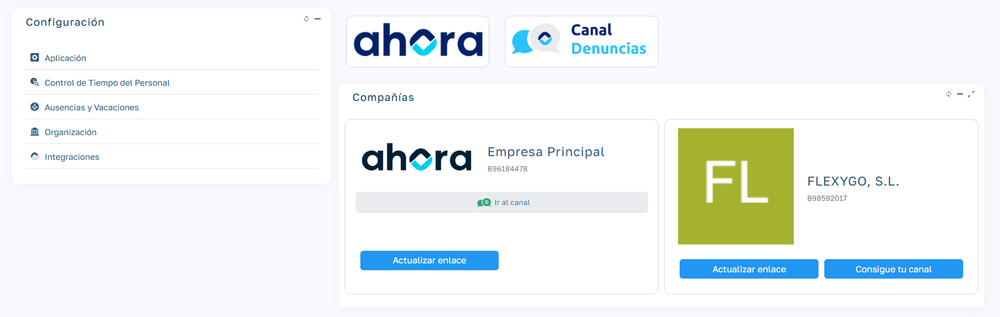

# Canal de denuncias

### Cumplimiento Legal: Ley 2/2023

La Ley 2/2023, de 20 de febrero , obliga a las empresas con 50 o más empleados y entidades del sector público a implementar un canal de denuncias que garantice la confidencialidad y proteja a los denunciantes contra represalias. Este canal debe ser fácil de usar, permitir denuncias anónimas y estar operativo desde junio de 2023.

  

### Activación del Canal de Denuncias en Sebastián HR

  1. `Desde el menú Mantenimiento > Parámetros > Integraciones > Canal de Denuncias.`

