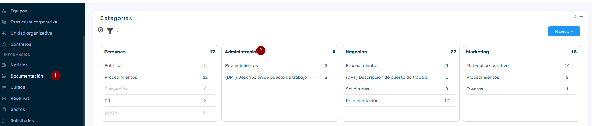
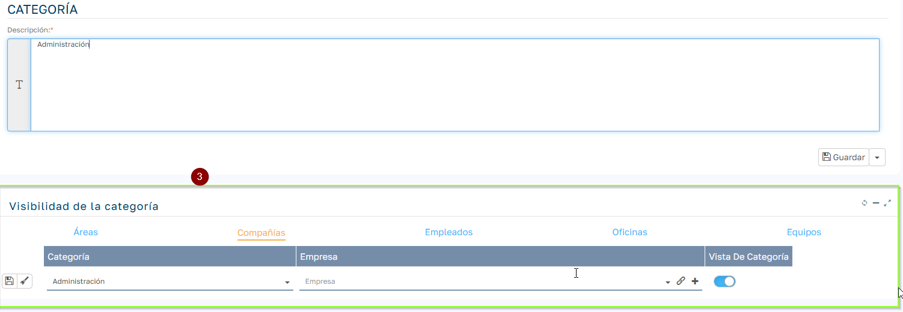

# Configurar visibilidad de documentos por categoría de documento.

## Visibilidad de Documentos por Categoría

### Descripción

La funcionalidad de Visibilidad por Categoría permite configurar qué empleados, oficinas, empresas, áreas o equipos pueden visualizar los documentos almacenados en una categoría o carpeta específica. Esta configuración complementa los permisos individuales de documentos, permitiendo establecer reglas de visibilidad a nivel de carpeta.

### ¿Para qué sirve?

Esta funcionalidad es especialmente útil cuando necesitas:

  * Restringir el acceso a documentos sensibles organizados por departamentos
  * Permitir que solo ciertas áreas visualicen documentación específica
  * Configurar permisos de visibilidad de forma masiva para todos los documentos de una categoría
  * Mantener la confidencialidad de información por oficinas o empresas

### Cómo configurar la visibilidad

### Acceso a la configuración

  1. Navega al módulo de Categorías en la gestión documental
  2. Selecciona o crea la categoría que deseas configurar
  3. En la ficha de la categoría, localiza la sección "Visibilidad de la categoría"  

### Pestañas de configuración

La sección de visibilidad cuenta con 5 pestañas que te permiten configurar diferentes niveles de acceso:

#### 1\. Áreas

Define qué áreas organizativas pueden visualizar los documentos de esta categoría.

Campos:

  * Categoría : Muestra la categoría actual
  * Área : Selector para elegir el área que tendrá visibilidad
  * Vista De Categoría : Toggle (activado/desactivado) para habilitar o deshabilitar la visibilidad

#### 2\. Compañías

Configura qué empresas o compañías del grupo tienen acceso a los documentos.

Campos:

  * Categoría : Muestra la categoría actual
  * Compañía : Selector de la empresa
  * Vista De Categoría : Toggle para activar/desactivar el acceso

#### 3\. Empleados

Permite asignar visibilidad a empleados específicos de forma individual.

Campos:

  * Categoría : Muestra la categoría actual
  * Empleado : Selector del empleado específico
  * Vista De Categoría : Toggle para habilitar/deshabilitar

#### 4\. Oficinas

Establece qué oficinas o ubicaciones pueden acceder a los documentos.

Campos:

  * Categoría : Muestra la categoría actual
  * Oficina : Selector de la oficina
  * Vista De Categoría : Toggle para activar/desactivar

#### 5\. Equipos

Configura el acceso por equipos de trabajo.

Campos:

  * Categoría : Muestra la categoría actual
  * Equipo : Selector del equipo
  * Vista De Categoría : Toggle para habilitar/deshabilitar

### Ejemplo de configuración

Supongamos que tienes una categoría llamada "Administración" con documentos contables y financieros:

  1. En la pestaña Áreas , agrega el área "Administración" y activa el toggle de Vista De Categoría
  2. En la pestaña Empleados , añade al Director Financiero individualmente
  3. En la pestaña Oficinas , agrega la oficina "Sede Central"

Con esta configuración:

  * Solo los empleados del área de Administración podrán ver los documentos
  * El Director Financiero tendrá acceso aunque no pertenezca al área
  * Solo desde la oficina Sede Central se podrá acceder a estos documentos

### Puntos importantes

⚠️ Consideraciones:

  * Los permisos se aplican de forma acumulativa : si un usuario cumple cualquiera de los criterios configurados, tendrá acceso
  * Si no se configura ninguna restricción, la categoría será visible para todos los usuarios con permisos básicos de documentación
  * Puedes combinar múltiples criterios para crear reglas de visibilidad complejas
  * Los cambios en la visibilidad se aplican inmediatamente
  * Esta configuración afecta a todos los documentos actuales y futuros dentro de la categoría

 _Para más información sobre la gestión de documentos y permisos, consulta la documentación general de FlexiGO._