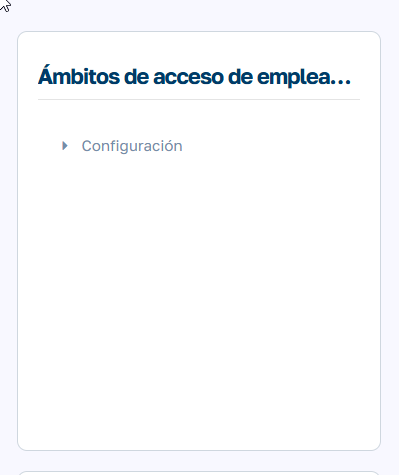
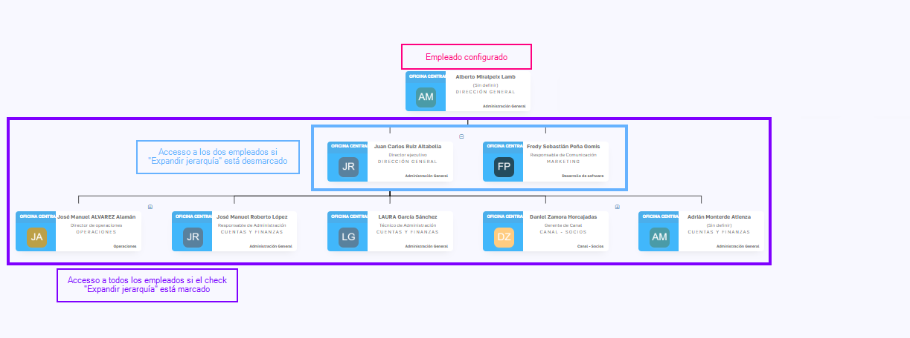

# Ámbitos de visibilidad de empleado

Esta funcionalidad solo está disponible en elmodo PRO de Sebastian HR

### ¿Para qué s irve?

Esta funcionalidad permite gestionar el acceso a los registros de empleados dentro de la aplicación, en función de diferentes criterios organizativos: compañía, oficina, equipo, unidad organizativa, etc.

  

El objetivo es que los usuarios puedan ver o gestionar información de empleados con los que tengan una relación lógica, como por ejemplo:

  * Solo empleados de su misma compañía.

  * Solo empleados de equipos que supervisan.

  * Solo empleados de departamentos específicos.

  

El nivel de acceso dependerá del rol de cada usuario y la configuración de control de acceso asignada.

  

  

### Configuración

La configuración se realiza desde:  
Mantenimiento > Ámbitos de visibilidad de empleados > Configuración  

  

Cada configuración se compone de los siguientes elementos:

####   

####  Cabecera

  * Descripción : Nombre o etiqueta descriptiva para la configuración.

  * Todos los empleados : Si está marcado, esta configuración se aplicará a todos los empleados , sin necesidad de listarlos individualmente en la pestaña de asignación.

 

#### Líneas de configuración

Cada línea tiene los siguientes campos:

  * Tipo : El objeto por el cual se define el acceso. Puede ser:

    * Compañía, Departamento, Grupo, Oficina, Responsable, Equipo, Unidad Organizativa

  * Al que pertenece: Se aplica al objeto propio del empleado.

    * La compañía a la que pertenece el empleado, su oficina, sus equipos, etc.

  * De los que es responsable: Se aplica a los empleados que pertenecen a otros objetos de los que el empleado es responsable. 

    * Los empleados que pertenecen a un grupo del cual es supervisor o líder, a los departamentos de los que es responsable, etc.

  * Expandir a la jerarquía: Este check se habilita únicamente para el tipo "Responsable" (del empleado)

    * Si está desmarcado, se aplica únicamente a los empleados de los que es responsable directamente, si está marcado, se aplica a toda la jerarquía de responsables que cuelga de el empleado.

  * Entidades relacionadas : Si “Se aplica a los propios” está desmarcado, este campo permite definir explícitamente las entidades (compañías, oficinas, equipos, etc.) a las que se quiere conceder acceso.

 

#### Asignación de empleados

Si el check Todos los empleados no está marcado, se mostrará un submódulo donde se podrán seleccionar manualmente los empleados que estarán afectados por esta configuración.

  

  

###   

  

### ¿Cómo se gestiona el acceso?

Una vez configuradas las reglas de acceso, el sistema determina a qué empleados puede acceder cada usuario de la aplicación. Este acceso se basa en dos elementos:

  1. La configuración definida en el módulo de Control de Acceso a Empleados  
(es decir, los filtros por compañía, oficina, equipo, etc.).

  2. El rol que tenga asignado el empleado  
(que determina si puede simplemente ver o también gestionar los datos de los empleados accesibles).

  

### Roles y permisos

El comportamiento final depende del rol del empleado. Veamos cómo actúa cada uno:

  

#### Rol: User

Empleado estándar, sin permisos de gestión.

  * Solo puede ver sus propios datos y la lista de todos los empleados.

  * Si forma parte de alguna configuración de acceso, solo podrá ver en la lista de empleados, aquellos que formen parte de su configuración.

#### Rol: Manager -NUEVO-

Nuevo rol intermedio entre User y RRHH.

  * Puede acceder a los fichajes de los empleados a los que tenga acceso mediante la configuración. Tiene habilitado el calendario de fichajes en su página inicial (Home)

  * Ideal para responsables de equipo o mandos intermedios que necesitan cierta visibilidad operativa sin tener acceso completo a los datos de RRHH.

#### Rol: RRHH

Acceso completo a la gestión de empleados.

  * Si no tiene ninguna configuración asociada, podrá acceder a todos los empleados del sistema.

  * Si tiene una configuración, el acceso se restringe a los empleados definidos por esa configuración , tanto para ver como para gestionar.

> ⚠️ Importante:  
>  Si un usuario con rol RRHH tiene configurado un control de acceso, ya no tendrá acceso global. A partir de ese momento, su visibilidad quedará limitada según la configuración definida.

  

<table style="width: 100%;"><thead><tr><th dir="ltr">ROL</th><th dir="ltr">SIN conf. de visibilidad</th><th dir="ltr">CON conf. de visibilidad </th></tr></thead><tbody><tr><td dir="ltr" style="width: 33.3333%;">HR</td><td dir="ltr" style="width: 33.3333%;">Acceso total a todos los empleados y sus registros.</td><td dir="ltr" style="width: 33.3333%;">Acceso a los empleados que forman parte de los objetos relacionados a su gestión</td></tr><tr><td dir="ltr" style="width: 33.3333%;">User</td><td dir="ltr" style="width: 33.3333%;">Puede ver sus datos y la lista de empleados completa, además de objetos genéricos como cursos, sugerencias, etc.</td><td dir="ltr" style="width: 33.3333%;">Puede ver sus datos. La lista de empleados está filtrada y únicamente puede ver los que forman parte de su configuración.</td></tr><tr><td dir="ltr" style="width: 33.3333%;">Manager</td><td dir="ltr" style="width: 33.3333%;">Puede ver todos los empleados y acceder a la gestión de fichajes.</td><td dir="ltr" style="width: 33.3333%;">Puede ver, editar y gestionar los empleados que forman parte de su configuración, al mismo nivel que los roles de RRHH.</td></tr><tr><td dir="ltr" style="width: 33.3333%;">Admin</td><td dir="ltr" style="width: 33.3333%;">Acceso total.</td><td dir="ltr" style="width: 33.3333%;">Acceso total, las configuraciones no le afectan.</td></tr></tbody></table>