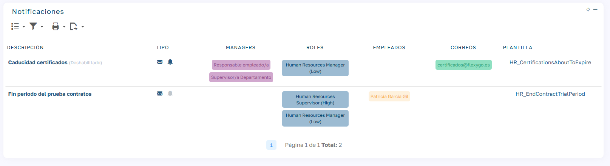
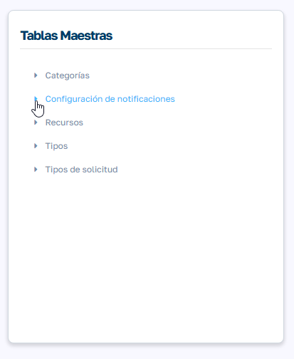
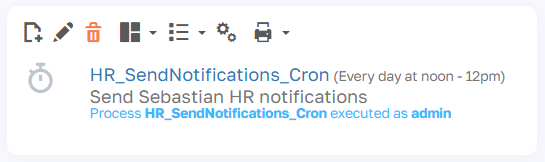

# Configuración de notificaciones

La funcionalidad de notificaciones en Sebastian HR permite a los usuarios configurar de manera personalizada el envío de notificaciones relacionadas con fechas clave del sistema.

Actualmente, el producto soporta ocho tipos de notificaciones, pero en futuras versiones esta lista se seguirá ampliando:

  1. Fecha de caducidad de los certificados de empleados.

  2. Fecha de fin de contratos temporales.

  3. Fecha de fin del periodo de prueba de los contratos.

  4. Finalización de bajas y excedencias.

  5. Caducidad de documento de identidad.

  6. Cumpleaños de empleados/as

  7. Incidencias en fichajes

  8. Documentos pendientes de confirmación

## Acceso a la configuración

La configuración de las notificaciones se gestiona desde el menú principal, en la sección: Mantenimiento / Tablas Maestras/ Configuración de notificaciones.

En este menú, los administradores y personal de RRHH pueden personalizar las notificaciones disponibles según sus necesidades organizativas. Al seleccionar una notificación, se muestran los siguientes campos configurables:

## Campos de configuración

| Campo | Descripción |
| --- | --- |
| Descripción | Un campo informativo que detalla la notificación seleccionada. La descripción se puede modificar, aunque su contenido es solo de referencia y no impacta funcionalmente. |
| Deshabilitado | Permite activar o desactivar el envío de la notificación. |
| Enviar correo | Habilita el envío de correos electrónicos a los destinatarios configurados. |
| Enviar aviso | Activa los avisos internos a través de la aplicación para los usuarios seleccionados. |
| Días de antelación | Define el número de días previos a la fecha clave en los que se enviará la notificación. En algunas notificaciones, este campo está gestionado por el objeto correspondiente, como sucede con la caducidad de los certificados o no es necesario como en el caso de la notificación de cumpleaños o los documentos pendiente de confirmar su recepción. |
| Gestores/as | Permite incluir gestores vinculados al empleado (por ejemplo, responsables, líderes de grupo o supervisores de departamento) como destinatarios. |
| Roles | Define los roles de usuarios que recibirán la notificación. |
| Empleados | Especifica a empleados específicos como receptores de la notificación. |
| Correos | Correo electrónico de los destinatarios, quienes no necesitan estar registrados como empleados o usuarios en el sistema **(solo para notificación por mail)** |
| Plantilla de correo | Permite editar la plantilla de correo asociada a la notificación para adaptarla a las necesidades del cliente. Es fundamental preservar los "tokens" entre {{}} para asegurar que la información sea sustituida correctamente durante el envío. Aunque la plantilla puede editarse, no es posible reemplazarla por otra diferente **(solo para notificación por mail)** |
| Notificar al empleado | En algunos casos existe la opción de notificar también al empleado, de forma de que le llegue un correo electrónico avisando de que su contrato se va a acabar, que tiene pendiente la confirmación de documentos, alguna incidencia en fichajes, etc **(solo para notificación por mail)** |

## Envío de notificaciones

El envío de notificaciones está automatizado mediante un cron job, denominado `HR_SendNotifications_Cron`. Este proceso asegura que las notificaciones se envíen correctamente y en los plazos establecidos. Por defecto, se ejecuta una vez al día al mediodía. Es recomendable mantener una única ejecución diaria para evitar envíos repetidos.

