# Confirmación de entrega de documentos

La funcionalidad de Confirmación de Entrega de Documentos permite a la empresa gestionar la entrega de información y documentos importantes a sus empleados, así como obtener una confirmación de que dicha información ha sido recibida y revisada por el empleado.

## Crear una publicación

En el menú principal lateral podemos acceder al nodo _Documentación_ mediante el cual accedemos a la lista de _Artículos_ (objeto que engloba la información de las distintas publicaciones) agrupadas en las distintas categorías de documentos.

Para crear una nueva publicación accedemos a la categoría en la que englobamos esa información y clicamos en _Nueva Publicación_

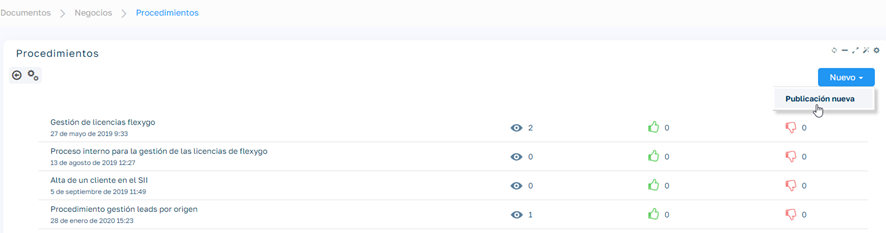

Para que la publicación gestione la confirmación de entrega marcamos la opción correspondiente desde la edición del Objeto:

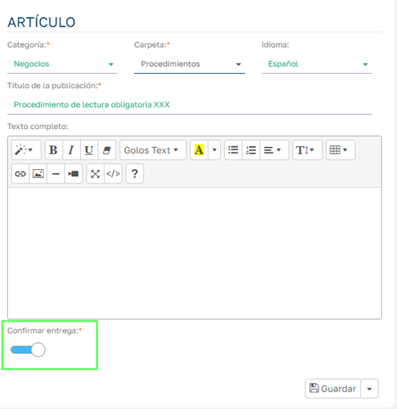

## Aspectos de una publicación

Al guardar visualizamos la vista de la publicación en la que observamos los siguientes aspectos relacionados con la funcionalidad actual:

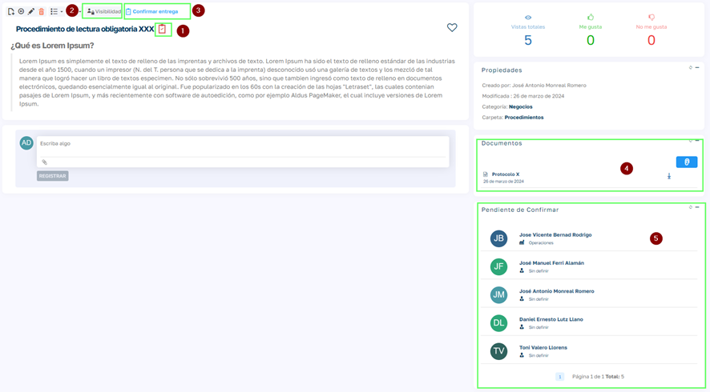

1. Cuando una publicación tenga activada la opción Confirmar Entrega aparecerá junto al nombre el icono que se visualiza en la imagen.
2. En el botón Visibilidad podemos definir los empleados a los que se le debe mostrar la publicación, los cuales deben también poder confirmar su entrega.

    Puedes seleccionar:

    - **Empleados** uno por uno.
    - **Áreas**, para que la publicación llegue a todos los empleados de esa área.
    - **Equipos**, para que la vean todos los miembros de ese equipo.
    - **Oficinas**, para que la reciban todos los empleados de esa oficina.
    - **Compañías**, para que la vean todos los empleados de esa compañía.
    - **No seleccionar nada**, con lo que se mostrará a todos los empleados que no estén bloqueados.

    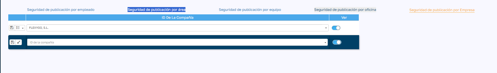

3. El botón `Confirmar Entrega` les aparecerá a los empleados que tengan visibilidad sobre una publicación con confirmación de entrega y que no hayan confirmado. Tras confirmarla el botón no se mostrará y en el módulo de lectores de la publicación aparecerá la fecha de confirmación de entrega, además el empleado ya no se mostrará en el módulo de empleados pendientes de confirmar.

    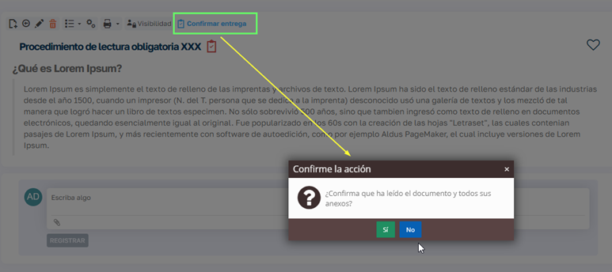

    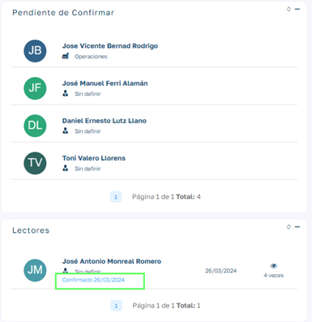

4. Lo habitual en este tipo publicaciones con confirmación de entrega es que se anexen documentación en ficheros, que el empleado deba examinar para dar su conformidad a la entrega.
5. El módulo pendiente de confirmar, muestra los empleados que tienen habilitada la visualización de la publicación y todavía no han confirmado su entrega mediante el botón de Confirmar Entrega. Este módulo solo es visible por usuarios con roles de admin o de RRHH.

## ¿Cómo ver las publicaciones pendientes de confirmar?

Desde el panel de control general de HR se ha añadido un apartado dentro del módulo de gestión pendiente, en el que vemos el número de publicaciones en la que existen empleados pendientes de confirmar la entrega de la publicación.

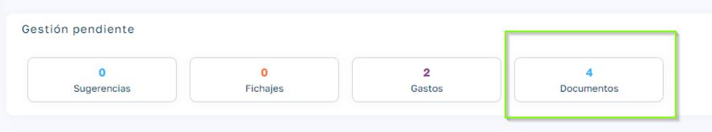

Al clicar se nos muestra la lista con el nombre de los distintos documentos y al seleccionar cualquiera de ellos entramos a la vista de la publicación en la que podemos ver los empleados que todavía no han confirmado la entrega.

Podemos añadir un mensaje en la publicación hacia alguno de los empleados pendientes de confirmar:

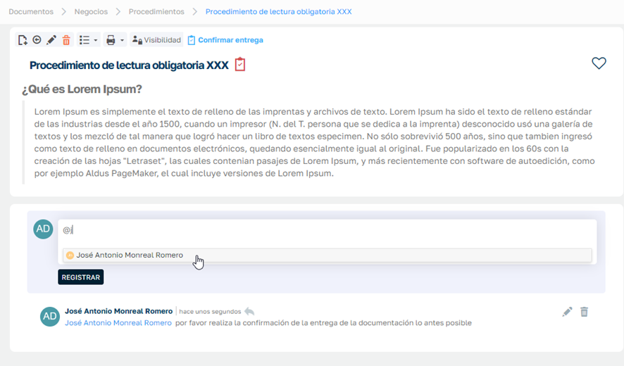

Además de quedar registrado el requerimiento, esta acción envía un aviso que aparece en la gestión de avisos del empleado en cuestión:

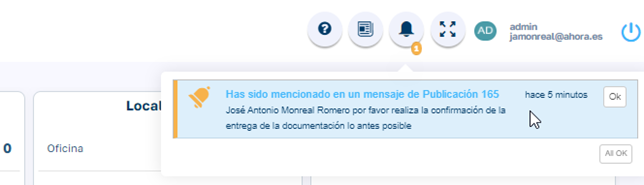

El empleado al pinchar en el aviso es dirigido a la publicación para que pueda confirmar su entrega.

## ¿Cómo ven los empleados las publicaciones que tienen pendientes de confirmar?

En el dashboard general del empleado, en el módulo de documentación, disponen de un apartado "Para confirmar"

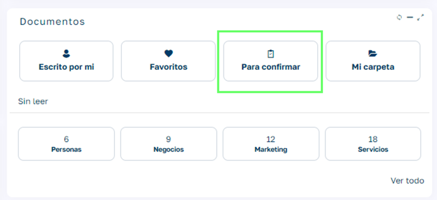

Al seleccionar la opción nos abre la lista de publicaciones pendientes de confirmar entrega por parte del usuario actual. Al seleccionar la publicación nos abre la vista de la publicación para poder revisar el contenido y confirmar la entrega si así lo considera pertinente el usuario.

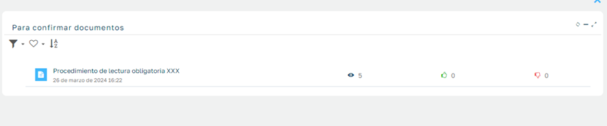