# Documentos de empleados y ABH Sign

En Sebastian HR, el equipo de recursos humanos tiene la capacidad de gestionar documentos de manera eficiente, permitiendo subir archivos de forma masiva y enlazarlos con los/las empleados/as correspondientes.

## Cómo Vincular Documentos a Empleados/as

Para empezar, dirígete a la lista de empleados/as. Desde allí, selecciona "Acciones" y luego "Documentos de empleados/as". Esto te llevará a la página de gestión de documentos, donde podrás subir y vincular archivos.

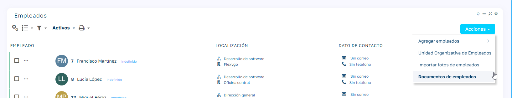

## Subida y Vinculación de Documentos

Para subir documentos, haz clic en "Acciones" y elige "Agregar documentos". Esto abrirá el gestor de documentos, donde podrás arrastrar y soltar los archivos que necesites.

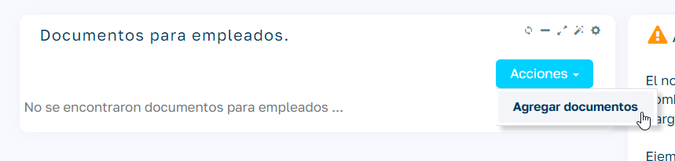

Asegúrate de que los nombres de los documentos cumplan con los parámetros necesarios para que el sistema pueda identificar correctamente a los/las empleados/as.

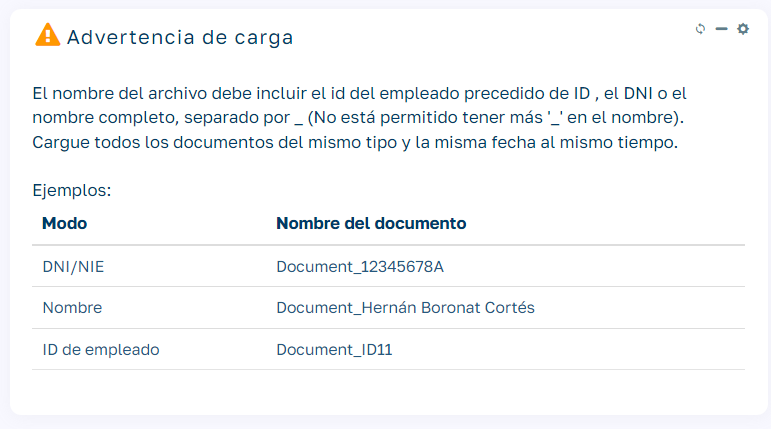

Una vez que los documentos se hayan subido, se habilitarán varias opciones en el menú "Acciones". Selecciona los documentos que deseas vincular y haz clic en "Enlazar seleccionados".

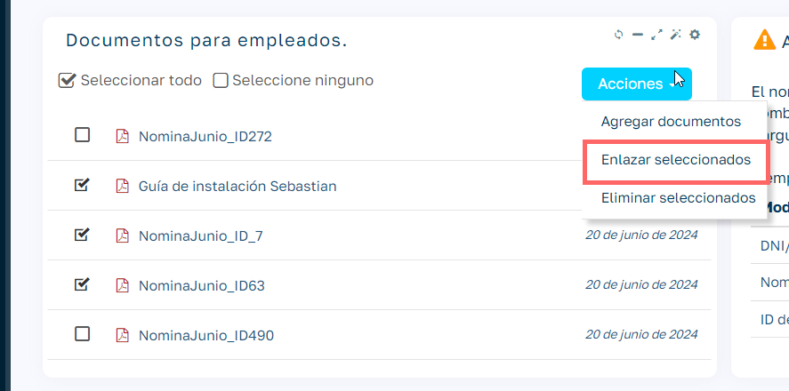

Durante este proceso, deberás asignar un nombre y una fecha que se aplicarán a todos los documentos enlazados, seleccionar la categoría de la gestión documental y elegir uno de los modos de vinculación (Id, nombre o DNI).

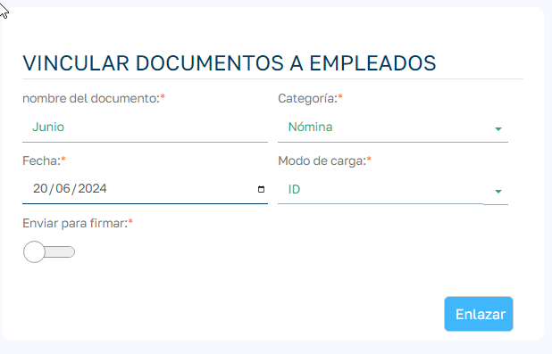  

Los documentos que se enlacen correctamente desaparecerán de la lista y estarán disponibles en la página del/de la empleado/a para su descarga.

Si algún documento no se puede vincular, el sistema mostrará un mensaje indicando el motivo del error.

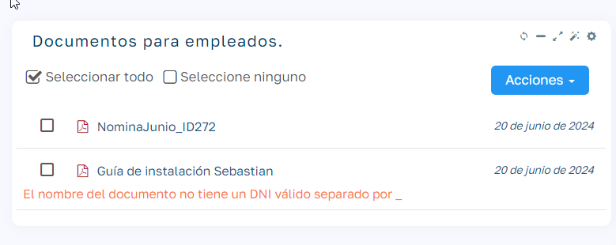

## Firma con ABH Sign

Además de vincular documentos, existe la posibilidad de enviarlos para su firma a través de ABH Sign. Para ello, en el proceso para vincular los documentos, marcaremos la opción "Enviar para firmar".

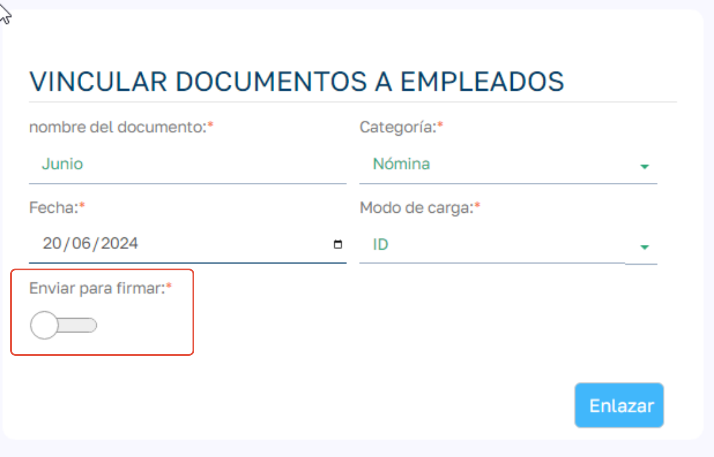  

Para utilizar este servicio, es necesario cumplir con los siguientes requisitos:

  * Tener contratado el servicio ABH Sign.
  * Configurar ABH Sign para el objeto empleados/as y las categorías correspondientes.
    * Al configurar los reports/categorías, el proceso del campo AfterProcess debe ser `HR_AfterSignEmployeesDocuments`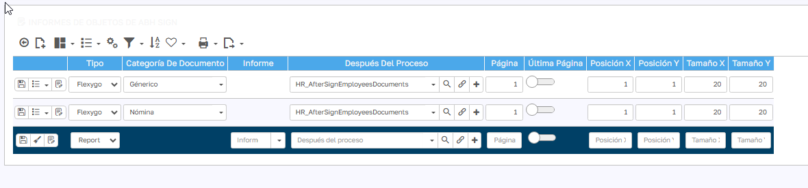
  * Disponer de suficientes créditos para enviar los documentos a firmar.
  * Asegurarte de que los/las empleados/as tengan registrado un correo electrónico y un número de teléfono válidos.
  * Los documentos deben estar en formato PDF.
  * Para que el check "Enviar para firmar" esté activo, se tiene que tener configurada la categoría seleccionada en el proceso.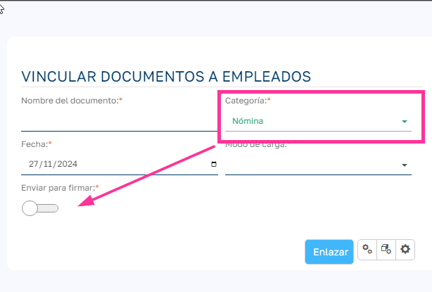

Al enviar documentos para firmar, el documento original se vincula a la gestión documental del/de la empleado/a y, simultáneamente, se envía un correo electrónico al/a la empleado/a con acceso al documento en la plataforma de firma.

Una vez que el/la empleado/a firma el documento, el original se elimina de la gestión documental y se reemplaza por el documento firmado.

!!! warning "Importante"
    Asegúrate de que los Cron Job `GetPendingAbhSigns` y `ClearAbhSign` están activos, ya que se encargan de recorrer los documentos pendientes y comprobar si se han firmado, y de actualizar los documentos caducados.

## Múltiples firmas en un documento

Un documento puede llevar asociadas varias firmas. Para ello, necesitaremos hacer las siguientes configuraciones:

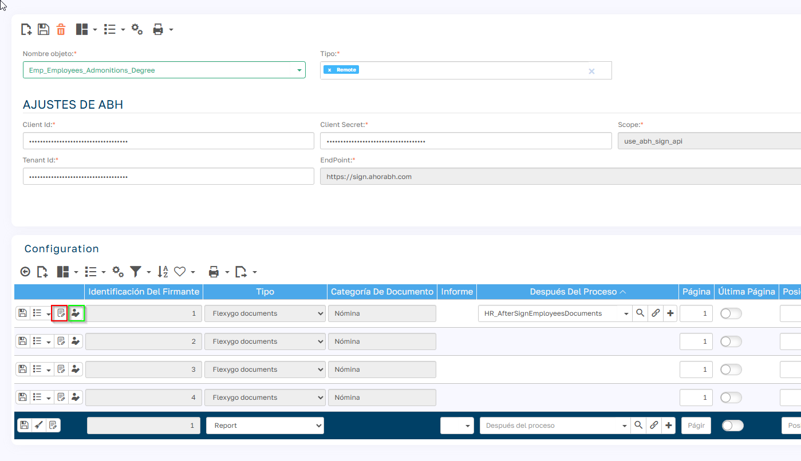

## Espacios de firma

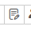

Cada firma debe tener un espacio asignado en el documento. Desde el botón se abre un asistente en el que se puede subir un documento de ejemplo y seleccionar el espacio para la firma.

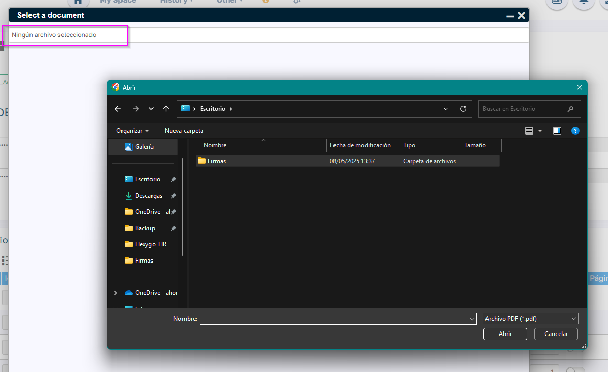  

## Configuración de los firmantes

Para cada espacio de firma, debe indicarse quién será el firmante. Las opciones disponibles son:

  * Jefe del departamento del empleado
  * Un empleado concreto
  * Responsable del empleado
  * Líder del grupo del empleado (solo disponible en HR PRO)
  * Supervisor del grupo del empleado (solo disponible en HR PRO)
  * Otro: Se puede especificar un correo electrónico y un teléfono, aunque no estén asociados a un empleado.

Además, se debe indicar el comportamiento del proceso en caso de que no se encuentre alguno de los firmantes o que no tenga email o teléfono:

  * Enviar de todas formas, omitiendo al firmante que falta.
  * No enviar el documento si no se puede completar la lista de firmantes.
   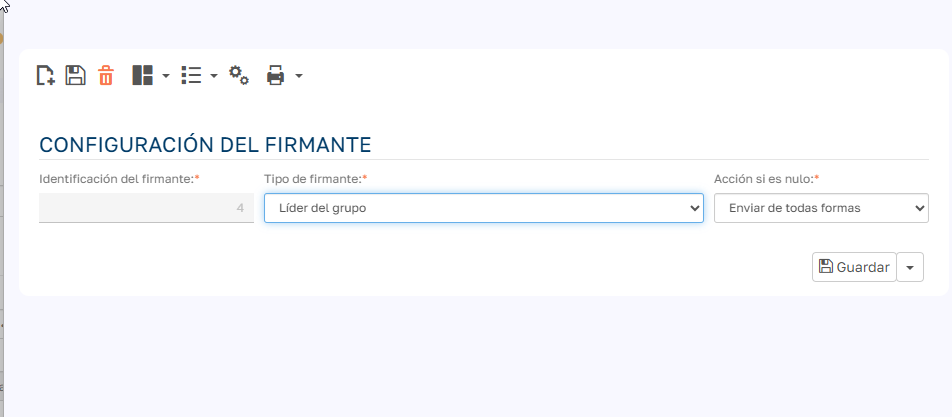

## Firmante principal

El Firmante n.º 1 es siempre el propietario del documento. Para este firmante no es necesario realizar ninguna configuración adicional.

## Finalización del proceso

El documento se considera firmado cuando todos los firmantes han completado su firma. En ese momento:

  * Se ejecuta una sola vez el proceso definido en el campo AfterSign.
  * Se guarda un único documento firmado y un único documento de evidencias con todas las firmas registradas.

## Evidencias de la Firma

Junto con el documento firmado, se genera un documento de evidencias que cumple con los requisitos necesarios para garantizar la validez de la firma. Este documento de evidencias también se añade a la gestión documental del/de la empleado/a.

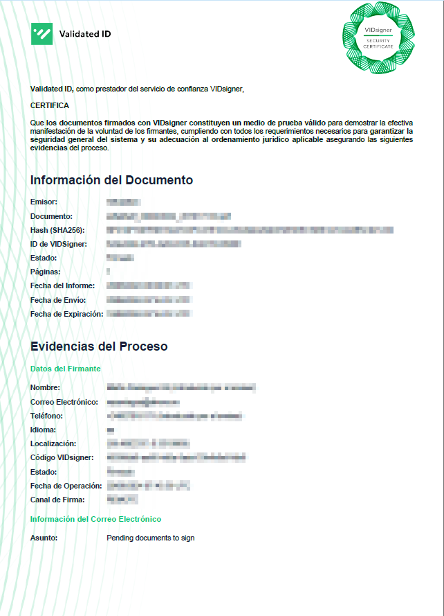

## Ver el Estado de la Firma

Puedes verificar el estado de la firma en el sistema, asegurándote de que todos los documentos hayan sido firmados correctamente en el menú de mantenimiento / Documentos de empleados / Documentos enviados para firmar.

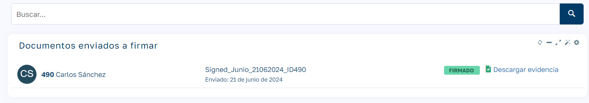

## Seguridad aplicada a los documentos

  * Los roles de RRHH pueden ver los documentos de todos los empleados.
  * El resto de roles (users y admin) únicamente pueden ver sus propios documentos.
