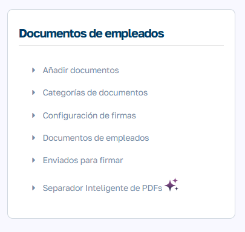
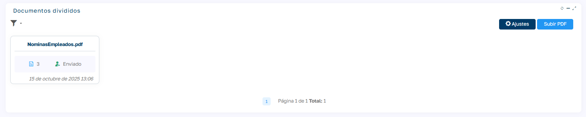
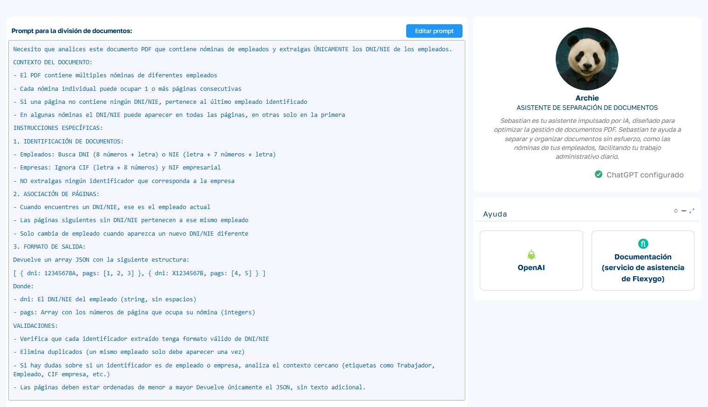
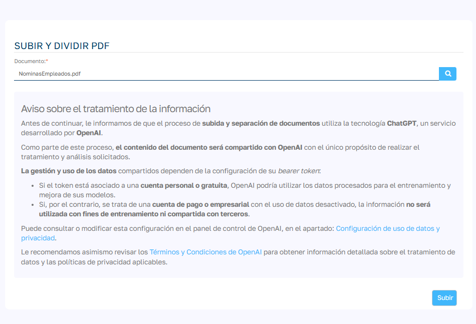
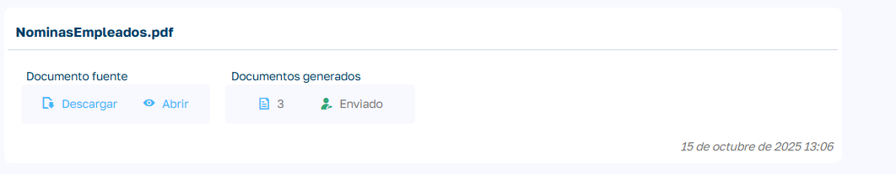
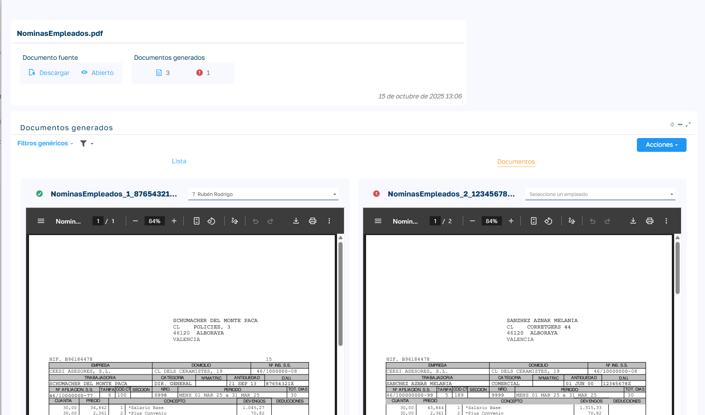
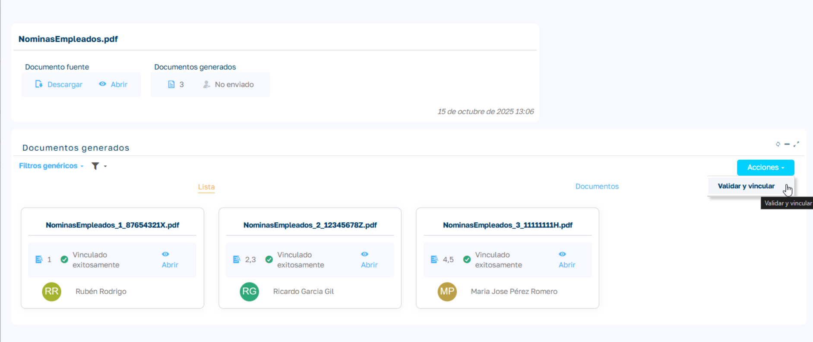
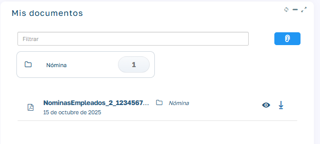

# Separación inteligente de PDFs

Esta funcionalidad está disponible exclusivamente para Sebastian HR PRO.

El Separador Inteligente de PDFs permite procesar de forma automatizada un único documento PDF que contenga múltiples nóminas, o cualquier otro tipo de documento que incluya el DNI del empleado.  
Mediante inteligencia artificial, el sistema identifica cada empleado dentro del documento, separa las páginas correspondientes y genera archivos individuales, que posteriormente se incorporan a la gestión documental del empleado.

En caso de que una nómina esté compuesta por varias páginas consecutivas, el sistema las reconocerá como un único documento.

Se accede desde el menú:

`Mantenimiento > Separador Inteligente de PDFs`



En esta página se muestra la lista de documentos procesados, junto con su estado de gestión, indicando:

- Si se han vinculado correctamente a los empleados o si hay documentos que no se han podido vincular.

- Cuantos documentos se han generado.



En la parte superior derecha de la lista encontrarás dos botones principales:  
Ajustes y Subir PDF.

## Ajustes y configuración

Para utilizar esta funcionalidad es necesario disponer de una API Key de OpenAI. [Consulta aquí cómo obtener tu API Key](https://www.splendidfi.com/blog/how-to-get-an-openai-api-key-for-chatgpt)



Desde este apartado podrás configurar los parámetros de funcionamiento del asistente de IA:

| Campo | Descripción |
| --- | --- |
| Prompt del asistente | Texto que define las instrucciones que debe seguir la inteligencia artificial para realizar la separación de los PDFs. El prompt incluido por defecto contempla la mayoría de casuísticas habituales y ofrece un funcionamiento adecuado con prácticamente cualquier tipo de documento. No obstante, puede modificarse en caso necesario. |
| Información del asistente | Formulario donde podrás ingresar tu API Key de OpenAI (Bearer Token). |
| Enlaces de ayuda | Ayuda de Flexygo<br>Enlace a este artículo de documentación |

Si necesitas cambiar el prompt, pulsa en Editar Prompt.  
El asistente debe devolver los resultados en formato JSON con esta estructura:

```json   
[
  {
    "dni":"12345678A",
    "pags":[1, 2, 3]
  },
  {
    "dni":"X1234567B",
    "pags":[4,5]
  }
]
```

## Carga y procesamiento de documentos

Una vez completada la configuración, se puede realizar la carga del documento desde la opción Subir PDF.  
El proceso de análisis y separación incluye las siguientes etapas:

1. Lectura del documento PDF.

2. Identificación de los DNIs de los empleados.

3. Separación de las páginas correspondientes a cada documento individual.

4. Intento de vinculación automática de cada documento con el empleado que posee el mismo DNI.



Visualización y seguimiento de resultados



Tras la ejecución del proceso, se habilita la página de visualización de resultados, donde se muestra un resumen general del documento procesado.  
La información incluye:

- Número total de documentos generados.

- Cantidad de documentos no vinculados.

- Estado global del proceso.

## Vista de documentos

Permite la revisión individual de cada documento.  
En esta vista se incorpora un campo de selección que, en caso de vinculación correcta, muestra el empleado correspondiente.  
Si la vinculación no se ha realizado, el campo aparece vacío y se señala con un indicador rojo.

Adicionalmente, se dispone de un filtro que permite mostrar únicamente los documentos que permanecen sin vincular.



## Vista en tarjetas

Presenta los documentos generados de forma ordenada, mostrando:

- Secuencia de aparición en el PDF original.

- Rango de páginas incluidas.

- Empleado vinculado, si corresponde.



## Validación y vinculación final

Una vez completada la revisión y asignación de los documentos, puede ejecutarse la acción Validar y vincular, disponible en el menú Acciones.  
Mediante esta operación, el sistema incorpora automáticamente cada documento a la gestión documental del empleado correspondiente, dentro de la categoría Nóminas.


