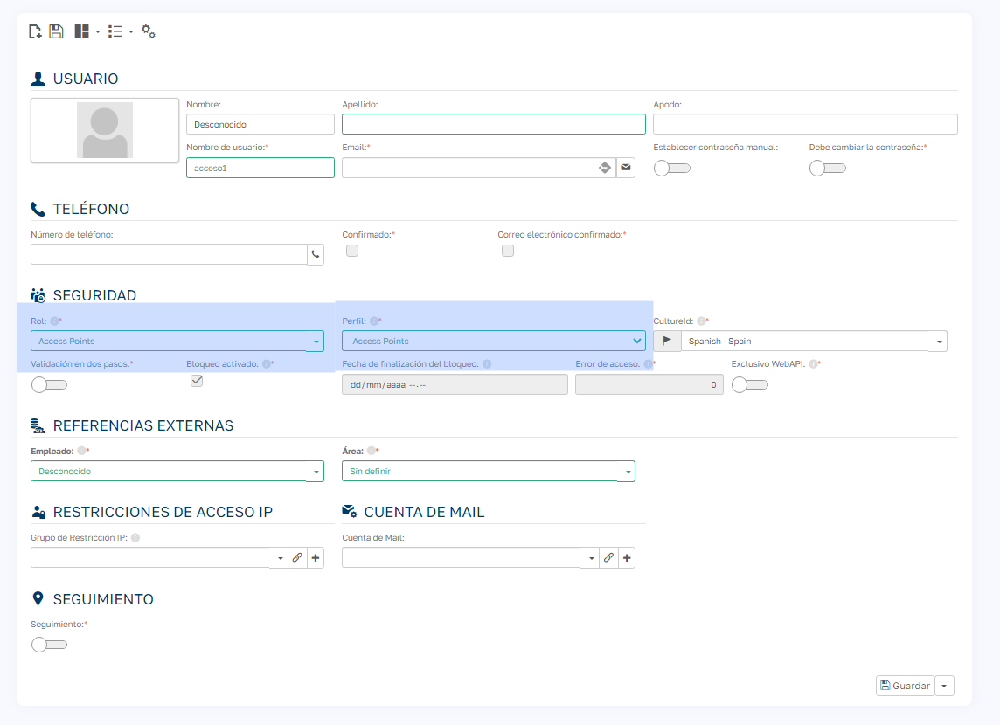
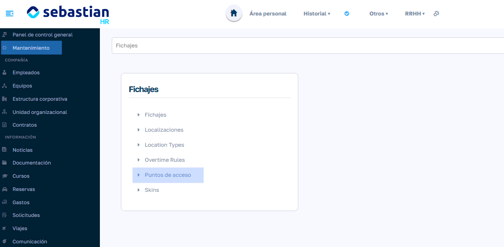
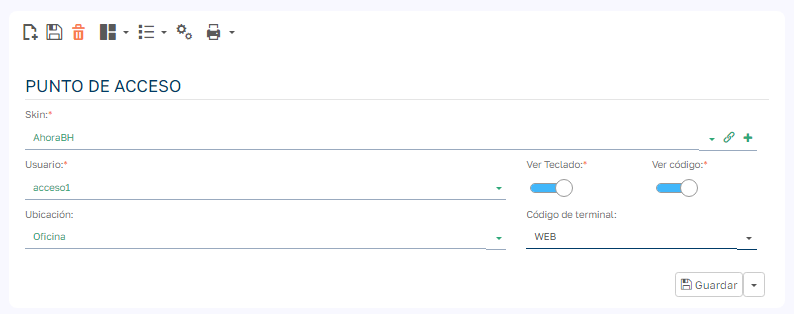
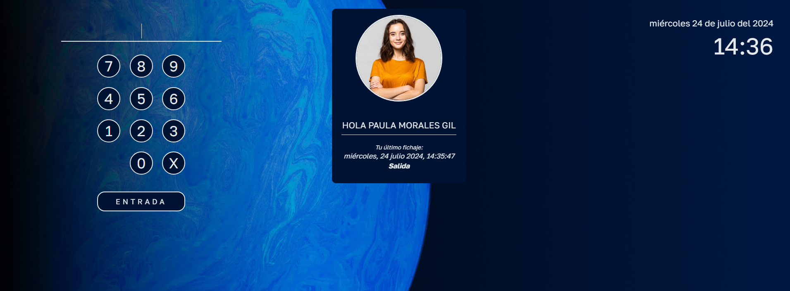

# Configurar un Punto de Acceso

Un punto de acceso nos permite configurar un dispositivo, ya sea una tablet o un PC con una pantalla, para que los empleados y las empleadas pueden fichar al acceder o abandonar las instalaciones de la compañía.

  

Configurarlo es muy sencillo, siguiendo estos pasos lo tendremos listo en menos de 10 minutos:

  

1\. Crear un usuario con el ROL y el PERFIL AccessPoint.

  

  

  

2\. Desde el menú lateral, accedemos a Mantenimiento/Fichajes/Puntos de acceso.

  

  

3\.  Creamos un nuevo punto de acceso:

  * Seleccionamos una de las interfaces/skins disponibles o creamos una nueva. Esto nos permitirá personalizar la imagen de fondo y los colores del punto de acceso.
  * Seleccionamos el usuario que hemos creado anteriormente. Es importante que su ROL y el PERFIL sea AccessPoint.
  * Seleccionamos la localización del punto de acceso. Esta localización se guardará en los fichajes, así como el código del terminal (este código es opcional).

  

  

4\. Iniciamos sesión en el dispositivo y ¡ya tendríamos configurado el punto de acceso!

  

  

5\. En el formulario de empleados, rellenar el campo Código de acceso con el código numerico que utilizará el empleado para fichar: