# Configuración Inicial Sebastian HR

Idiomas

Idiomas: En Sebastián HR tenemos que diferenciar entre el idioma de visualización del interfaz y el idioma de los datos maestros.

El idioma de interfaz se define a nivel de usuario y cada usuario puede seleccionar el que desee dentro de las opciones disponibles. Por defecto el idioma de interfaz para los usuarios será el inglés. El usuario puede modificar su idioma de interfaz desde las opciones de usuario.

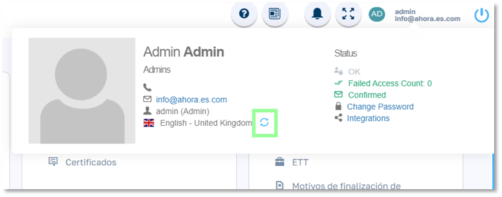

El idioma de datos maestros es común para todos los usuarios. Por defecto al instalar la aplicación estos datos están en inglés.

Para cambiar el idioma predeterminado de los datos maestros debemos ir al Mantenimiento/Parámetros/ y seleccionar el proceso de traducción que se requiera.

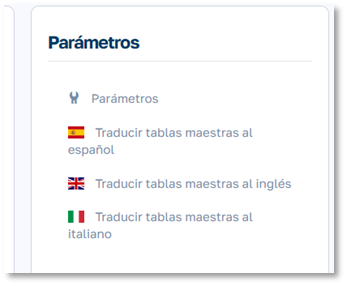

Empresas

Para dar de alta la estructura de empresas a gestionar vamos a: Mantenimiento/Organización/Empresas

Damos de alta cada empresa a gestionar y su estructura de centros de trabajo.

Calendarios

Definiremos los distintos calendarios de festivos que necesitemos gestionar en función de los distintos lugares y regiones con distinta configuración de festivos.

Entendemos como festivos tantos los festivos nacionales, regionales y locales y además los días semanales que se consideran como festivos como pueden ser en muchos casos los domingos 

Para dar de alta calendarios vamos a Mantenimiento/Organización/Calendarios

Una vez dado el nombre al calendario accedemos a él y añadimos los festivos pudiendo hacerlo de dos formas:

_Primera: Indicar días o periodos desde el calendario._

Clicamos en el día en cuestión e indicamos los datos del festivo. Si queremos indicar varios días consecutivos rellenaremos el campo fecha fin, si no lo dejamos en blanco.

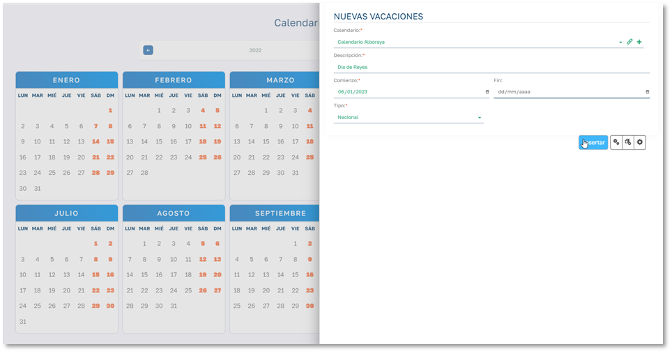

 _Segunda: Indicar días festivos semanales desde el botón “Insertar festivo semanal”_

Clicamos en dicho botón e indicamos el periodo a tener en cuenta y el día de la semana que consideramos festivo.

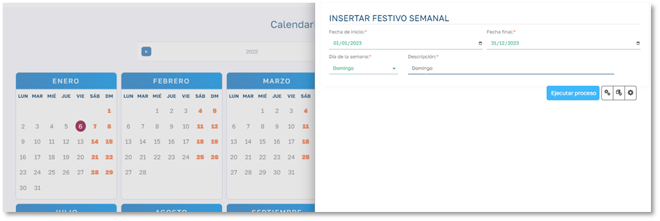

De esta forma se marcarán todos los domingos del año como festivos.

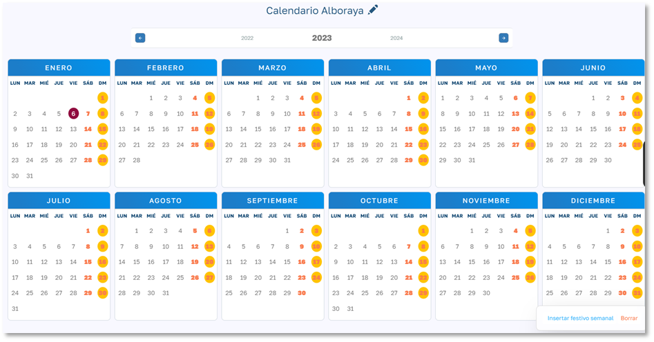

 _Borrar Festivos_

Si tenemos que rectificar algún festivo clicaremos en el botón “Borrar” y nos pedirá que tipo de festivo eliminar y en qué periodo.

Centros de trabajo

Para dar de alta los centros de trabajo podemos hacerlo desde la vista del objeto empresa o bien desde Mantenimiento/Organización/Centros de trabajo.

Aquí simplemente tenemos que rellenar los datos de información que nos solicita el formulario y como dato obligatorio tenemos que indicar el calendario que gestiona los festivos de ese centro de trabajo, así como la empresa a la que pertenece.

Es importante para el correcto funcionamiento de la aplicación asignar uno de los distintos calendarios que hemos definido en la aplicación.

Departamentos

Para dar de alta los distintos departamentos de la empresa vamos a: Mantenimiento/Organización/Departamentos.

Simplemente tenemos que rellenar los distintos nombres de departamento. Cuando tengamos dados de alta los empleados podemos asignar un responsable al departamento.

Puestos de trabajo

La diferencia entre categoría y puesto de trabajo es que en Sebastian HR la categoría hace referencia a la categoría definida en un convenio colectivo y contiene los datos relativos a lo definido en ese convenio. Por el contrario, el Puesto de Trabajo es una definición de los puestos de trabajo que se definan a nivel de nuestra empresa y tendrán los datos que se haya estipulado por parte de la misma. De esta forma un empleado tendrá una categoría de las establecidas en el convenio asignado a su contrato, pero podrá ejercer el puesto de trabajo que hayamos definido en la empresa.

Para dar de alta los distintos puestos de trabajo a gestionar vamos a: Mantenimiento/Organización/Puestos de Trabajo.

Por ahora bastará con darle un nombre y posteriormente clicar el botón Cambiar precios para establecer el precio mes y hora desde una fecha determinada.

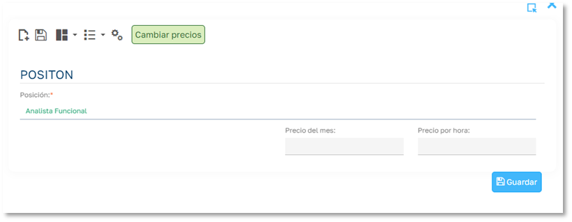

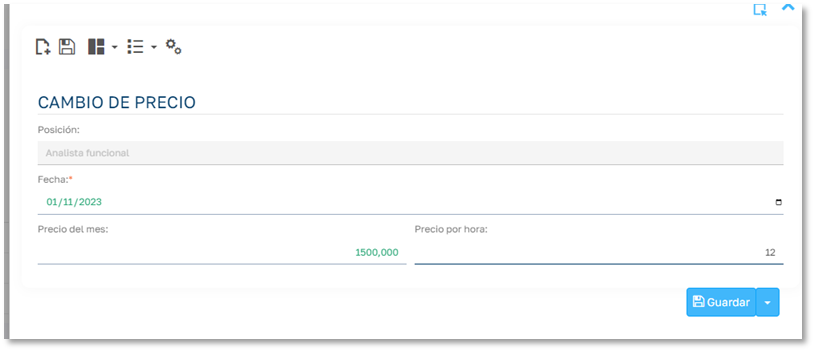

Regímenes Seguridad Social

Para dar de alta los Regímenes vamos a: Mantenimiento/Contratos/Regímenes

He indicamos los datos de los distintos regímenes que manejemos en la empresa, los días no laborables de cada régimen si los hubiera y el % de cotización a la Seguridad Social.

Convenios Colectivos

Para dar de alta Convenios Colectivos vamos a: Mantenimiento/Contratos/Convenios Colectivos

  * Código : Código interno del convenio
  * Referencia : Referencia externa
  * Descripción : Descripción del convenio
  * Horas Anuales Máximas: Horas anuales que estipula el convenio.
  * Máximo de horas mensuales: Horas mensuales a efectos de cálculos 
  * Máximo de horas semanales: Horas semanales a efectos de cálculos
  * Horas máximas diarias: Horas diarias a efectos de cálculos
  * Máximo de horas adicionales anuales.
  * Días de vacaciones: que estipula el convenio
  * Tipo de días: si los días de vacaciones son en base a días laborables o naturales.
  * Nocturnidad: Si el convenio contempla la nocturnidad y en que franja horaria.

Una vez dado de alta el convenio tenemos que asociar las categorías que establece el convenio y sus datos asociados, estos datos son los siguientes:

  * Categoría _: Nombre de la categoría._
  * Mensualidad _: Salario mensual que establece el convenio para esa categoría. (tipo de salario mensual)_
  * Numero de Pagos _:__número de pagas que establece el convenio para esa categoría._
  * Precio por hora:_precio de la hora que establece el convenio para esa categoría. (tipo de salario por horas)_

Para cada categoría tendremos que asignar que puestos de trabajo puede desempeñar el empleado que tenga esta categoría en su contrato. Esto lo haremos en el módulo “Categoría – Posiciones” desde la misma ficha de la categoría.

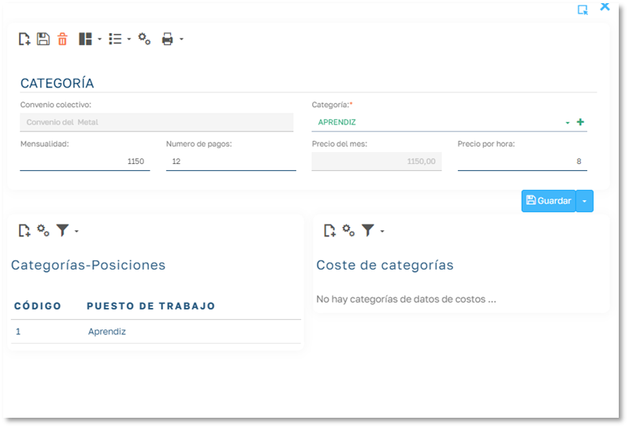

Alta de Empleados

Para dar de alta un empleado iremos al [menú lateral]/Empleados] para visualizar la lista de empleados.

Hacemos clic en el botón “Agregar Empleados” y seleccionaremos la opción “Asistente” y se nos abrirá el asistente de alta de empleados.

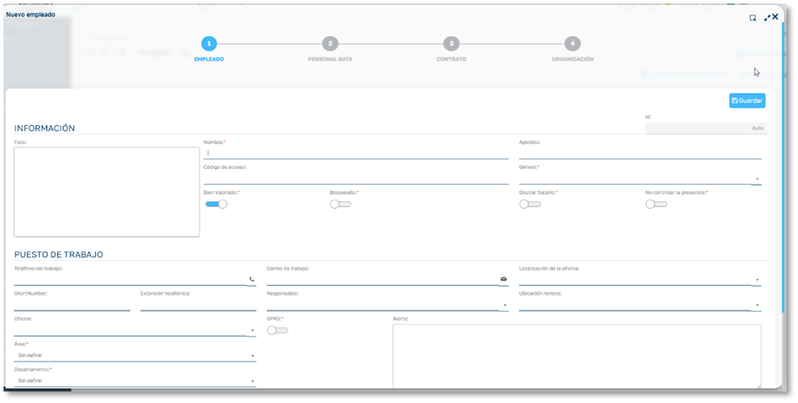

Es un asistente de 4 pasos:

  * Paso 1 (Empleado): Aquí rellenaremos los datos generales de empleado. Una vez guardado este paso, podemos salir del asistente y el empleado ya estará creado en la base de datos de Empleados. Pudiendo rellenar el resto de información e los siguientes pasos en otro momento si así lo consideremos.
  * Paso 2 (Datos Personales): En este paso podemos rellenar la información personal del empleado. También podremos hacerlo en el área de datos personales de la ficha del empleado una vez creado en el punto 1.
  * Paso 3 (Datos de Contrato): En este paso podemos dar de alta el contrato del trabajador en el propio asistente de alta del empleado. Esta acción también la podemos hacer posteriormente en la ficha del empleado dando de alta un contrato al empleado.
  * Paso 4 (Datos de Organización): Este paso tiene que ver con la asignación de unidades organizativas, en un primer momento se puede obviar y en caso de trabajar con unidades organizativas podemos hacer esta gestión también desde la ficha del empleado.

Los datos de cada uno de los pasos como decimos se pueden gestionar desde la misma ficha de empleado:

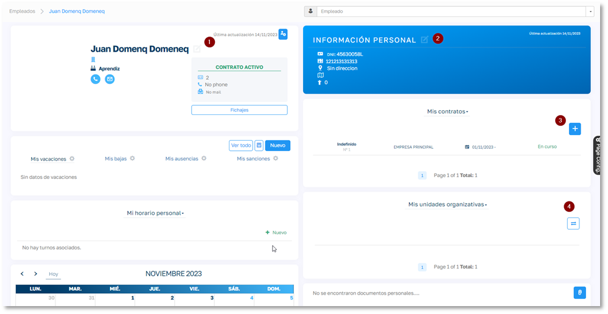

 _Importación Excel_

El alta de contratos también podemos hacerla importando un Excel con un formato determinado.

Para ello empleado iremos al [menú lateral]/Empleados] para visualizar la lista de empleados.

Hacemos clic en el botón “Agregar Empleados” y seleccionaremos la opción “Plantilla Excel” y se nos abrirá un dialogo de importación:

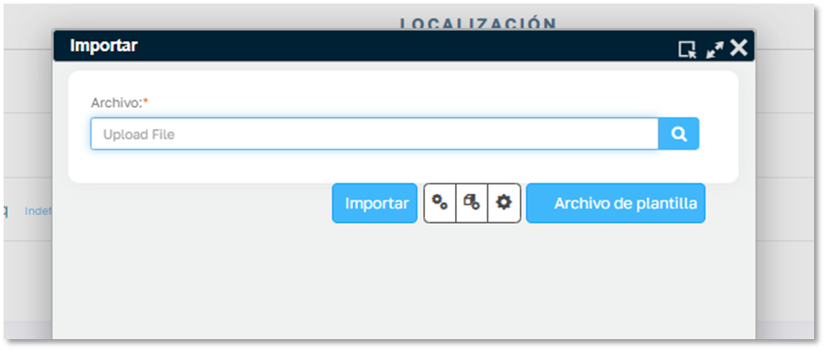

Si ya tenemos preparado el fichero Excel lo buscaremos desde el botón lupa y le daremos a importar.

Si tenemos que preparar el fichero, descargaremos la plantilla mediante el botón “Archivo de plantilla” y se nos descargará el fichero Excel vacío con la cabecera de los campos a rellenar y en una segunda hoja del fichero tendremos información relativa al dato a rellenar en cada columna.

## __Importar fotos de empleados__

Podemos asignar la foto de cada empleado desde su ficha de empleado.

En caso de que queramos asignarlas de forma masiva tendremos que generar un fichero con la foto de cada empleado y nombrarlo con el código del empleado.

De esta forma podemos ir el proceso de “Importar fotos de empleados” de la lista de empleados y seleccionar todos los ficheros cargarlos en el módulo de “Arrastrar para subir” y darle al botón “importar fotos”

Alta de Contratos

El alta del contrato bien se puede hacer desde el propio asistente de Alta de empleados o directamente desde la ficha del empleado en el módulo de contrato dando al botón de nuevo contrato (+), con lo que se abrirá el proceso de alta de contrato que nos pedirá los datos necesarios para realizar el alta.

  * Tipo de contrato: seleccionar el tipo de contrato de la lista desplegable.
  * Fecha de inicio del contrato.
  * Empresa
  * Oficina (centro de trabajo)
  * ETT: Si es un contrato a través de una empresa de trabajo temporal marcamos esta opción y nos pedirá que indiquemos que empresa de ETT. Para ello previamente tendremos que tenerla dadas de alta (Mantenimientos/Contratos/ETT).
  * Convenio colectivo
  * Categoría: Cargará un desplegable con las categorías que hemos definido en ese convenio.
  * Puesto de trabajo: Cargará los puestos de trabajo vinculados a esa categoría y convenio colectivo.
  * Régimen
  * Fecha fin: (solo la rellenamos cuando se finaliza el contrato)
  * Cantidad de vacaciones: días de vacaciones anuales de ese contrato.
  * Tipo de cotización: dos opciones Mensual o Por Horas. Nos indicará si el empleado tiene un sueldo mensual establecido o este se calcula en base a las horas realizadas.
  * Cuenta Bancaria: Desde aquí podemos dar de alta la cuenta bancaria del empleado por la cual vamos a realizar los pagos del salario.

Alta de Usuarios

La licencia de evaluación permite tener 3 usuarios: Uno con el rol Admin, uno con el rol Guess y otro con el rol User.

Puedes encontrar más información acerca del licenciamiento [aquí](https://help.flexygo.com/support/solutions/articles/154000130165--como-puedo-activar-mi-licencia-).

Una vez tengamos una licencia comercial de Sebastian HR, podremos empezar a crear los usuarios para el portal.

Para ello, desde el menú RRHH de la barra de navegación superior vamos a Agregar Usuarios:

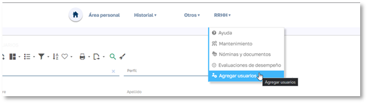

En esta página veremos un listado de los usuarios creados.

Para crear un nuevo usuario, clicamos en el botón:

  1. _Rellenamos los datos personales y de inicio de sesión. En el caso de que marquemos el check_ “Establecer contraseña manual”,_podremos definir una contraseña para el usuario, eligiendo si queremos que se cambie esa contraseña la primera vez que se acceda a la aplicación. Si lo dejamos desmarcado, el sistema enviara un correo electrónico al nuevo usuario con un enlace para establecer la contraseña._
  2. _Elegir el rol del usuario. Entre los principales roles encontramos_ “Human Resources High Level _”, que tiene acceso a todos los datos y gestiones disponibles_ , “Human Resources Low Level” _que tiene restringido el acceso a ciertas partes de la aplicación, “Access Point”, usuario que se utiliza para el punto de acceso de fichajes, y_ “Users” _para los empleados._
  3. _Access point para el rol Access Point y Default Profile para el resto._
  4. _El empleado asociado al usuario._
  5. _El área del empleado._

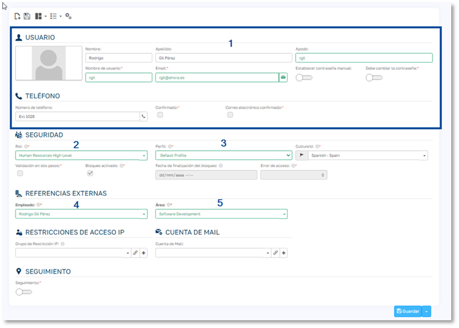

Alta de Localizaciones

Las localizaciones son las distintas ubicaciones desde las que un empleado puede fichar.

Aunque las localizaciones tienen diversas utilidades vamos a ceñirnos en este apartado a los datos imprescindibles para que los empleados puedan empezar a fichar.

Cada localización debe estar vinculada a un tipo de localización de entre los 3 tipos disponibles en el sistema: 

  * Sede (trabajo presencial en el centro de trabajo)
  * Teletrabajo
  * Otros

Para de alta localizaciones vamos a Mantenimiento/Fichajes/Localizaciones

Como mínimo daremos de alta una localización de tipo Sede y otra de tipo Teletrabajo.

Ejemplo tipo Sede

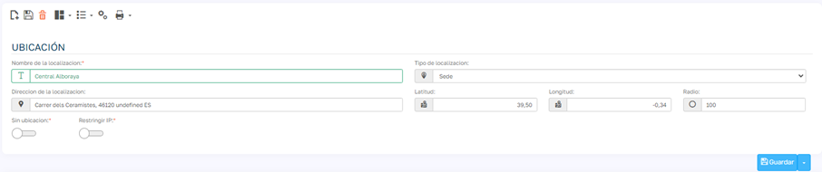

##  __Asignación de localizaciones por defecto al empleado (para Fichaje desde el portal y Access point)__

Para que el empleado pueda fichar desde el portal del empleado tenemos que indicar cual es la localización por defecto del empleado tanto de tipo Sede como de tipo Teletrabajo.

Esto lo haremos desde la ficha del empleado / información general

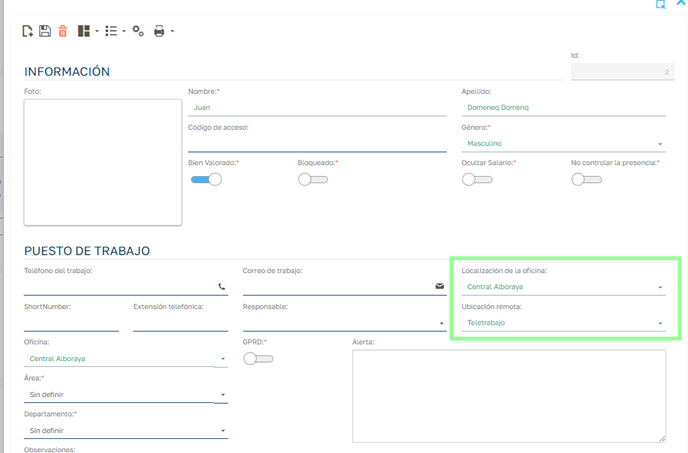

Turnos

En un turno se establece el horario de trabajo y descansos para cada uno de los días de la semana.

Además, también podemos indicar datos del comportamiento de los fichajes sobre ese turno.

A un empleado solo se le puede planificar un turno en una misma fecha o jornada de trabajo.

 _Cabecera de turno_

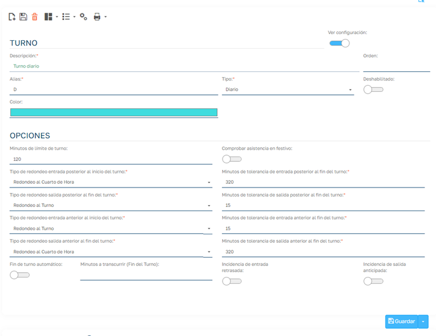

Para dar de alta un turno indicamos los datos generales en la cabecera:

  * Descripción del turno
  * Alias : Es un identificador visual del turno.
  * Tipo : Seleccionar el tipo más acorde con el turno.
  * Deshabilitado : Dado que una vez utilizado el turno ya no podemos eliminarlo, si queremos que deje de estar disponible para seleccionarlo lo deshabilitamos.
  * Color : identificador visual del turno junto con el alias.

Si activamos la opción “Ver configuración” nos aparecen las OPCIONES del turno, estas por defecto se cargan con los datos de los settings correspondientes que tenemos en el apartado “Parámetros” de la página de Mantenimiento.

  * Minutos límite del turno: cuantos minutos antes y después del turno habilitamos para que un fichaje de un empleado se entienda que pertenece a ese turno, si el fichaje es anterior o posterior a los limites no se asigna el turno al fichaje.
  * Comprobar asistencias en festivos: en la gestión de marcajes se nos muestra un módulo con el personal que tienen planificado un turno y no ha asistido al trabajo, por defecto si el día es festivo para el empleado, este no se mostrará en ese modulo, si en un turno determinado si queremos mostrar a esos empleados en días festivos marcaremos esta opción.
  * Tipos de redondeo anteriores/posteriores al inicio y fin de turno y sus minutos de tolerancia: Nos indica que tipo de redondeo queremos aplicar si el fichaje entra dentro de los minutos de tolerancia. 
    1. Tenemos tres opciones:
    2. Sin redondeo: no modifica la hora de marcaje
    3. Redondeo al turno: lleva la hora de marcaje al punto del turno según la opción (inicio o fin).
    4. Redonde al cuarto: redondea la hora de marcaje al cuarto de hora.
    5. Nota: Hay que tener en cuenta que la hora real del fichaje no se pierde ya que el redondeo lo realizamos sobre un campo de hora editada del marcaje.

  * Fin de turno automático y Minutos a transcurrir: Finaliza el turno del empleado automáticamente al pasar los “minutos a transcurrir” indicados.
  * Incidencia de Entrada Retrasada: Si queremos que se muestre una incidencia cuando el empleado llega más tarde de la hora de inicio del turno.
  * Incidencia de Salida Anticipada: Si queremos que se muestre una incidencia cuando el empleado sale antes de la hora de fin del turno.

 _Línea de turno_

Las líneas del turno definen el horario para los días de la semana en que el turno tiene vigencia.

Si varios días consecutivos tienen el mismo horario podemos poner una sola línea indicando el horario del periodo.

Por ejemplo, para un turno de lunes a viernes en el que de lunes a jueves tenemos el mismo horario y que cambia el viernes tendríamos algo como esto:

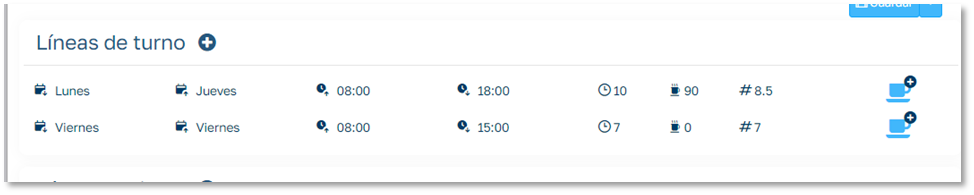

Al dar de alta o editar una línea de turno disponemos de los siguientes campos:

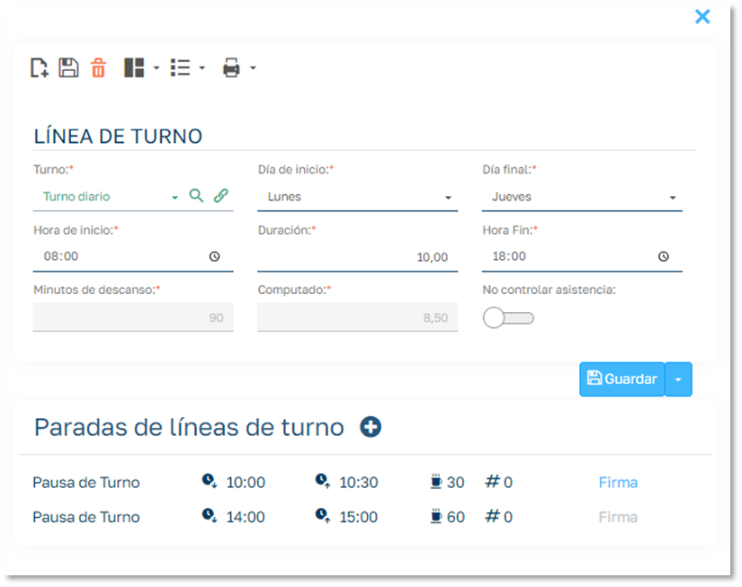

  * Duración: Es la diferencia de horas entre inicio y fin de turno.
  * Minutos de descanso: Es el sumatorio de minutos de todos los descansos asignados a la línea de turno.
  * Computado: Son las horas efectivas del turno.
  * No controlar asistencia: Similar al campo “Comprobar asistencias en festivos” de la cabera del turno, pero para esa línea de turno.

Para dar de alta los descansos del turno tendremos los siguientes campos:

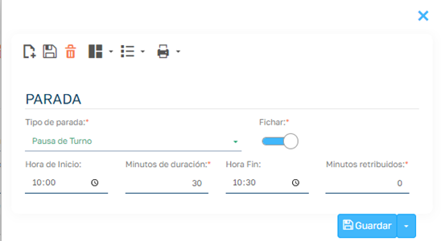

  * Tipo de parada: definibles en Mantenimientos/Turnos/Tipos de Paradas
  * Fichar: Si el descanso se ficha por parte de los empleados.
  * Minutos retribuidos: Para empleados que trabajen por tipo de salario horas, se puede indicar que parte del descanso es retribuido.

Planificación de Empleados

 _La aplicación debe ser capaz de poder calcular un turno de trabajo a cada empleado para cada día en que el empleado vaya a fichar._

Para esto se deben dar dos circunstancias:

  1. Que el empleado tenga contrato en vigor para la fecha de planificación.
  2. Que el empleado tenga asignado como mínimo un criterio de planificación. En caso de que para un día el sistema detecte más de un criterio prevalecerá el nivel de planificación de mayor prioridad.

Para realizar este cálculo la aplicación permite planificar a distintos niveles en que cada nivel tiene una prioridad establecida sobre el resto de niveles.

Los distintos niveles son los siguientes y la prioridad de asignación (de mayor a menor):

  1. Planificador de turnos de Empleados.
  2. Reglas de empleado. (Pueden modificar para un periodo los valores del turno del punto 1)
  3. Periodos de turnos de Empleado.
  4. Planificador turnos de Grupos.
  5. Periodos de turnos de Grupos.
  6. Periodos de turnos por Puestos de Trabajo
  7. Periodos de turnos por Unidad Organizativa
  8. Periodos de turnos por Ámbito
  9. Periodos de turno por Centro de trabajo (oficina)

Cuando un empleado tiene planificación podremos se podrá ver tanto en el portal como en la ficha del empleado que turno tiene planificado para cada día.

Portal

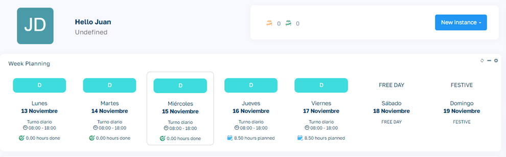

Ficha del empleado

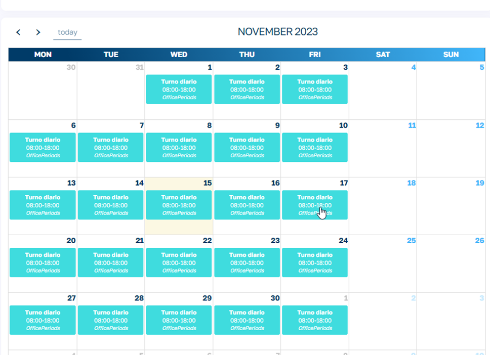
