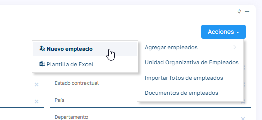

# Creación de empleados

A continuación, se describen los pasos necesarios para crear un empleado y configurar sus objetos relacionados en Sebastian HR.

1. Crear al empleado: Es la base del registro del trabajador en el sistema.

2. Añadir los datos personales: En este punto, se completa la información personal del empleado.

3. Generar el contrato: Se configura el contrato laboral, indispensable para calcular las vacaciones y otros beneficios.

Los pasos 1, 2 y 3 pueden realizarse de manera integrada mediante el Asistente de creación de empleado disponible en la lista de empleados.

!!! note "Nota"
    En el asistente, puedes optar por no crear el contrato marcando el check "Sin contrato", pero recuerda que es un registro necesario para el resto de funcionalidades de la aplicación.

## Configuración para la solicitud de vacaciones

Para que el empleado pueda solicitar vacaciones, realiza las siguientes acciones:

- **Rellenar las vacaciones totales del empleado**: Introduce la cantidad de días de vacaciones asignados para el año en curso. Este cálculo se basa en los días con contrato activo durante ese periodo.

- **Configurar el flujo de aprobación de instancias**: Define un flujo de aprobación para que las solicitudes de vacaciones sean correctamente gestionadas.

## Configuración para que el empleado pueda fichar

Si el empleado necesita registrar su jornada laboral, asegúrate de planificarlo correctamente en el sistema:

- Planificar al empleado: Asigna una planificación específica al empleado o utiliza una planificación genérica según las necesidades.   
