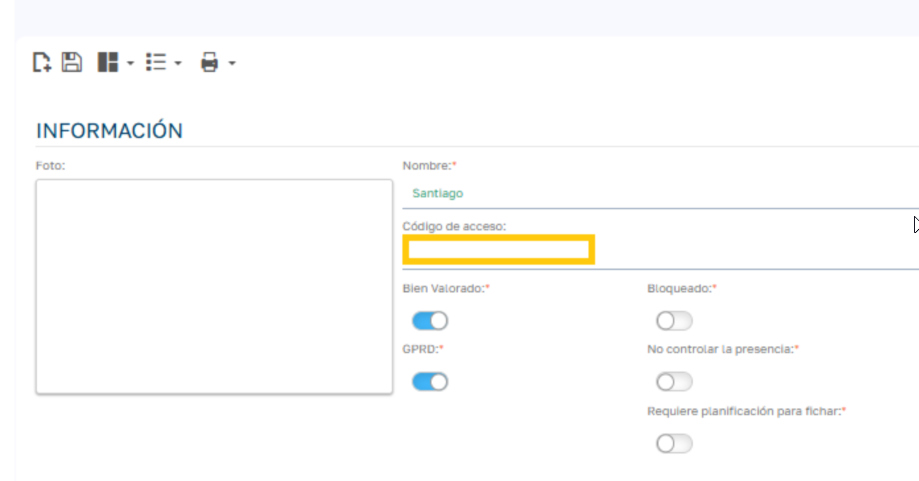
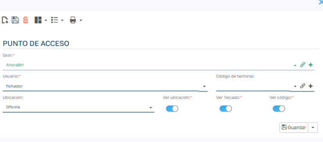
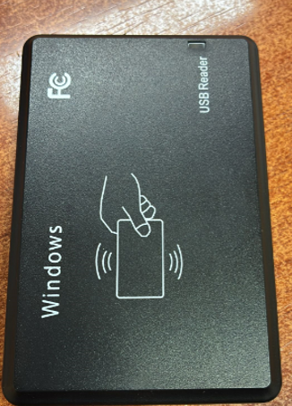
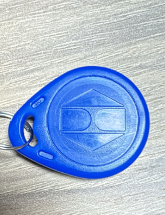

# Dispositivos RFID para Puntos de Acceso

!!! warning "Método de lectura"
    El lector RFID funciona como un teclado: al leer una tarjeta o un llavero, escribe el código como si se tecleara a mano. En el Punto de Acceso, Sebastian HR no procesa NFC de forma nativa; toda la integración depende de esa emulación de teclado. Si necesitas terminales de fichaje con tarjeta, QR o NFC gestionados por la aplicación, consulta la [integración con terminales Kapri](../../integraciones/kapri.es.md).

## Asignación del dispositivo RFID al empleado

Para registrar una tarjeta o llavero RFID en la ficha del empleado:

1. Abre la ficha del empleado.
2. Localiza el campo **Código de acceso**.
3. Escanea o introduce el código de la tarjeta. Tiene que ser único: si otro empleado ya lo tiene, la aplicación avisa al guardar.
4. Guarda los cambios.

## Creación y configuración de Puntos de Acceso

Crea un punto de acceso por cada dispositivo físico de fichaje, cada uno con su propio usuario. Si quieres identificar el dispositivo en los fichajes, indica un **Código de terminal**. Todos los pasos están en [Configurar un Punto de Acceso](punto-de-acceso.es.md).

## Instalación de dispositivos RFID

El lector se conecta por USB al ordenador o a la tablet del punto de acceso y se comporta como un dispositivo HID (teclado), sin software intermediario.

Lee códigos de tarjetas o etiquetas RFID a corta distancia (normalmente de 1 a 5 cm) y los escribe automáticamente.

Los empleados pueden usar tarjetas o llaveros RFID de proximidad (típicamente de 125 kHz). Al acercarlos al lector, transmiten su código único. No necesitan batería: usan la energía del lector.

## Funcionamiento con Sebastian

La pantalla del punto de acceso recoge cualquier tecla que envíe el lector, sin necesidad de que haya un campo seleccionado:

1. Al acercar la tarjeta, el lector escribe el código y, normalmente, pulsa Intro.
2. Sebastian HR muestra el nombre del empleado.
3. Para registrar el fichaje hay que confirmar con el botón de entrada/salida o con otra pulsación de Intro.

Solo se aceptan letras y números: cualquier otro carácter (guiones, dos puntos…) se ignora.

## Recomendaciones

- Configura el lector para que envíe el código solo con letras o números, sin separadores, y terminado en Intro.
- Comprueba que el lector usa la misma distribución de teclado que el equipo.
- Verifica que el código leído coincide con el guardado en la ficha del empleado.
- Haz una prueba en cada punto de acceso antes de ponerlo en uso.
