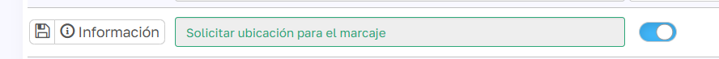
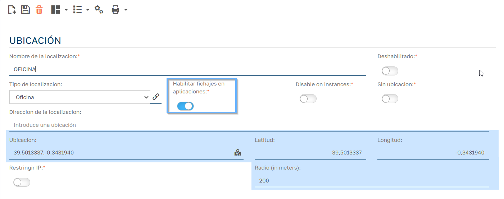
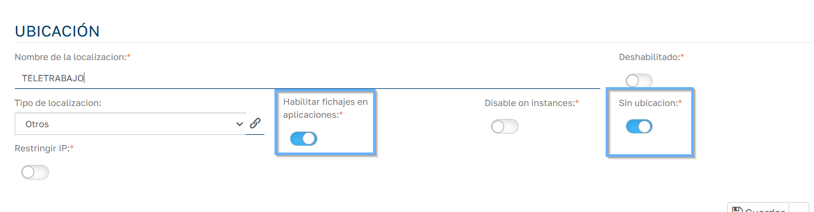
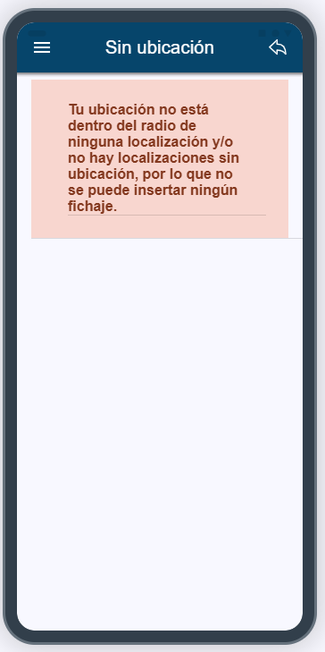

# Fichajes desde la APP Offline

La APP offline de Sebastian HR (HR Mobile) permite a los empleados fichar desde el móvil y registra, además, las coordenadas GPS del dispositivo. Este artículo explica qué tiene que configurar el gestor para que esos fichajes se asocien a la localización correcta.

## Diferencias respecto a los fichajes desde la web

En los fichajes desde la web se usa la localización que elige el empleado o, por defecto, la de su oficina. Los fichajes desde la APP recogen además las coordenadas GPS del dispositivo, lo que permite asociar el fichaje a una localización física concreta.

## Parámetro "Solicitar ubicación para el marcaje"

El comportamiento de los fichajes desde la APP depende del parámetro **Solicitar ubicación para el marcaje**, que está en `Mantenimiento > Parámetros > Configuración`, grupo **App**. Viene activado por defecto.

### Si el parámetro está activado

- Al fichar la **entrada**, la APP comprueba si el dispositivo está dentro del radio de alguna localización que tenga activado **Habilitar fichajes en aplicaciones** (`Mantenimiento > Registros de tiempo > Localizaciones`). Esta comprobación necesita conexión.

    

- Si hay coincidencia, el fichaje guarda las coordenadas GPS y la localización.
- Si el dispositivo está fuera del radio de todas las localizaciones habilitadas, la APP muestra al empleado la lista de localizaciones que tienen activados a la vez **Habilitar fichajes en aplicaciones** y **Sin ubicacion**. El fichaje se guarda en el móvil con la localización elegida y se sincroniza después.

    

- Si no hay ninguna localización que cumpla esos criterios, la APP muestra el mensaje "Tu ubicación no está dentro del radio de ninguna localización y/o no hay localizaciones sin ubicación, por lo que no se puede insertar ningún fichaje."
- Al fichar la **salida** no se comprueba la posición: el fichaje toma la localización de la última entrada.

### Si el parámetro está desactivado

- El fichaje registra solo las coordenadas GPS del dispositivo.
- No se asocia ninguna localización al fichaje, aunque exista en el sistema.

  

## Configuración de las localizaciones

En cada localización que se vaya a usar desde la APP, revisa:

| Campo | Descripción |
| --- | --- |
| Habilitar fichajes en aplicaciones | Solo las localizaciones con este check se envían a la APP. |
| Latitud y Longitud | Centro de la localización. |
| Radio (en metros) | Distancia máxima al centro para considerar que el empleado está en la localización. |
| Sin ubicacion Pro | La localización se ofrece aunque el empleado esté fuera de radio. En modo LITE este check está oculto y siempre activado. |
| Restringir IP Pro | Limita los fichajes a determinadas IP. Un fichaje desde una IP no permitida puede bloquearse o generar una incidencia. |
